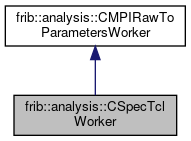

do not remove this div, it is closed by doxygen! 
|  |
| --- |
| FRIBParallelanalysis1.0FrameworkforMPIParalleldataanalysisatFRIB |

 end header part 
 Generated by Doxygen 1.8.13 

 window showing the filter options 

 iframe showing the search results (closed by default) 

- **frib**
- **analysis**
- [[CSpecTclWorker|classfrib_1_1analysis_1_1CSpecTclWorker]]

 top 
[Public Member Functions](#pub-methods) |
[[List of all members|classfrib_1_1analysis_1_1CSpecTclWorker-members]]

frib::analysis::CSpecTclWorker Class Reference

header
`#include <SpecTclWorker.h>`

Inheritance diagram for frib::analysis::CSpecTclWorker:

[[[legend|graph_legend]]]

Collaboration diagram for frib::analysis::CSpecTclWorker:

[[[legend|graph_legend]]]

|  |  |
| --- | --- |
| Public Member Functions |
|  | CSpecTclWorker(AbstractApplication&app) |
|  |
| virtual | ~CSpecTclWorker() |
|  |
| std::string | addProcessor(CEventProcessor*pProcessor, const char *name=nullptr) |
|  |
| void | removeEventProcessor(CEventProcessor*pProcessor) |
|  |
| void | removeEventProcessor(const char *name) |
|  |
| virtual void | initializeUserCode(int argc, char **argv,AbstractApplication&app) |
|  |
| virtual void | unpackData(const void *pData) |
|  |
| virtual std::string | getInputFilename(int argc, char **argv) |
|  |
| Public Member Functions inherited fromfrib::analysis::CMPIRawToParametersWorker |
|  | CMPIRawToParametersWorker(AbstractApplication&App) |
|  |
| virtual | ~CMPIRawToParametersWorker() |
|  |
| virtual void | operator()(int argc, char **argv) |
|  |

## Detailed Description

The generic parallel processing framework supports a worker class that can have its function call operator (operator()) invoked for each ring item in a work block. [[CSpecTclWorker|classfrib_1_1analysis_1_1CSpecTclWorker]] extends this class to provide an analysis pipeline much like SpecTcl for ported EventProcessors.

The point is to provde the capability to import unpacking/analysis code from SpecTcl easily into this framework drastically speeding up the initial processing of event data.

Note NSCLDAQ 11.x and later are the only formats supported.

## Constructor & Destructor Documentation

## [◆](#a96fad1184e81a0f0bb498f7a555fe63a)CSpecTclWorker()

|  |  |  |  |  |  |
| --- | --- | --- | --- | --- | --- |
| frib::analysis::CSpecTclWorker::CSpecTclWorker | ( | AbstractApplication& | app | ) |  |

constructor

- initialize the index used to assign names to unnamed processors.
- Create the dummy decoder, analyzer and event to pass into the pipeline elements.

## [◆](#af6cb9ee0de85a97b1d616513e7cd6c3a)~CSpecTclWorker()

|  |  |  |  |  |  |  |
| --- | --- | --- | --- | --- | --- | --- |
| frib::analysis::CSpecTclWorker::~CSpecTclWorker() | frib::analysis::CSpecTclWorker::~CSpecTclWorker | ( |  | ) |  | virtual |
| frib::analysis::CSpecTclWorker::~CSpecTclWorker | ( |  | ) |  |

destructor Note that the event processor ownership is retained by the client so we leave them alone. We do need to delete our props for the SpecTcl objects

## Member Function Documentation

## [◆](#a092db30a0a4c06f372836961663e6c56)addProcessor()

|  |  |  |  |
| --- | --- | --- | --- |
| std::string frib::analysis::CSpecTclWorker::addProcessor | ( | CEventProcessor* | pProcessor, |
|  |  | const char * | name=nullptr |
|  | ) |  |  |

addProcessor Append an event processor to the end of the logical event processing pipeline.

Parameters
|  |  |
| --- | --- |
| pProcessor | - Pointer to the event processor object. This storage remains owned/managed by the caller. |
| name | - If the name is nullptr (the default) a new, unique one is generated. |

Returnsstd::string - name of the event processor.

## [◆](#a6f33396a8ce46b81894b4ded7de60a17)getInputFilename()

|  |  |  |  |  |  |  |  |  |  |  |  |  |  |
| --- | --- | --- | --- | --- | --- | --- | --- | --- | --- | --- | --- | --- | --- |
| std::string frib::analysis::CSpecTclWorker::getInputFilename(intargc,char **argv) | std::string frib::analysis::CSpecTclWorker::getInputFilename | ( | int | argc, |  |  | char ** | argv |  | ) |  |  | virtual |
| std::string frib::analysis::CSpecTclWorker::getInputFilename | ( | int | argc, |
|  |  | char ** | argv |
|  | ) |  |  |

getInputFilename Default implementation - argv[1] is the input filename. If it does not exist, std::invalid_argument is thrown.

Parameters
|  |  |
| --- | --- |
| argc,argv | - the command line. |

Returnsstd::string 
Exceptions
|  |  |
| --- | --- |
| std::invalid_argument | - see above. |

## [◆](#ad9c1c74b18539fedd0e670dbb41fc8e8)initializeUserCode()

|  |  |  |  |  |  |  |  |  |  |  |  |  |  |  |  |  |  |
| --- | --- | --- | --- | --- | --- | --- | --- | --- | --- | --- | --- | --- | --- | --- | --- | --- | --- |
| void frib::analysis::CSpecTclWorker::initializeUserCode(intargc,char **argv,AbstractApplication&app) | void frib::analysis::CSpecTclWorker::initializeUserCode | ( | int | argc, |  |  | char ** | argv, |  |  | AbstractApplication& | app |  | ) |  |  | virtual |
| void frib::analysis::CSpecTclWorker::initializeUserCode | ( | int | argc, |
|  |  | char ** | argv, |
|  |  | AbstractApplication& | app |
|  | ) |  |  |

initializeUserCode Use getInputFilename to get the name of the input file and call OnInitialize and OnEventSourceOpen for all elements of the pipeline. If any element returns kfFalse, our abort is even stronger than SpecTcl's throwing a std::runtime_error.

Parameters
|  |  |
| --- | --- |
| argc,argv | - command parameters. |
| app | - application reference. |

Reimplemented from [[frib::analysis::CMPIRawToParametersWorker|classfrib_1_1analysis_1_1CMPIRawToParametersWorker]].

## [◆](#a35211a582117ce40105cec71bf1d82cd)removeEventProcessor() [1/2]

|  |  |  |  |  |  |
| --- | --- | --- | --- | --- | --- |
| void frib::analysis::CSpecTclWorker::removeEventProcessor | ( | CEventProcessor* | pProcessor | ) |  |

removeEventProcessor Remove an event processor specified by a pointer to it.

Parameters
|  |  |
| --- | --- |
| pProcessor | - pointer to the one to remove. |

Exceptions
|  |  |
| --- | --- |
| std::logic_error | - no such processor. |

## [◆](#ac1f61575e852e35c14186cd3af65b451)removeEventProcessor() [2/2]

|  |  |  |  |  |  |
| --- | --- | --- | --- | --- | --- |
| void frib::analysis::CSpecTclWorker::removeEventProcessor | ( | const char * | name | ) |  |

removeEventProcessor Removes an event processor given its name.

Parameters
|  |  |
| --- | --- |
| name | name of the event processor. |

Exceptions
|  |  |
| --- | --- |
| std::logic_error | - no such processor. |

## [◆](#ab010922c1133670bc23c8e37d40f814e)unpackData()

|  |  |  |  |  |  |  |  |
| --- | --- | --- | --- | --- | --- | --- | --- |
| void frib::analysis::CSpecTclWorker::unpackData(const void *pData) | void frib::analysis::CSpecTclWorker::unpackData | ( | const void * | pData | ) |  | virtual |
| void frib::analysis::CSpecTclWorker::unpackData | ( | const void * | pData | ) |  |

unpackData Called for each ring item. Invokes the event processor pipeline element operator()'s. On a failure, the event is reset to empty and processing continues with the next event.

Parameters
|  |  |
| --- | --- |
| pData | - pointer to the ring item. |

Implements [[frib::analysis::CMPIRawToParametersWorker|classfrib_1_1analysis_1_1CMPIRawToParametersWorker]].

---

The documentation for this class was generated from the following files:- spectcl/[[SpecTclWorker.h|SpecTclWorker_8h_source]]
- spectcl/[[SpecTclWorker.cpp|SpecTclWorker_8cpp]]

 contents 
 start footer part 

---

Generated by   1.8.13
