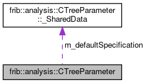

do not remove this div, it is closed by doxygen! 
|  |
| --- |
| FRIBParallelanalysis1.0FrameworkforMPIParalleldataanalysisatFRIB |

 end header part 
 Generated by Doxygen 1.8.13 

 window showing the filter options 

 iframe showing the search results (closed by default) 

- **frib**
- **analysis**
- [[CTreeParameter|classfrib_1_1analysis_1_1CTreeParameter]]

 top 
[Classes](#nested-classes) |
[Public Types](#pub-types) |
[Public Member Functions](#pub-methods) |
[Static Public Member Functions](#pub-static-methods) |
[Static Public Attributes](#pub-static-attribs) |
[[List of all members|classfrib_1_1analysis_1_1CTreeParameter-members]]

frib::analysis::CTreeParameter Class Reference

header
Collaboration diagram for frib::analysis::CTreeParameter:

[[[legend|graph_legend]]]

|  |  |
| --- | --- |
| Classes |
| struct | _SharedData |
|  |

|  |  |
| --- | --- |
| Public Types |
| typedef structfrib::analysis::CTreeParameter::_SharedData | SharedData |
|  |
| typedef structfrib::analysis::CTreeParameter::_SharedData* | pSharedData |
|  |

|  |  |
| --- | --- |
| Public Member Functions |
|  | CTreeParameter() |
|  |
|  | CTreeParameter(std::string name) |
|  |
|  | CTreeParameter(std::string name, std::string units) |
|  |
|  | CTreeParameter(std::string name, double lowLimit, double highLimit, std::string units) |
|  |
|  | CTreeParameter(std::string name, unsigned channels, double lowLimit, double highLimit, std::string units) |
|  |
|  | CTreeParameter(std::string name, unsigned resolution) |
|  |
|  | CTreeParameter(std::string name, unsigned resolution, double lowLimit, double widthOrHigh, std::string units, bool widthOrHighGiven) |
|  |
|  | CTreeParameter(std::string name, constCTreeParameter&Template) |
|  |
|  | CTreeParameter(constCTreeParameter&rhs) |
|  |
|  | ~CTreeParameter() |
|  |
| void | Initialize(std::string name, unsigned resolution) |
|  |
| void | Initialize(std::string name, unsigned resolution, double lowLimit, double highOrWidth, std::string units, bool highOrWidthGiven) |
|  |
| void | Initialize(std::string name) |
|  |
| void | Initialize(std::string name, std::string units) |
|  |
| void | Initialize(std::string name, unsigned channels, double lowLimit, double highLimit, std::string units) |
|  |
| bool | isBound() const |
|  |
|  | operator double() const |
|  |
| CTreeParameter& | operator=(double newValue) |
|  |
| CTreeParameter& | operator=(constCTreeParameter&rhs) |
|  |
| CTreeParameter& | operator+=(double rhs) |
|  |
| CTreeParameter& | operator-=(double rhs) |
|  |
| CTreeParameter& | operator*=(double rhs) |
|  |
| CTreeParameter& | operator/=(double rhs) |
|  |
| double | operator++(int dummy) |
|  |
| CTreeParameter& | operator++() |
|  |
| double | operator--(int dummy) |
|  |
| CTreeParameter& | operator--() |
|  |
| std::string | getName() const |
|  |
| unsigned | getId() const |
|  |
| double | getValue() const |
|  |
| void | setValue(double newValue) |
|  |
| unsigned | getBins() const |
|  |
| void | setBins(unsigned channels) |
|  |
| double | getStart() const |
|  |
| void | setStart(double low) |
|  |
| double | getStop() const |
|  |
| void | setStop(double high) |
|  |
| double | getInc() const |
|  |
| void | setInc(double channelWidth) |
|  |
| std::string | getUnit() const |
|  |
| void | setUnit(std::string units) |
|  |
| bool | isValid() const |
|  |
| void | setInvalid() |
|  |
| void | Reset() |
|  |
| void | clear() |
|  |
| bool | hasChanged() const |
|  |
| void | setChanged() |
|  |
| void | resetChanged() |
|  |
| void | Bind() |
|  |

|  |  |
| --- | --- |
| Static Public Member Functions |
| static void | nextEvent() |
|  |
| static std::vector< std::pair< unsigned, double > > | collectEvent() |
|  |
| static void | setDefaultLimits(double low, double high) |
|  |
| static void | setDefaultBins(unsigned bins) |
|  |
| static void | setDefaultUnits(const char *units) |
|  |
| static void | BindParameters() |
|  |
| static void | setEvent(...) |
|  |
| static const std::vector< double > & | getEvent() |
|  |
| static const std::vector< unsigned > | getScoreboard() |
|  |
| static std::vector< std::pair< std::string,SharedData> > | getDefinitions() |
|  |
| static void | ResetAll() |
|  |

|  |  |
| --- | --- |
| Static Public Attributes |
| staticSharedData | m_defaultSpecification |
|  |

## Constructor & Destructor Documentation

## [◆](#a90c65868f89d30d07257c21f7c6fc567)CTreeParameter() [1/9]

|  |  |  |  |  |
| --- | --- | --- | --- | --- |
| frib::analysis::CTreeParameter::CTreeParameter | ( |  | ) |  |

Constructors of instances of [[CTreeParameter|classfrib_1_1analysis_1_1CTreeParameter]]: default constructor Well actually I'd prefer to phase this out, however legacy code that constructed and then initialized might use this:

- The name is set empty.
- the definition point is set null.

Someone better invoke initialize on this before doing anything meaningful or there could be hell to pay:

## [◆](#a164ed44dcc1fa5fab14b79a89b12f758)CTreeParameter() [2/9]

|  |  |  |  |  |  |
| --- | --- | --- | --- | --- | --- |
| frib::analysis::CTreeParameter::CTreeParameter | ( | std::string | name | ) |  |

construct with only the name. Initialize with all the default definitions.

Parameters
|  |  |
| --- | --- |
| name | - name of the object. |

## [◆](#a3d28ed1066ee6ad5cfbd563554dac8d6)CTreeParameter() [3/9]

|  |  |  |  |
| --- | --- | --- | --- |
| frib::analysis::CTreeParameter::CTreeParameter | ( | std::string | name, |
|  |  | std::string | units |
|  | ) |  |  |

construct with the units overriding the defaults.

Parameters
|  |  |
| --- | --- |
| name | - tree parameter name. |
| units | - units of measure. |

## [◆](#a1f9f359dfd1bc3e7f539c1e3b54e8b69)CTreeParameter() [4/9]

|  |  |  |  |
| --- | --- | --- | --- |
| frib::analysis::CTreeParameter::CTreeParameter | ( | std::string | name, |
|  |  | double | lowLimit, |
|  |  | double | highLimit, |
|  |  | std::string | units |
|  | ) |  |  |

construct withy low, high and units overriding the defaaults.

Parameters
|  |  |
| --- | --- |
| name | -name of the parameter |
| lowLimit | - suggested low limit |
| highLimit | - suggested high limit |
| units | -units of measure. |

## [◆](#a1c86fe1af3e39cb316c8e60c55ce4e74)CTreeParameter() [5/9]

|  |  |  |  |
| --- | --- | --- | --- |
| frib::analysis::CTreeParameter::CTreeParameter | ( | std::string | name, |
|  |  | unsigned | channels, |
|  |  | double | lowLimit, |
|  |  | double | highLimit, |
|  |  | std::string | units |
|  | ) |  |  |

constructor fully specified:

Parameters
|  |  |
| --- | --- |
| name | - name of the parameter. |
| channels | - suggested bins. |
| lowLimit,highLimit | - suggested axis limits. |
| units | - units of measure. |

## [◆](#a24982bec41120cb46ad57d58f67d6020)CTreeParameter() [6/9]

|  |  |  |  |
| --- | --- | --- | --- |
| frib::analysis::CTreeParameter::CTreeParameter | ( | std::string | name, |
|  |  | unsigned | resolution |
|  | ) |  |  |

constructor for simple raw parameter.

Parameters
|  |  |
| --- | --- |
| name | - name of parameter. |
| resolution | - bits of resolution e.g. 0-2^resolution with 2^resolution channels. |

## [◆](#aebd7c11d9792f3dec069bb16b25b3b40)CTreeParameter() [7/9]

|  |  |  |  |
| --- | --- | --- | --- |
| frib::analysis::CTreeParameter::CTreeParameter | ( | std::string | name, |
|  |  | unsigned | resolution, |
|  |  | double | lowLimit, |
|  |  | double | widthOrHigh, |
|  |  | std::string | units, |
|  |  | bool | widthOrHighGiven |
|  | ) |  |  |

This constructor is no longer supported because it's too wonky, and overdetermined to boot. convince me otherwise.

## [◆](#aab265eae4f4c78b8b101ff26b317082d)CTreeParameter() [8/9]

|  |  |  |  |
| --- | --- | --- | --- |
| frib::analysis::CTreeParameter::CTreeParameter | ( | std::string | name, |
|  |  | constCTreeParameter& | t |
|  | ) |  |  |

Construct a tree parameter from an existing one (just a different name).

Parameters
|  |  |
| --- | --- |
| name | - name of the new tree parameter. |
| t | - the existing tree parameter that will be duplicated into the new one. |

## [◆](#a6cdfa84723df021a0e97f4660c2b81cf)CTreeParameter() [9/9]

|  |  |  |  |  |  |
| --- | --- | --- | --- | --- | --- |
| frib::analysis::CTreeParameter::CTreeParameter | ( | constCTreeParameter& | rhs | ) |  |

Copy construction.

## [◆](#a4704c41ccdbeeafcdb4e40a3dcda4b4e)~CTreeParameter()

|  |  |  |  |  |
| --- | --- | --- | --- | --- |
| frib::analysis::CTreeParameter::~CTreeParameter | ( |  | ) |  |

Destructor is no-op now:

## Member Function Documentation

## [◆](#a2b8a2e124ecd4f427fdae5d9fe0a13c8)Bind()

|  |  |  |  |  |
| --- | --- | --- | --- | --- |
| void frib::analysis::CTreeParameter::Bind | ( |  | ) |  |

Bind Bind the parameter to a slot. If the parameter is already bound, this is a no-op. The metadata values will be those of the default.

## [◆](#afba816dffc60f43184a477418b0f5767)BindParameters()

|  |  |  |  |  |  |  |
| --- | --- | --- | --- | --- | --- | --- |
| void frib::analysis::CTreeParameter::BindParameters() | void frib::analysis::CTreeParameter::BindParameters | ( |  | ) |  | static |
| void frib::analysis::CTreeParameter::BindParameters | ( |  | ) |  |

BindParameters Supplied only for compatiblity - parameters are bound as they are created because the old SpecTcl parameters that are not tree parameters don't exist in this incarnation of the world.

## [◆](#af4ee7dd5f48e4cc937980d0a360601ae)collectEvent()

|  |  |  |  |  |  |  |
| --- | --- | --- | --- | --- | --- | --- |
| std::vector< std::pair< unsigned, double > > frib::analysis::CTreeParameter::collectEvent() | std::vector< std::pair< unsigned, double > > frib::analysis::CTreeParameter::collectEvent | ( |  | ) |  | static |
| std::vector< std::pair< unsigned, double > > frib::analysis::CTreeParameter::collectEvent | ( |  | ) |  |

collectEvent Using the scoreboard and the event, return a vector of pairs that describe the event contents. The first element of each pair is the parameter number while the second element is the parameter value for all elements parameters that have been set this event.

Returnsstd::vector<std::pair<unsigned, double> - see above. 
Noteif, somehow the scoreboard has an invalid index, std::out_of_range is throw.

## [◆](#aed1a62acebf1e4c5c31871f61a20b9ff)getBins()

|  |  |  |  |  |
| --- | --- | --- | --- | --- |
| unsigned frib::analysis::CTreeParameter::getBins | ( |  | ) | const |

getBins

Returnsunsigned - number of bins suggested for this parameter. 
Exceptions
|  |  |
| --- | --- |
| std::logic_error | - if we are not yet bound. |

## [◆](#a096f7b50387e60c244980f6a1328f6ce)getDefinitions()

|  |  |  |  |  |  |  |
| --- | --- | --- | --- | --- | --- | --- |
| std::vector< std::pair< std::string,CTreeParameter::SharedData> > frib::analysis::CTreeParameter::getDefinitions() | std::vector< std::pair< std::string,CTreeParameter::SharedData> > frib::analysis::CTreeParameter::getDefinitions | ( |  | ) |  | static |
| std::vector< std::pair< std::string,CTreeParameter::SharedData> > frib::analysis::CTreeParameter::getDefinitions | ( |  | ) |  |

getDefinitions

Returnsstd::vector<std::pair<std::string, SharedData> - the tree parameter definitions. 
Note- tree parameter vectors will appear as several entries in this vector.

## [◆](#a47954cf33d99ffcfd5ed0267b211907d)getEvent()

|  |  |  |  |  |  |  |
| --- | --- | --- | --- | --- | --- | --- |
| const std::vector< double > & frib::analysis::CTreeParameter::getEvent() | const std::vector< double > & frib::analysis::CTreeParameter::getEvent | ( |  | ) |  | static |
| const std::vector< double > & frib::analysis::CTreeParameter::getEvent | ( |  | ) |  |

getEvent

Returnsconst std::vector<double>& - reference to the event vector.

## [◆](#ab654767114326936c1be727e0501fef6)getId()

|  |  |  |  |  |
| --- | --- | --- | --- | --- |
| unsigned frib::analysis::CTreeParameter::getId | ( |  | ) | const |

getId

- Requires that the parameter is bound to a slot. Returnsunsigned - parameter number binding 
  Exceptions
  |  |  |
  | --- | --- |
  | std::logic_error | if the parameter is not bound. |

## [◆](#adf102ebcfc113e4e6fb78d017ee362f5)getInc()

|  |  |  |  |  |
| --- | --- | --- | --- | --- |
| double frib::analysis::CTreeParameter::getInc | ( |  | ) | const |

getInc Get the width of a channel, in parameter value. This is just high - low / bins.

Returnsdouble - width of a channel 
Exceptions
|  |  |
| --- | --- |
| std::logic_error | - if not bound yet. |

Notethis can be negative if the axis is 'backwards' (high < low).

## [◆](#a4e33f320d42074dc302adac64ee48656)getName()

|  |  |  |  |  |
| --- | --- | --- | --- | --- |
| std::string frib::analysis::CTreeParameter::getName | ( |  | ) | const |

getters/setters and testers. getName

Returnsstd::string - the tree parameter name.

## [◆](#abefb8699922575955baca9d7aab9585d)getScoreboard()

|  |  |  |  |  |  |  |
| --- | --- | --- | --- | --- | --- | --- |
| const std::vector< unsigned > frib::analysis::CTreeParameter::getScoreboard() | const std::vector< unsigned > frib::analysis::CTreeParameter::getScoreboard | ( |  | ) |  | static |
| const std::vector< unsigned > frib::analysis::CTreeParameter::getScoreboard | ( |  | ) |  |

getScoreboard

Returnsconst std::vector<unsigned>& - referencde to the event scoreboard.

## [◆](#a1cd97e843b216fc90508dcfbe967989a)getStart()

|  |  |  |  |  |
| --- | --- | --- | --- | --- |
| double frib::analysis::CTreeParameter::getStart | ( |  | ) | const |

getStart

Returnsdouble - the suggested low limit for histograms. 
Exceptions
|  |  |
| --- | --- |
| std::logic_error | if not bound. |

## [◆](#ae6b65dd1ef24e45d2f0167040c20c2dc)getStop()

|  |  |  |  |  |
| --- | --- | --- | --- | --- |
| double frib::analysis::CTreeParameter::getStop | ( |  | ) | const |

getStop

Returnsdouble - the suggested high axis value for this parameter. 
Exceptions
|  |  |
| --- | --- |
| std::Logic_error | - if the parameter is not yet bound. |

## [◆](#aa08aa3aab539dd9490ae44891e7b3f3c)getUnit()

|  |  |  |  |  |
| --- | --- | --- | --- | --- |
| std::string frib::analysis::CTreeParameter::getUnit | ( |  | ) | const |

getUnit

Returnsstd::string - the units of measure of the parameter. 
Exceptions
|  |  |
| --- | --- |
| std::Logic_error | if the parameter has not yet been bound. |

## [◆](#a28f75682ecbe9a047b780735acfe960e)getValue()

|  |  |  |  |  |
| --- | --- | --- | --- | --- |
| double frib::analysis::CTreeParameter::getValue | ( |  | ) | const |

getValue Return the current value of the parameter.

- The parameter must be bound.
- The parameter must have been assigned to for this event. Returnsdouble - the parameter's value for this event. 
  Exceptions
  |  |  |
  | --- | --- |
  | std::logic_error | - the parameter is not bound. |
  | std::range_error | - the parameter has no value yet. |

## [◆](#ae02584ff616af320ce900789cf761eb0)hasChanged()

|  |  |  |  |  |
| --- | --- | --- | --- | --- |
| bool frib::analysis::CTreeParameter::hasChanged | ( |  | ) | const |

hasChanged Parameter metatdata has, associated with it, a flag that indicates if it any metadata has been modified in the course of running the program. This can be used, in large parameter spaces, to limit the set of parameter definitions that are output.

Returnsbool if the parameter's metadata has changed. 
Exceptions
|  |  |
| --- | --- |
| std::logic_error | - if not bound. |

## [◆](#ab730f7001fdf31c77160fa68bf4d0851)Initialize() [1/5]

|  |  |  |  |
| --- | --- | --- | --- |
| void frib::analysis::CTreeParameter::Initialize | ( | std::string | name, |
|  |  | unsigned | resolution |
|  | ) |  |  |

Initialize These overloads do the actual heavy lifting of creating a tree parameter Note that all of these funnel into the fully specified Initialize. Initialize

Parameters
|  |  |
| --- | --- |
| name | - name of the parameter. |
| resolution | - the number of bits of resolution. |

## [◆](#accb330d6bc630ad7306a3ef9300fa4af)Initialize() [2/5]

|  |  |  |  |
| --- | --- | --- | --- |
| void frib::analysis::CTreeParameter::Initialize | ( | std::string | name, |
|  |  | unsigned | resolution, |
|  |  | double | lowLimit, |
|  |  | double | highOrWidth, |
|  |  | std::string | units, |
|  |  | bool | highOrWidthGiven |
|  | ) |  |  |

Initialize This is no longer available - it's over determined and wonky to boot.

## [◆](#af6932db5876cb8a16176704beaa78f66)Initialize() [3/5]

|  |  |  |  |  |  |
| --- | --- | --- | --- | --- | --- |
| void frib::analysis::CTreeParameter::Initialize | ( | std::string | name | ) |  |

Initialize With only the name and everything else default:

Parameters
|  |  |
| --- | --- |
| name | - the parameter name. |

## [◆](#a585efc802419451d8241ffee350598cb)Initialize() [4/5]

|  |  |  |  |
| --- | --- | --- | --- |
| void frib::analysis::CTreeParameter::Initialize | ( | std::string | name, |
|  |  | std::string | units |
|  | ) |  |  |

Initialize WIth just the name and units.

Parameters
|  |  |
| --- | --- |
| name | - name of the parameter. |
| units | - units of measure |

## [◆](#ab214b7e8f3b32396eb69b6c2718c4caf)Initialize() [5/5]

|  |  |  |  |
| --- | --- | --- | --- |
| void frib::analysis::CTreeParameter::Initialize | ( | std::string | name, |
|  |  | unsigned | channels, |
|  |  | double | lowLimit, |
|  |  | double | highLimit, |
|  |  | std::string | units |
|  | ) |  |  |

Initialize (full)

- If there's already a shared data associated with this, overwrite it with the requested metadata.
- If there's not a shared data associated with this, create it. NoteIf the tree parameter is bound and the name is different than its current binding it will be bound to a different parameter. 
  Parameters
  |  |  |
  | --- | --- |
  | name | - name of the parameter. |
  | channes | - suggested channels |

## [◆](#a718aa03c7bfa70113e92cb447819981b)isBound()

|  |  |  |  |  |
| --- | --- | --- | --- | --- |
| bool frib::analysis::CTreeParameter::isBound | ( |  | ) | const |

isBound A parameter is bound if it has shared data:

Returnsbool - true if the parameter is bound.

## [◆](#a827fcff24007d9667681be6e907d330a)isValid()

|  |  |  |  |  |
| --- | --- | --- | --- | --- |
| bool frib::analysis::CTreeParameter::isValid | ( |  | ) | const |

isValid

Returnsbool - true if the parameter has been set 
Exceptions
|  |  |
| --- | --- |
| std::logic_error | if the parameter is not yet bound. |

## [◆](#ac76200d9964c0d7e683876b46fc4d863)nextEvent()

|  |  |  |  |  |  |  |
| --- | --- | --- | --- | --- | --- | --- |
| void frib::analysis::CTreeParameter::nextEvent() | void frib::analysis::CTreeParameter::nextEvent | ( |  | ) |  | static |
| void frib::analysis::CTreeParameter::nextEvent | ( |  | ) |  |

Static Method implementations: nextEvent

- Increments m_generation.
- Clears m_scorecard This sufficient to set all tree parameters to invalid and to have an empty event for [[collectEvent()|classfrib_1_1analysis_1_1CTreeParameter#af4ee7dd5f48e4cc937980d0a360601ae]].

## [◆](#ae4df98291a08564c8fe01ccf8803dcee)operator double()

|  |  |  |  |  |
| --- | --- | --- | --- | --- |
| frib::analysis::CTreeParameter::operator double | ( |  | ) | const |

Support for treating instances as doubles. Note all fetches are via getValue and sets via setValue so the validity handling is done in a single spot. operator double() Convert value to a double.

Returnsdouble. 
Exceptions
|  |  |
| --- | --- |
| std::Logic_error | if the value is invalid or not bound. |

## [◆](#abd421c05f35a418f51772a88f8ca35fd)operator*=()

|  |  |  |  |  |  |
| --- | --- | --- | --- | --- | --- |
| CTreeParameter& frib::analysis::CTreeParameter::operator*= | ( | double | rhs | ) |  |

operator *=

Parameters
|  |  |
| --- | --- |
| rhs | value ot multiply this by |

## [◆](#a3000b0aa2461458c57ac33a8c85cbf1e)operator++()

|  |  |  |  |  |
| --- | --- | --- | --- | --- |
| CTreeParameter& frib::analysis::CTreeParameter::operator++ | ( |  | ) |  |

pre-increment

Returns*this

## [◆](#a96c9a724cf8f94cfa61689d47c30635d)operator+=()

|  |  |  |  |  |  |
| --- | --- | --- | --- | --- | --- |
| CTreeParameter& frib::analysis::CTreeParameter::operator+= | ( | double | rhs | ) |  |

operator+= Add to from double

Parameters
|  |  |
| --- | --- |
| rhs | - double to add to this. |

## [◆](#a7de5c6666ad6e7ae83410bd77f7fb883)operator--() [1/2]

|  |  |  |  |  |  |
| --- | --- | --- | --- | --- | --- |
| double frib::analysis::CTreeParameter::operator-- | ( | int | dummy | ) |  |

post decrement

Returnsdouble

## [◆](#aef1fb51e92c6aaa04a464c51d75ce340)operator--() [2/2]

|  |  |  |  |  |
| --- | --- | --- | --- | --- |
| CTreeParameter& frib::analysis::CTreeParameter::operator-- | ( |  | ) |  |

pre-decrement

Returns*this

## [◆](#aba97aa07c7fb6928da609829a7633ce3)operator-=()

|  |  |  |  |  |  |
| --- | --- | --- | --- | --- | --- |
| CTreeParameter& frib::analysis::CTreeParameter::operator-= | ( | double | rhs | ) |  |

operator-= Subtract double from us.

Parameters
|  |  |
| --- | --- |
| rhs | value to subtract |

## [◆](#ab8d0cb0f3bfd85c681e1b2a8668d5647)operator/=()

|  |  |  |  |  |  |
| --- | --- | --- | --- | --- | --- |
| CTreeParameter& frib::analysis::CTreeParameter::operator/= | ( | double | rhs | ) |  |

operator /=

Parameters
|  |  |
| --- | --- |
| rhs | value to divide us by |

## [◆](#a48df0bab8b7d1ca4a02c7a1cbb57b2b8)operator=() [1/2]

|  |  |  |  |  |  |
| --- | --- | --- | --- | --- | --- |
| CTreeParameter& frib::analysis::CTreeParameter::operator= | ( | double | newValue | ) |  |

operator= - assign from double.

Parameters
|  |  |
| --- | --- |
| newValue | -the double to assign to this. |

Returns*this.

## [◆](#ae1b5f25fd30f54532a2deff99a26e628)operator=() [2/2]

|  |  |  |  |  |  |
| --- | --- | --- | --- | --- | --- |
| CTreeParameter& frib::analysis::CTreeParameter::operator= | ( | constCTreeParameter& | rhs | ) |  |

operator= assign from another tree parameter.

Parameters
|  |  |
| --- | --- |
| rhs | - tree parameter to get the data fromm. |

Returns*this.

## [◆](#a21969650ac12b5729cd576643a9171c5)Reset()

|  |  |  |  |  |
| --- | --- | --- | --- | --- |
| void frib::analysis::CTreeParameter::Reset | ( |  | ) |  |

Reset, clear Synonyms for setInvalid:

## [◆](#a0b36621f1dd6ace568fc1e991ce75598)ResetAll()

|  |  |  |  |  |  |  |
| --- | --- | --- | --- | --- | --- | --- |
| void frib::analysis::CTreeParameter::ResetAll() | void frib::analysis::CTreeParameter::ResetAll | ( |  | ) |  | static |
| void frib::analysis::CTreeParameter::ResetAll | ( |  | ) |  |

ResetAll Synonym for nextEvent

## [◆](#aa883276d6929d0967b993d9564c3fb05)resetChanged()

|  |  |  |  |  |
| --- | --- | --- | --- | --- |
| void frib::analysis::CTreeParameter::resetChanged | ( |  | ) |  |

resetChanged Clear the metadata changed flag.

## [◆](#aad46f51c8961bfac63ac01a869a5fc9c)setBins()

|  |  |  |  |  |  |
| --- | --- | --- | --- | --- | --- |
| void frib::analysis::CTreeParameter::setBins | ( | unsigned | channels | ) |  |

setBins Set a new suggested bin count for the parameter. This also sets the changed flag.

Parameters
|  |  |
| --- | --- |
| channels | - new suggested binning. |

Exceptions
|  |  |
| --- | --- |
| std::logic_error | - the parameter is not bound. |
| std::range_error | - the new channel count is zero. |

## [◆](#ae132d613d9aeaa3b249fe1a7ffda998c)setChanged()

|  |  |  |  |  |
| --- | --- | --- | --- | --- |
| void frib::analysis::CTreeParameter::setChanged | ( |  | ) |  |

setChanged Set the changed flag in the parameter.

## [◆](#ae4ae59b00a1facb7fe3799ede0b8f705)setDefaultBins()

|  |  |  |  |  |  |  |  |
| --- | --- | --- | --- | --- | --- | --- | --- |
| void frib::analysis::CTreeParameter::setDefaultBins(unsignedbins) | void frib::analysis::CTreeParameter::setDefaultBins | ( | unsigned | bins | ) |  | static |
| void frib::analysis::CTreeParameter::setDefaultBins | ( | unsigned | bins | ) |  |

setDefaultBins Set the number of bins that will be used for tree parameters that have not specified this.

Parameters
|  |  |
| --- | --- |
| bins | - number of bins. |

## [◆](#a0fff6519d585ce088053b38841d2846f)setDefaultLimits()

|  |  |  |  |  |  |  |  |  |  |  |  |  |  |
| --- | --- | --- | --- | --- | --- | --- | --- | --- | --- | --- | --- | --- | --- |
| void frib::analysis::CTreeParameter::setDefaultLimits(doublelow,doublehigh) | void frib::analysis::CTreeParameter::setDefaultLimits | ( | double | low, |  |  | double | high |  | ) |  |  | static |
| void frib::analysis::CTreeParameter::setDefaultLimits | ( | double | low, |
|  |  | double | high |
|  | ) |  |  |

setDefaultLimits Set the default limits value that will be used for tree parameters that have not had those limits specified.

Parameters
|  |  |
| --- | --- |
| low | - Low limit. |
| high | - high limit. |

## [◆](#a9071a27c67c976fb9667726da3e2acea)setDefaultUnits()

|  |  |  |  |  |  |  |  |
| --- | --- | --- | --- | --- | --- | --- | --- |
| void frib::analysis::CTreeParameter::setDefaultUnits(const char *units) | void frib::analysis::CTreeParameter::setDefaultUnits | ( | const char * | units | ) |  | static |
| void frib::analysis::CTreeParameter::setDefaultUnits | ( | const char * | units | ) |  |

setDefaultUnits Set the units string that will be associated with tree parameters that have not specified this information.

Parameters
|  |  |
| --- | --- |
| units | -new default units. |

## [◆](#acfe0d48f80c1b43ecd734ed1bc24cabb)setEvent()

|  |  |  |  |  |  |  |  |
| --- | --- | --- | --- | --- | --- | --- | --- |
| void frib::analysis::CTreeParameter::setEvent(...) | void frib::analysis::CTreeParameter::setEvent | ( |  | ... | ) |  | static |
| void frib::analysis::CTreeParameter::setEvent | ( |  | ... | ) |  |

setEvent Supplied only for compatibility. This incarnation of tree paramter maintains a static vector that is the event.

## [◆](#a1fe7777a165d27c2f2f9f550690caf9a)setInc()

|  |  |  |  |  |  |
| --- | --- | --- | --- | --- | --- |
| void frib::analysis::CTreeParameter::setInc | ( | double | channelWidth | ) |  |

setInc Set the channel width. This just means adjusting bins so that the high-low/bins = inc. If high -low == 0 we set 0 for bins.

Parameters
|  |  |
| --- | --- |
| channelWidth | - noew channel width. |

Exceptions
|  |  |
| --- | --- |
| std::logic_error | if the parameter is not bound. |

Note- the actual increment may only be an approximation since the bins are integer typed.

## [◆](#ab0c455037c883d8f73724b4f6d7f3c76)setInvalid()

|  |  |  |  |  |
| --- | --- | --- | --- | --- |
| void frib::analysis::CTreeParameter::setInvalid | ( |  | ) |  |

setInvalid

- If the parameter is not bound throw logic_error.,
- If the parameter's generation is the same as current: # Remove its index from the set of indices in the scoreboard.

# Set the generation to one less than current.

## [◆](#a8e1fefa3848060c9c3dd597c23757eb2)setStart()

|  |  |  |  |  |  |
| --- | --- | --- | --- | --- | --- |
| void frib::analysis::CTreeParameter::setStart | ( | double | low | ) |  |

setStart Set a new low value for the suggested histograms.

Parameters
|  |  |
| --- | --- |
| low | - new vlaue to use. |

Exceptions
|  |  |
| --- | --- |
| std::logic_error | -if the parameter is not yet bound. |

## [◆](#a951ef201146462bcdea55f55d2e488ba)setStop()

|  |  |  |  |  |  |
| --- | --- | --- | --- | --- | --- |
| void frib::analysis::CTreeParameter::setStop | ( | double | high | ) |  |

setStop

Parameters
|  |  |
| --- | --- |
| high | - new stop value. |

Exceptions
|  |  |
| --- | --- |
| std::logic_error | -if the parameter is not yet bound. |

## [◆](#a2cf976d537e9b1de31e26f545112eb00)setUnit()

|  |  |  |  |  |  |
| --- | --- | --- | --- | --- | --- |
| void frib::analysis::CTreeParameter::setUnit | ( | std::string | units | ) |  |

setUnit Change the units of measure for the parameter.

Parameters
|  |  |
| --- | --- |
| units | - new units of measure.  std::Logic_error - if not bound. |

## [◆](#a97cf290e4a36576d53e0221e403320b0)setValue()

|  |  |  |  |  |  |
| --- | --- | --- | --- | --- | --- |
| void frib::analysis::CTreeParameter::setValue | ( | double | newValue | ) |  |

setValue Set the parameter to a new value and do the book-keeping needed to ensure that the world knows our value is valid.

Parameters
|  |  |
| --- | --- |
| newValue | - new value to assign to *this. |

Exceptions
|  |  |
| --- | --- |
| std::logic_error | if the tree parameter is not yet bound. |

## Member Data Documentation

## [◆](#a60bd0a9ba59e948b0d47b067e07c5e0d)m_defaultSpecification

|  |  |  |
| --- | --- | --- |
| CTreeParameter::SharedDatafrib::analysis::CTreeParameter::m_defaultSpecification | CTreeParameter::SharedDatafrib::analysis::CTreeParameter::m_defaultSpecification | static |
| CTreeParameter::SharedDatafrib::analysis::CTreeParameter::m_defaultSpecification |

**Initial value:**= {

.s_low = 0,

.s_high = 100,

.s_chans = 100,

.s_units = "Chans"

}

 fragment

---

The documentation for this class was generated from the following files:- base/[[TreeParameter.h|TreeParameter_8h_source]]
- base/TreeParameter.cpp

 contents 
 start footer part 

---

Generated by   1.8.13
