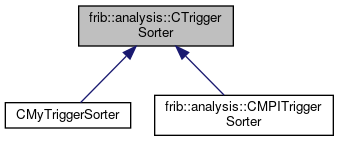

do not remove this div, it is closed by doxygen! 
|  |
| --- |
| FRIBParallelanalysis1.0FrameworkforMPIParalleldataanalysisatFRIB |

 end header part 
 Generated by Doxygen 1.8.13 

 window showing the filter options 

 iframe showing the search results (closed by default) 

- **frib**
- **analysis**
- [[CTriggerSorter|https://github.com/FRIBDAQ/docs/tree/main/apipeline/classfrib_1_1analysis_1_1CTriggerSorter.md]]

 top 
[Public Member Functions](#pub-methods) |
[[List of all members|https://github.com/FRIBDAQ/docs/tree/main/apipeline/classfrib_1_1analysis_1_1CTriggerSorter-members.md]]

frib::analysis::CTriggerSorter Class Referenceabstract

header
`#include <TriggerSorter.h>`

Inheritance diagram for frib::analysis::CTriggerSorter:

[[[legend|https://github.com/FRIBDAQ/docs/tree/main/apipeline/graph_legend.md]]]

|  |  |
| --- | --- |
| Public Member Functions |
|  | CTriggerSorter() |
|  |
| virtual | ~CTriggerSorter() |
|  |
| void | addItem(pParameterItemitem) |
|  |
| void | flush() |
|  |
| virtual void | emitItem(pParameterItemitem)=0 |
|  |

## Detailed Description

[[CTriggerSorter|https://github.com/FRIBDAQ/docs/tree/main/apipeline/classfrib_1_1analysis_1_1CTriggerSorter.md]] has methods to add parameter ring items which may be out of order and then to emit ring items later in order.

This is implemented in a manner that does not depend on MPI so that ordinary unit tests can be used to verify the operation of the class. The idea is that addItem is called to add items to the sorting system. When one or more items can be emitted (because they have triggers sequential to the last emitted item), emitItem is called with those items.

emitItem is pure virtual so that derived classes can decide what to actually do with items that are sorted.

## Constructor & Destructor Documentation

## [◆](#a4217016984a1587df3402f82141f82b3)CTriggerSorter()

|  |  |  |  |  |
| --- | --- | --- | --- | --- |
| frib::analysis::CTriggerSorter::CTriggerSorter | ( |  | ) |  |

constructor The hardest part of the constructor is initializing the last emitted trigger... we emit it to 0-1 unsigned so that it + 1 (0) is the next trigger.

## [◆](#a293115c2fe7b7a84147fbccd3b4e1331)~CTriggerSorter()

|  |  |  |  |  |  |  |
| --- | --- | --- | --- | --- | --- | --- |
| frib::analysis::CTriggerSorter::~CTriggerSorter() | frib::analysis::CTriggerSorter::~CTriggerSorter | ( |  | ) |  | virtual |
| frib::analysis::CTriggerSorter::~CTriggerSorter | ( |  | ) |  |

destructor

Delete any remaining items.

## Member Function Documentation

## [◆](#a9ab0b37fe9ee4bb265289c53d4183207)addItem()

|  |  |  |  |  |  |
| --- | --- | --- | --- | --- | --- |
| void frib::analysis::CTriggerSorter::addItem | ( | pParameterItem | item | ) |  |

addItem

- If the item is the next trigger just emit it. otherwise shove it into m_items indexed by trigger#
- while the map is not empty and the 'first' item's trigger is sequential, emit it and remove it from the map. A bit on ownereship Ownership of the item is ours and passes to emitItem or whatever it does. Note that in most of the frameworks we put his class into, delete should should be called by emitItem to get rid of the item. - Parameters
    |  |  |
    | --- | --- |
    | item | pointer to the item to add/sort/emit. |
  - Note
    the 'sorting' via the map is amortized O(nLog(m)) where m is the number of in-flight items and n is the total number of items.

## [◆](#a36693571b3cd711315ba9eb2204e4622)flush()

|  |  |  |  |  |
| --- | --- | --- | --- | --- |
| void frib::analysis::CTriggerSorter::flush | ( |  | ) |  |

flush flush all elements of m_items -> emitItem

- Note
  that at the end of this m_items will be empty.

  if the application operates properly, this should not really do anything as the application is supposed to hand us empty parameter item placeholders for events that were software filtered out.

---

The documentation for this class was generated from the following files:- base/[[TriggerSorter.h|https://github.com/FRIBDAQ/docs/tree/main/apipeline/TriggerSorter_8h_source.md]]
- base/[[TriggerSorter.cpp|https://github.com/FRIBDAQ/docs/tree/main/apipeline/TriggerSorter_8cpp.md]]

 contents 
 start footer part 

---

Generated by   1.8.13
