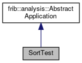
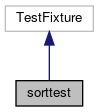

do not remove this div, it is closed by doxygen! 
|  |
| --- |
| FRIBParallelanalysis1.0FrameworkforMPIParalleldataanalysisatFRIB |

 end header part 
 Generated by Doxygen 1.8.13 

 window showing the filter options 

 iframe showing the search results (closed by default)

 top 
[Public Member Functions](#pub-methods) |
[Protected Member Functions](#pro-methods) |
[[List of all members|classsorttest-members]]

sorttest Class Reference

header
Inheritance diagram for sorttest:

[[[legend|graph_legend]]]

Collaboration diagram for sorttest:

[[[legend|graph_legend]]]

|  |  |
| --- | --- |
| Public Member Functions |
| void | setUp() |
|  |
| void | tearDown() |
|  |

|  |  |
| --- | --- |
| Protected Member Functions |
| void | construct_1() |
|  |
| void | construct_2() |
|  |
| void | add_1() |
|  |
| void | add_2() |
|  |
| void | add_3() |
|  |
| void | add_4() |
|  |
| void | flush_1() |
|  |
| void | flush_2() |
|  |

---

The documentation for this class was generated from the following file:- base/[[sorttests.cpp|sorttests_8cpp]]

 contents 
 start footer part 

---

Generated by   1.8.13
