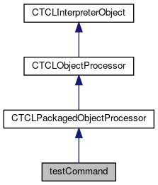

do not remove this div, it is closed by doxygen! 
|  |
| --- |
| FRIBParallelanalysis1.0FrameworkforMPIParalleldataanalysisatFRIB |

 end header part 
 Generated by Doxygen 1.8.13 

 window showing the filter options 

 iframe showing the search results (closed by default)

 top 
[Public Member Functions](#pub-methods) |
[List of all members](https://github.com/FRIBDAQ/docs/tree/main/apipeline/classtestCommand-members.md)

testCommand Class Reference

header
Inheritance diagram for testCommand:

[[legend](https://github.com/FRIBDAQ/docs/tree/main/apipeline/graph_legend.md)]

Collaboration diagram for testCommand:

[[legend](https://github.com/FRIBDAQ/docs/tree/main/apipeline/graph_legend.md)]

|  |  |
| --- | --- |
| Public Member Functions |
|  | testCommand(CTCLInterpreter&interp) |
|  |
| virtual int | operator()(CTCLInterpreter&interp, vector<CTCLObject> &objv) |
|  |
| CTCLObjectPackage* | package() |
|  |
| bool | isInitialized() const |
|  |
| virtual void | Initialize() |
|  |
| Public Member Functions inherited fromCTCLPackagedObjectProcessor |
|  | CTCLPackagedObjectProcessor(CTCLInterpreter&interp, std::string command, bool registerMe=true) |
|  |
| virtual | ~CTCLPackagedObjectProcessor() |
|  |
| void | onAttach(CTCLObjectPackage*package) |
|  |
| Public Member Functions inherited fromCTCLObjectProcessor |
|  | CTCLObjectProcessor(CTCLInterpreter&interp, std::string name, bool registerMe=true) |
|  |
| virtual | ~CTCLObjectProcessor() |
|  |
| void | Register() |
|  |
| Tcl_Command | RegisterAs(std::string name) |
|  |
| void | unregister() |
|  |
| void | unregisterAs(Tcl_Command token) |
|  |
| std::string | getName() const |
|  |
| Tcl_CmdInfo | getInfo() const |
|  |
| Public Member Functions inherited fromCTCLInterpreterObject |
|  | CTCLInterpreterObject(CTCLInterpreter*pInterp) |
|  |
|  | CTCLInterpreterObject(constCTCLInterpreterObject&aCTCLInterpreterObject) |
|  |
| CTCLInterpreterObject& | operator=(constCTCLInterpreterObject&aCTCLInterpreterObject) |
|  |
| int | operator==(constCTCLInterpreterObject&aCTCLInterpreterObject) const |
|  |
| CTCLInterpreter* | getInterpreter() const |
|  |
| CTCLInterpreter* | Bind(CTCLInterpreter&rBinding) |
|  |
| CTCLInterpreter* | Bind(CTCLInterpreter*pBinding) |
|  |

|  |  |
| --- | --- |
| Additional Inherited Members |
| Protected Member Functions inherited fromCTCLPackagedObjectProcessor |
| CTCLObjectPackage* | getPackage() |
|  |
| Protected Member Functions inherited fromCTCLObjectProcessor |
| virtual int | operator()(CTCLInterpreter&interp, std::vector<CTCLObject> &objv)=0 |
|  |
| virtual void | onUnregister() |
|  |
| void | bindAll(CTCLInterpreter&interp, std::vector<CTCLObject> &objv) |
|  |
| void | requireAtLeast(std::vector<CTCLObject> &objv, unsigned n, const char *msg=0) const |
|  |
| void | requireAtMost(std::vector<CTCLObject> &objv, unsigned n, const char *msg=0) const |
|  |
| void | requireExactly(std::vector<CTCLObject> &objv, unsigned n, const char *msg=0) const |
|  |
| Protected Member Functions inherited fromCTCLInterpreterObject |
| CTCLInterpreter* | AssertIfNotBound() |
|  |

## Member Function Documentation

## [◆](#a6f085e980b062a895cf423e1c2c4aa9e)Initialize()

|  |  |  |  |  |  |  |
| --- | --- | --- | --- | --- | --- | --- |
| void testCommand::Initialize() | void testCommand::Initialize | ( |  | ) |  | virtual |
| void testCommand::Initialize | ( |  | ) |  |

Default initialize is null. The derived class can override this however:

Reimplemented from [CTCLPackagedObjectProcessor](https://github.com/FRIBDAQ/docs/tree/main/apipeline/classCTCLPackagedObjectProcessor.md#a94fc3403370d17a1762cf286ec71ef96).

---

The documentation for this class was generated from the following file:- libtclplus/tclplus/packagetests.cpp

 contents 
 start footer part 

---

Generated by   1.8.13
