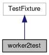

do not remove this div, it is closed by doxygen! 
|  |
| --- |
| FRIBParallelanalysis1.0FrameworkforMPIParalleldataanalysisatFRIB |

 end header part 
 Generated by Doxygen 1.8.13 

 window showing the filter options 

 iframe showing the search results (closed by default)

 top 
[Public Member Functions](#pub-methods) |
[Protected Member Functions](#pro-methods) |
[[List of all members|classworker2test-members]]

worker2test Class Reference

header
Inheritance diagram for worker2test:

[[[legend|graph_legend]]]

Collaboration diagram for worker2test:

[[[legend|graph_legend]]]

|  |  |
| --- | --- |
| Public Member Functions |
| void | setUp() |
|  |
| void | tearDown() |
|  |

|  |  |
| --- | --- |
| Protected Member Functions |
| void | count_1() |
|  |
| void | params_1() |
|  |
| void | params_2() |
|  |
| void | params_3() |
|  |
| void | vars_1() |
|  |
| void | vars_2() |
|  |
| void | vars_3() |
|  |
| void | state_1() |
|  |
| void | state_2() |
|  |
| void | data_1() |
|  |
| void | data_2() |
|  |

---

The documentation for this class was generated from the following file:- base/[[worker2tests.cpp|worker2tests_8cpp]]

 contents 
 start footer part 

---

Generated by   1.8.13
