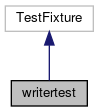

do not remove this div, it is closed by doxygen! 
|  |
| --- |
| FRIBParallelanalysis1.0FrameworkforMPIParalleldataanalysisatFRIB |

 end header part 
 Generated by Doxygen 1.8.13 

 window showing the filter options 

 iframe showing the search results (closed by default)

 top 
[Public Member Functions](#pub-methods) |
[Protected Member Functions](#pro-methods) |
[[List of all members|classwritertest-members]]

writertest Class Reference

header
Inheritance diagram for writertest:

[[[legend|graph_legend]]]

Collaboration diagram for writertest:

[[[legend|graph_legend]]]

|  |  |
| --- | --- |
| Public Member Functions |
| void | setUp() |
|  |
| void | tearDown() |
|  |

|  |  |
| --- | --- |
| Protected Member Functions |
| void | construct_1() |
|  |
| void | construct_2() |
|  |
| void | construct_3() |
|  |
| void | construct_4() |
|  |
| void | construct_5() |
|  |
| void | construct_6() |
|  |
| void | construct_7() |
|  |
| void | write_1() |
|  |
| void | write_2() |
|  |
| void | write_3() |
|  |
| void | writepars_1() |
|  |
| void | writepars_2() |
|  |

## Member Function Documentation

## [◆](#a6619ac6a119e7238f5602eca2e0d78fe)construct_3()

|  |  |  |  |  |  |  |
| --- | --- | --- | --- | --- | --- | --- |
| void writertest::construct_3() | void writertest::construct_3 | ( |  | ) |  | protected |
| void writertest::construct_3 | ( |  | ) |  |

Params:

Variables:

## [◆](#ab5c46cef7a18ad59146356b705cb6bf2)construct_4()

|  |  |  |  |  |  |  |
| --- | --- | --- | --- | --- | --- | --- |
| void writertest::construct_4() | void writertest::construct_4 | ( |  | ) |  | protected |
| void writertest::construct_4 | ( |  | ) |  |

Params:

---

The documentation for this class was generated from the following file:- base/[[writertests.cpp|writertests_8cpp]]

 contents 
 start footer part 

---

Generated by   1.8.13
