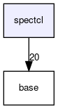

do not remove this div, it is closed by doxygen! 
|  |
| --- |
| FRIBParallelanalysis1.0FrameworkforMPIParalleldataanalysisatFRIB |

 end header part 
 Generated by Doxygen 1.8.13 

 window showing the filter options 

 iframe showing the search results (closed by default) 

- [[dir_18495d4159aaa38323f4c7ea9307a4f7]]

 top 
spectcl Directory Reference

header
Directory dependency graph for spectcl:

|  |  |
| --- | --- |
| Files |
| file | Analyzer.cpp |
|  | : Implement CAnalyzer stub class. |
|  |
| file | Analyzer.h[code] |
|  | : Stub replacement for SpecTcl CAnalyzer class. |
|  |
| file | BufferDecoder.cpp |
|  | : Implement the stubbed CBufferDecoder class |
|  |
| file | BufferDecoder.h[code] |
|  | : Stub Buffer Decoder. |
|  |
| file | Event.cpp |
|  | : Implementfrib::analysis::CEvent |
|  |
| file | Event.h[code] |
|  | : Stubbed CEvent for parallel analysis. |
|  |
| file | EventProcessor.h[code] |
|  | : Stand in for SpecTcl Event processor base class. |
|  |
| file | spectclTest.cpp |
|  | : Full MPI integration test of SpecTcl event processor. |
|  |
| file | SpecTclWorker.cpp |
|  | : Implement the CSpecTclWorker class. |
|  |
| file | testSpecTcl.cpp |
|  | : Test contents of file made by spectclTest program. |
|  |
| file | workerTest.cpp |
|  | : Unit tests for CSpecTclWorker |
|  |

 contents 
 start footer part 

---

Generated by   1.8.13
