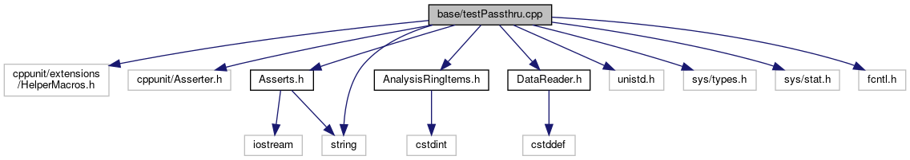

do not remove this div, it is closed by doxygen! 
|  |
| --- |
| FRIBParallelanalysis1.0FrameworkforMPIParalleldataanalysisatFRIB |

 end header part 
 Generated by Doxygen 1.8.13 

 window showing the filter options 

 iframe showing the search results (closed by default) 

- [[dir_e914ee4d4a44400f1fdb170cb4ead18a]]

 top 
[Classes](#nested-classes) |
[Functions](#func-members) |
[Variables](#var-members)

testPassthru.cpp File Reference

header
: Check the file passthruTest created.  
[More...](#details)

`#include <cppunit/extensions/HelperMacros.h>`  

`#include <cppunit/Asserter.h>`  

`#include "Asserts.h"`  

`#include "AnalysisRingItems.h"`  

`#include "DataReader.h"`  

`#include <unistd.h>`  

`#include <sys/types.h>`  

`#include <sys/stat.h>`  

`#include <fcntl.h>`  

`#include <string>`

Include dependency graph for testPassthru.cpp:

|  |  |
| --- | --- |
| Classes |
| class | passthrutest |
|  |

|  |  |
| --- | --- |
| Functions |
|  | CPPUNIT_TEST_SUITE_REGISTRATION(passthrutest) |
|  |

|  |  |
| --- | --- |
| Variables |
| std::string | outfile |
|  |

## Detailed Description

: Check the file passthruTest created.

 contents 
 start footer part 

---

Generated by   1.8.13
