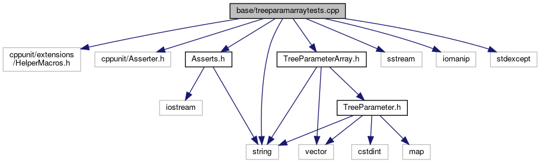

do not remove this div, it is closed by doxygen! 
|  |
| --- |
| FRIBParallelanalysis1.0FrameworkforMPIParalleldataanalysisatFRIB |

 end header part 
 Generated by Doxygen 1.8.13 

 window showing the filter options 

 iframe showing the search results (closed by default) 

- [[dir_e914ee4d4a44400f1fdb170cb4ead18a]]

 top 
[Classes](#nested-classes) |
[Macros](#define-members) |
[Functions](#func-members)

treeparamarraytests.cpp File Reference

header
: Tests [[classfrib_1_1analysis_1_1CTreeParameterArray]]
[More...](#details)

`#include <cppunit/extensions/HelperMacros.h>`  

`#include <cppunit/Asserter.h>`  

`#include "Asserts.h"`  

`#include "TreeParameterArray.h"`  

`#include <sstream>`  

`#include <iomanip>`  

`#include <string>`  

`#include <stdexcept>`

Include dependency graph for treeparamarraytests.cpp:

|  |  |
| --- | --- |
| Classes |
| class | TPATest |
|  |

|  |  |
| --- | --- |
| Macros |
| #define | privatepublic |
|  |

|  |  |
| --- | --- |
| Functions |
|  | CPPUNIT_TEST_SUITE_REGISTRATION(TPATest) |
|  |

## Detailed Description

: Tests [[classfrib_1_1analysis_1_1CTreeParameterArray]]

 contents 
 start footer part 

---

Generated by   1.8.13
