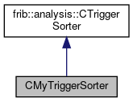

do not remove this div, it is closed by doxygen! 
|  |
| --- |
| FRIBParallelanalysis1.0FrameworkforMPIParalleldataanalysisatFRIB |

 end header part 
 Generated by Doxygen 1.8.13 

 window showing the filter options 

 iframe showing the search results (closed by default)

 top 
[Public Member Functions](#pub-methods) |
[Public Attributes](#pub-attribs) |
[[structCMyTriggerSorter-members]]

CMyTriggerSorter Struct Reference

header
Inheritance diagram for CMyTriggerSorter:

[[[graph_legend]]]

Collaboration diagram for CMyTriggerSorter:

[[[graph_legend]]]

|  |  |
| --- | --- |
| Public Member Functions |
| virtual void | emitItem(pParameterItemitem) |
|  |
| Public Member Functions inherited fromfrib::analysis::CTriggerSorter |
|  | CTriggerSorter() |
|  |
| virtual | ~CTriggerSorter() |
|  |
| void | addItem(pParameterItemitem) |
|  |
| void | flush() |
|  |

|  |  |
| --- | --- |
| Public Attributes |
| std::vector< std::uint64_t > | m_triggers |
|  |

---

The documentation for this struct was generated from the following file:- base/[[sorttests_8cpp]]

 contents 
 start footer part 

---

Generated by   1.8.13
