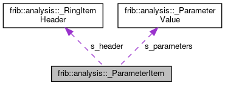

do not remove this div, it is closed by doxygen! 
|  |
| --- |
| FRIBParallelanalysis1.0FrameworkforMPIParalleldataanalysisatFRIB |

 end header part 
 Generated by Doxygen 1.8.13 

 window showing the filter options 

 iframe showing the search results (closed by default) 

- **frib**
- **analysis**
- [[structfrib_1_1analysis_1_1__ParameterItem]]

 top 
[Public Attributes](#pub-attribs) |
[[structfrib_1_1analysis_1_1__ParameterItem-members]]

frib::analysis::_ParameterItem Struct Reference

header
Collaboration diagram for frib::analysis::_ParameterItem:

[[[graph_legend]]]

|  |  |
| --- | --- |
| Public Attributes |
| RingItemHeader | s_header |
|  |
| std::uint64_t | s_triggerCount |
|  |
| std::uint32_t | s_parameterCount |
|  |
| ParameterValue | s_parameters[0] |
|  |

---

The documentation for this struct was generated from the following file:- base/[[AnalysisRingItems_8h_source]]

 contents 
 start footer part 

---

Generated by   1.8.13
