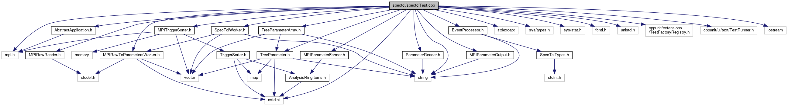

do not remove this div, it is closed by doxygen! 
|  |
| --- |
| FRIBParallelanalysis1.0FrameworkforMPIParalleldataanalysisatFRIB |

 end header part 
 Generated by Doxygen 1.8.13 

 window showing the filter options 

 iframe showing the search results (closed by default) 

- [[dir_18495d4159aaa38323f4c7ea9307a4f7]]

 top 
[Classes](#nested-classes) |
[Functions](#func-members) |
[Variables](#var-members)

spectclTest.cpp File Reference

header
: Full MPI integration test of SpecTcl event processor.  
[More...](#details)

`#include "AbstractApplication.h"`  

`#include "SpecTclWorker.h"`  

`#include "EventProcessor.h"`  

`#include <MPIRawToParametersWorker.h>`  

`#include <MPIParameterFarmer.h>`  

`#include <MPIParameterOutput.h>`  

`#include <MPITriggerSorter.h>`  

`#include <MPIRawReader.h>`  

`#include <TreeParameter.h>`  

`#include <TreeParameterArray.h>`  

`#include <ParameterReader.h>`  

`#include <string>`  

`#include <stdexcept>`  

`#include <cstdint>`  

`#include <sys/types.h>`  

`#include <sys/stat.h>`  

`#include <fcntl.h>`  

`#include <unistd.h>`  

`#include <mpi.h>`  

`#include <cppunit/extensions/TestFactoryRegistry.h>`  

`#include <cppunit/ui/text/TestRunner.h>`  

`#include <iostream>`

Include dependency graph for spectclTest.cpp:

|  |  |
| --- | --- |
| Classes |
| class | DummyParameterReader |
|  |
| class | Raw |
|  |
| class | Sum |
|  |
| class | Application |
|  |

|  |  |
| --- | --- |
| Functions |
| void | runTests(const std::string &fname) |
|  |
| int | main(int argc, char **argv) |
|  |

|  |  |
| --- | --- |
| Variables |
| const std::uint32_t | BEGIN_RUN= 1 |
|  |
| const std::uint32_t | END_RUN= 2 |
|  |
| const std::uint32_t | PHYSICS_EVENT= 30 |
|  |
| const size_t | NUM_EVENTS=10000 |
|  |
| std::string | testFile |
|  |

## Detailed Description

: Full MPI integration test of SpecTcl event processor.

 contents 
 start footer part 

---

Generated by   1.8.13
