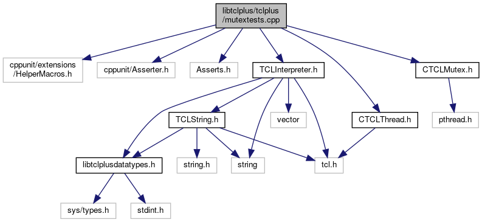

do not remove this div, it is closed by doxygen! 
|  |
| --- |
| FRIBParallelanalysis1.0FrameworkforMPIParalleldataanalysisatFRIB |

 end header part 
 Generated by Doxygen 1.8.13 

 window showing the filter options 

 iframe showing the search results (closed by default) 

- [libtclplus](https://github.com/FRIBDAQ/docs/tree/main/apipeline/dir_4b82a50f27f43da3ef4ad81c5c8f36d1.md)
- [tclplus](https://github.com/FRIBDAQ/docs/tree/main/apipeline/dir_c948a11158a47e9d05fa31773eff393c.md)

 top 
[Classes](#nested-classes) |
[Functions](#func-members)

mutextests.cpp File Reference

header
: Test CTCLMutex.  
[More...](#details)

`#include <cppunit/extensions/HelperMacros.h>`  

`#include <cppunit/Asserter.h>`  

`#include "Asserts.h"`  

`#include <CTCLThread.h>`  

`#include <CTCLMutex.h>`  

`#include <TCLInterpreter.h>`

Include dependency graph for mutextests.cpp:

|  |  |
| --- | --- |
| Classes |
| class | mutextests |
|  |

|  |  |
| --- | --- |
| Functions |
|  | CPPUNIT_TEST_SUITE_REGISTRATION(mutextests) |
|  |

## Detailed Description

: Test CTCLMutex.

 contents 
 start footer part 

---

Generated by   1.8.13
