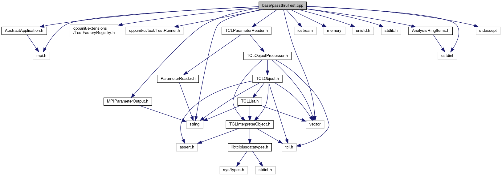

do not remove this div, it is closed by doxygen! 
|  |
| --- |
| FRIBParallelanalysis1.0FrameworkforMPIParalleldataanalysisatFRIB |

 end header part 
 Generated by Doxygen 1.8.13 

 window showing the filter options 

 iframe showing the search results (closed by default) 

- [[base|dir_e914ee4d4a44400f1fdb170cb4ead18a]]

 top 
[Classes](#nested-classes) |
[Functions](#func-members) |
[Variables](#var-members)

passthruTest.cpp File Reference

header
: Test passthrough ring items.  
[More...](#details)

`#include <AbstractApplication.h>`  

`#include <cppunit/extensions/TestFactoryRegistry.h>`  

`#include <cppunit/ui/text/TestRunner.h>`  

`#include <string>`  

`#include <iostream>`  

`#include <vector>`  

`#include <memory>`  

`#include <mpi.h>`  

`#include <unistd.h>`  

`#include <stdlib.h>`  

`#include <cstdint>`  

`#include <stdexcept>`  

`#include "AnalysisRingItems.h"`  

`#include "TCLParameterReader.h"`  

`#include "MPIParameterOutput.h"`

Include dependency graph for passthruTest.cpp:

|  |  |
| --- | --- |
| Classes |
| class | Application |
|  |

|  |  |
| --- | --- |
| Functions |
| int | main(int argc, char **argv) |
|  |

|  |  |
| --- | --- |
| Variables |
| std::string | outfile |
|  |

## Detailed Description

: Test passthrough ring items.

 contents 
 start footer part 

---

Generated by   1.8.13
