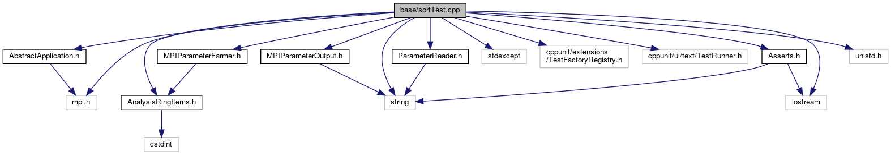

do not remove this div, it is closed by doxygen! 
|  |
| --- |
| FRIBParallelanalysis1.0FrameworkforMPIParalleldataanalysisatFRIB |

 end header part 
 Generated by Doxygen 1.8.13 

 window showing the filter options 

 iframe showing the search results (closed by default) 

- [[base|https://github.com/FRIBDAQ/docs/tree/main/apipeline/dir_e914ee4d4a44400f1fdb170cb4ead18a.md]]

 top 
[Classes](#nested-classes) |
[Functions](#func-members) |
[Variables](#var-members)

sortTest.cpp File Reference

header
: Run the MPIParameterFarmer in the framework.  
[More...](#details)

`#include "AbstractApplication.h"`  

`#include "AnalysisRingItems.h"`  

`#include "MPIParameterFarmer.h"`  

`#include "MPIParameterOutput.h"`  

`#include "ParameterReader.h"`  

`#include <mpi.h>`  

`#include <stdexcept>`  

`#include <cppunit/extensions/TestFactoryRegistry.h>`  

`#include <cppunit/ui/text/TestRunner.h>`  

`#include <string>`  

`#include <iostream>`  

`#include <Asserts.h>`  

`#include <unistd.h>`

Include dependency graph for sortTest.cpp:

|  |  |
| --- | --- |
| Classes |
| class | SortTest |
|  |
| class | CDummyReader |
|  |

|  |  |
| --- | --- |
| Functions |
| int | main(int argc, char **argv) |
|  |

|  |  |
| --- | --- |
| Variables |
| std::string | testFile |
|  |

## Detailed Description

: Run the MPIParameterFarmer in the framework.

 contents 
 start footer part 

---

Generated by   1.8.13
