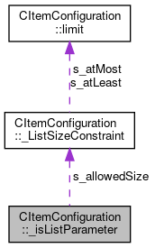

do not remove this div, it is closed by doxygen! 
|  |
| --- |
| FRIBParallelanalysis1.0FrameworkforMPIParalleldataanalysisatFRIB |

 end header part 
 Generated by Doxygen 1.8.13 

 window showing the filter options 

 iframe showing the search results (closed by default) 

- [[CItemConfiguration|classCItemConfiguration]]
- [[_isListParameter|structCItemConfiguration_1_1__isListParameter]]

 top 
[Public Attributes](#pub-attribs) |
[[List of all members|structCItemConfiguration_1_1__isListParameter-members]]

CItemConfiguration::_isListParameter Struct Reference

header
Collaboration diagram for CItemConfiguration::_isListParameter:

[[[legend|graph_legend]]]

|  |  |
| --- | --- |
| Public Attributes |
| ListSizeConstraint | s_allowedSize |
|  |
| TypeCheckInfo | s_checker |
|  |

---

The documentation for this struct was generated from the following file:- libtclplus/include/tclplus/[[CItemConfiguration.h|CItemConfiguration_8h_source]]

 contents 
 start footer part 

---

Generated by   1.8.13
