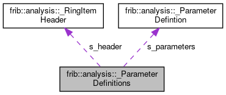

do not remove this div, it is closed by doxygen! 
|  |
| --- |
| FRIBParallelanalysis1.0FrameworkforMPIParalleldataanalysisatFRIB |

 end header part 
 Generated by Doxygen 1.8.13 

 window showing the filter options 

 iframe showing the search results (closed by default) 

- **frib**
- **analysis**
- [[_ParameterDefinitions|structfrib_1_1analysis_1_1__ParameterDefinitions]]

 top 
[Public Attributes](#pub-attribs) |
[[List of all members|structfrib_1_1analysis_1_1__ParameterDefinitions-members]]

frib::analysis::_ParameterDefinitions Struct Reference

header
`#include <AnalysisRingItems.h>`

Collaboration diagram for frib::analysis::_ParameterDefinitions:

[[[legend|graph_legend]]]

|  |  |
| --- | --- |
| Public Attributes |
| RingItemHeader | s_header |
|  |
| std::uint32_t | s_numParameters |
|  |
| ParameterDefinition | s_parameters[0] |
|  |

## Detailed Description

parameter defintion ring item sizeof is not useful.

---

The documentation for this struct was generated from the following file:- base/[[AnalysisRingItems.h|AnalysisRingItems_8h_source]]

 contents 
 start footer part 

---

Generated by   1.8.13
