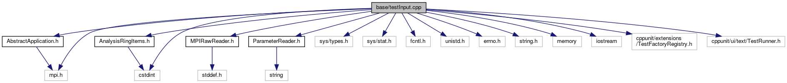

do not remove this div, it is closed by doxygen! 
|  |
| --- |
| FRIBParallelanalysis1.0FrameworkforMPIParalleldataanalysisatFRIB |

 end header part 
 Generated by Doxygen 1.8.13 

 window showing the filter options 

 iframe showing the search results (closed by default) 

- [[base|dir_e914ee4d4a44400f1fdb170cb4ead18a]]

 top 
[Classes](#nested-classes) |
[Functions](#func-members) |
[Variables](#var-members)

testInput.cpp File Reference

header
: Test the input stage of an application (MPIRawREader).  
[More...](#details)

`#include "AbstractApplication.h"`  

`#include "AnalysisRingItems.h"`  

`#include "MPIRawReader.h"`  

`#include "ParameterReader.h"`  

`#include <mpi.h>`  

`#include <sys/types.h>`  

`#include <sys/stat.h>`  

`#include <fcntl.h>`  

`#include <unistd.h>`  

`#include <errno.h>`  

`#include <string.h>`  

`#include <memory>`  

`#include <cstdint>`  

`#include <iostream>`  

`#include <cppunit/extensions/TestFactoryRegistry.h>`  

`#include <cppunit/ui/text/TestRunner.h>`

Include dependency graph for testInput.cpp:

|  |  |
| --- | --- |
| Classes |
| class | NullParameters |
|  |
| class | MyApp |
|  |

|  |  |
| --- | --- |
| Functions |
| int | main(int argc, char **argv) |
|  |

|  |  |
| --- | --- |
| Variables |
| unsigned | NUM_DATAITEMS=1000 |
|  |
| std::string | testFilename |
|  |

## Detailed Description

: Test the input stage of an application (MPIRawREader).

 contents 
 start footer part 

---

Generated by   1.8.13
