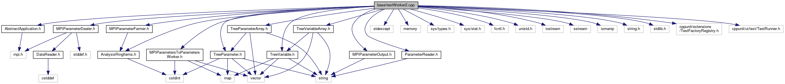

do not remove this div, it is closed by doxygen! 
|  |
| --- |
| FRIBParallelanalysis1.0FrameworkforMPIParalleldataanalysisatFRIB |

 end header part 
 Generated by Doxygen 1.8.13 

 window showing the filter options 

 iframe showing the search results (closed by default) 

- [[base|dir_e914ee4d4a44400f1fdb170cb4ead18a]]

 top 
[Classes](#nested-classes) |
[Functions](#func-members) |
[Variables](#var-members)

testWorker2.cpp File Reference

header
: Tests for parameters –> parameters worker(s).  
[More...](#details)

`#include "AbstractApplication.h"`  

`#include "MPIParameterDealer.h"`  

`#include "MPIParametersToParametersWorker.h"`  

`#include "MPIParameterFarmer.h"`  

`#include "MPIParameterOutput.h"`  

`#include "ParameterReader.h"`  

`#include "AnalysisRingItems.h"`  

`#include "TreeParameter.h"`  

`#include "TreeParameterArray.h"`  

`#include "TreeVariable.h"`  

`#include "TreeVariableArray.h"`  

`#include <stdexcept>`  

`#include <memory>`  

`#include <sys/types.h>`  

`#include <sys/stat.h>`  

`#include <fcntl.h>`  

`#include <unistd.h>`  

`#include <iostream>`  

`#include <sstream>`  

`#include <iomanip>`  

`#include <string.h>`  

`#include <stdlib.h>`  

`#include <cppunit/extensions/TestFactoryRegistry.h>`  

`#include <cppunit/ui/text/TestRunner.h>`

Include dependency graph for testWorker2.cpp:

|  |  |
| --- | --- |
| Classes |
| class | MyWorker |
|  |
| class | MyApp |
|  |
| class | MyReader |
|  |

|  |  |
| --- | --- |
| Functions |
| const std::uint32_t | BEGIN_RUN(1) |
|  |
| const std::uint32_t | END_RUN(2) |
|  |
| const std::uint32_t | EVENT_COUNT(10000) |
|  |
| void | runTests(const char *outputFile, unsigned numEvents) |
|  |
| int | main(int argc, char **argv) |
|  |

|  |  |
| --- | --- |
| Variables |
| std::string | outputFile |
|  |
| unsigned | numEvents |
|  |

## Detailed Description

: Tests for parameters –> parameters worker(s).

 contents 
 start footer part 

---

Generated by   1.8.13
