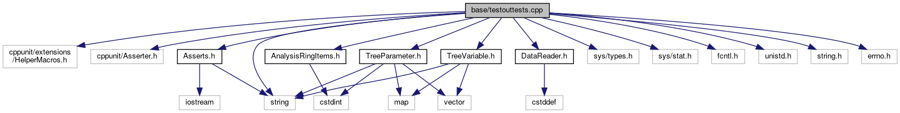

do not remove this div, it is closed by doxygen! 
|  |
| --- |
| FRIBParallelanalysis1.0FrameworkforMPIParalleldataanalysisatFRIB |

 end header part 
 Generated by Doxygen 1.8.13 

 window showing the filter options 

 iframe showing the search results (closed by default) 

- [base](https://github.com/FRIBDAQ/docs/tree/main/apipeline/dir_e914ee4d4a44400f1fdb170cb4ead18a.md)

 top 
[Classes](#nested-classes) |
[Macros](#define-members) |
[Functions](#func-members) |
[Variables](#var-members)

testouttests.cpp File Reference

header
: Tests for the success of the testOutput parallel program.  
[More...](#details)

`#include <cppunit/extensions/HelperMacros.h>`  

`#include <cppunit/Asserter.h>`  

`#include "Asserts.h"`  

`#include "TreeParameter.h"`  

`#include "TreeVariable.h"`  

`#include "AnalysisRingItems.h"`  

`#include "DataReader.h"`  

`#include <string>`  

`#include <sys/types.h>`  

`#include <sys/stat.h>`  

`#include <fcntl.h>`  

`#include <unistd.h>`  

`#include <string.h>`  

`#include <errno.h>`

Include dependency graph for testouttests.cpp:

|  |  |
| --- | --- |
| Classes |
| class | outputtest |
|  |

|  |  |
| --- | --- |
| Macros |
| #define | privatepublic |
|  |

|  |  |
| --- | --- |
| Functions |
|  | CPPUNIT_TEST_SUITE_REGISTRATION(outputtest) |
|  |

|  |  |
| --- | --- |
| Variables |
| std::string | testFile |
|  |

## Detailed Description

: Tests for the success of the testOutput parallel program.

 contents 
 start footer part 

---

Generated by   1.8.13
