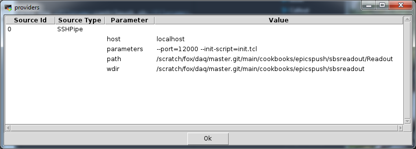

|  |  |  |
| --- | --- | --- |
| The NSCLDAQ cookbook |
| Prev |  | Next |


---

# <a name="ch.controlpush"></a>Chapter 6. 
            Including EPICS data in event files.

Both the SBS readout framework and the VMUSBReadout framework (as
            of 11.3-006), have the ability to log the values of Tcl variables
            in their main interpreters to text list ring items (MONITORED_VARIABLE)
            items.  This can be used to log the values of a selected set of
            EPICS parameters to the event file.

While setting this up is relatively simple, there are a lot of moving
            parts and some pitfalls.  Furthemore, the procedure is slightly
            different between SBSReadout and VMUSBReadout.   This chapter gives
            recipes for setting this up in both of those readout frameworks.


- [[*The SBS readout program.*|https://github.com/FRIBDAQ/docs/tree/main/cookbook/x848.md]]
                      describes how to setup the inclusion of epics data in event
                      data generated by the SBSReadout frameworks (note that
                      DDASReadout uses this framework).
- [[*The VMUSBReadout program.*|https://github.com/FRIBDAQ/docs/tree/main/cookbook/x848.md]]
                      describes how to include epics data in event data generated
                      by the VMUSBReadout program.

Regardless of the readout program there are some common, uniting
            principles.

All make use of the fact that readout programs can run a Tcl
            server allowing remote programs to poke commands into them.
            The controlpush program is then used
            to do exactly that.  Furthermore, as described above, the two
            readout programs described have mechanisms to log the values of
            tcl variables to event file.

Therefore the procedures is similar for both readout programs;
            They run a Tcl server.  controlpush is then
            used to maintain a set of variables.  At startup, the set of
            variables controlpush will maintain
            are declared as variables to log to the output event stream.
            Both programs support an `--init-script` which allows
            that initialization to take place.

# <a name="sec.epicssbs"></a>6.1. The SBS readout program.

The files described here are all in
                $DAQROOT/share/recipes/epicspush/sbsreadout.
                These files include a do-nothing Readout program you can use
                to test this procedures.  They also include
                dumper.out which shows the dump of
                one of the ring itesm this configuration will produce.

You need to:


- Create a text file that has the names of the EPICS channels
                          you want logged, one per line.  This file,
                          channels.dat, will be used as input
                          by controlpush to decide which
                          channels to monitor.  It will also be used when Readout
                          is initialized to setup the variables to be monitored.
- An `--init-script` to define the set of
                          variables that will be logged in ring items.
- A ReadoutCallouts.tcl file
                          that starts the controlpush
                          application in the system running one of the readouts.
- A shell script to run controlpush
                          with the appropriate environment variables defined
                          to support access to EPICS.  This script is
                          controlpush.sh

Let's look at channels.dat. It's really
                simple.  Each line contains the name of an EPICS channel to
                monitor.  In our case, we only look at a single channel:

<a name="AEN708"></a>```

Z001F-C
                
```

Stock this file with the values you care about.

Next, lets look at the initialization script init.tcl.
                This file reads the channels.dat file
                assumed to be in the working directory.  For each of the
                non empty lines in the file, it issues **runvar**
                commands to define the set of variables controlpush
                will create:

<a name="AEN715"></a>```

set f [open channels.dat r]
while {![eof $f]} {
    set line [gets $f]
    if {$line ne ""} {
        runvar EPICS_DATA($line)
        runvar EPICS_UNITS($line)
        runvar EPICS_UPDATED($line)
    }
}
puts "Monitored variables:"
puts [runvar -list]
close $f

                
```

controlpush maintains three arrays,
                each indexed by the channel name.
                `EPICS_DATA` will have the value of the
                channel, `EPICS_UNITS` will have the units string
                and `EPICS_UPDATED` will have the real-time at
                which the channel most recently changed value.

The script reads the channels.dat and for
                each non-empty line in that file creates a runvar for the
                three array elements above.

Before looking at ReadoutCallouts.tcl,
                let's look at controlpush.sh, a shell
                script that will be used to run the controlpush
                program.  This file is intended to be a command run over ssh.
                Here are its contents:

<a name="AEN728"></a>```

#!/bin/bash

. /etc/profile             # Define epics vars.
. /usr/opt/daq/11.3-006/daqsetup.bash  # Pick the version of NSCLDAQ

printenv |grep EPICS

$DAQBIN/controlpush -p12000 -i5 -nlocalhost   \
      /scratch/fox/daq/master.git/main/cookbooks/epicspush/sbsreadout/channels.dat

                
```

A script is needed because that's the only way to ensure that
                appropriate environment variables are set for the
                controlpush program.
                /etc/profile is sourced because it
                supplies system wide environment variables that are needed
                to access EPICS (e.g. EPICS gateway specifications) channels.

The appropriate version of NSCLDAQ's envirionment definition
                file is also sourced in so that we can use $DAQBIN
                to locate the controlpush program.

The command line parameters mean:


- `-p12000`
  Connect to  a TclServer that's listening on port
                              12000.  We'll talk later about how to set that up.
- `-i5`
  Update the monitored variables at an interval
                              of 5 seconds.
- `-nlocalhost`
  Indicates the program will connect to a Tcl server
                              int the local host. controlpush
                              will be run via an ssh pipe in the system in which
                              the Readout program is running.   This is because
                              the SBSReadout won't accept connections from a
                              remote host.
- `/scratch/fox/daq/master.git/main/cookbooks/epicspush/sbsreadout/channels.dat`
  The full path to the channels.dat
                              file.  The full path is needed because the
                              ssh pipe will run controlpush
                              in the home directory.  Naturally you'll need to change
                              this parameter to point to your own
                              channel names file.

Let's now look at the ReadoutCallouts.tcl
                    file:

<a name="AEN763"></a>```

package require Process                   

set readoutHost charlie                   

set here [file dirname [info script]]    

proc OnStart {} {                        
    puts "Killing old proc"
    Process ctlkill -command [list ssh $::readoutHost killall controlpush] 
    puts "Starting chanlog in host charlie - where Readout is"
    Process ctlpush -command [list  \         
       ssh $::readoutHost $::here/controlpush.sh
    ]
    puts "Running"
}

                    
```

Let's dissect this script line by line.

- [[|https://github.com/FRIBDAQ/docs/tree/main/cookbook/c665.md#epics.sbs.process]]
  the Process package is a package
                              that allows you to easily start subprocesses from
                              Tcl in a way that they are tracked and killed on normal
                              exit.  Subprocesses are run in a way that  also makes
                              it possible and easy to capture the xit of the program
                              you run.
  This line includes the code for the
                              Process package in your script.
- [[|https://github.com/FRIBDAQ/docs/tree/main/cookbook/c665.md#epics.sbs.readouthost]]
  I've parameterized where the readout will run so that
                              it's easy for you to change this script to suit your own
                              needs.  Just set `readoutHost`
                              to the host in which the Readout will run into which
                              you are going to push Epics channel values.
- [[|https://github.com/FRIBDAQ/docs/tree/main/cookbook/c665.md#epics.sbs.here]]
  The script that starts controlpush
                              will be located in the same directory as this script.
                              The code here figures out which directory this script
                              is located in.  Thus, for example, if you put this
                              script in ~/stagearea/experiment/current
                              but run $DAQBIN/ReadoutShell while
                              your current working directory is different,
                              the variable `here` will still
                              contain the name of the directory that holds the
                              script.
  `here` is global.  If you use this
                              trick for other scripts you might want to investigate
                              the Tcl **namespace** command which would
                              allow you to qualify the name of the variable with
                              a namespace name to make variable name collisions
                              less likely.  Similarly with `readoutHost`.
- [[|https://github.com/FRIBDAQ/docs/tree/main/cookbook/c665.md#epics.sbs.onstart]]
  `OnStart` is invoked when the
                              ReadoutShell is transitioning from Not Ready
                              to Halted.  This is the transition
                              that starts the data sources (readout programs).  We
                              will us it to kill off any stale instances of
                              controlpush and to start our new
                              instance.
- [[|https://github.com/FRIBDAQ/docs/tree/main/cookbook/c665.md#epics.sbs.kill]]
  This line spawns off a process to kill off any instances
                              of controlpush running in
                              the readout program's host that we've started.  This
                              is because while the Process package
                              does its best to do that on script exit it's not perfect
                              and there can be stranded controlpush
                              processes.
- [[|https://github.com/FRIBDAQ/docs/tree/main/cookbook/c665.md#epics.sbs.start]]
  This line starts the contrlpush.sh.
                              It's run over ssh
                              to place it in the same host as the
                              Readout program it will push into.
  Note that to reiterate the  the discussion of
                              controlpush.sh, running an ssh
                              pipe in this way, starts the script off in the user's
                              home directory, unless their login scripts change
                              that.

Now let's tie this all together.  We stil need to ensure that
                our Readout program will


- Start a Tcl server listening on the same port that
                          controlpush connects to.
- Sources our init.tcl intialization
                          script.

All this is done in the way we setup the data source.  Have
                a look at the screenshot from the data source list below:

<a name="AEN817"></a>

The key points to note are the use of
                `--port` and `--init-script`.

When `--port` is used it enables the SBS readout's
                Tcl server.  The parameter of the `--port` option
                is the port number on which that server wil listen for connections.
                By default, the Tcl server only accepts connections from
                localhost.  While this can be expanded,
                it's beyond the scope of this recipe.

When the `--init-script` option is present,
                it's value is the name of a Tcl script the main interpreter
                of SBSReadout will run after the program is initialized but before
                it can accept its first command.

So what do we get from all of this.  The following
                output from $DAQBIN/dumper is an
                example string list record:

<a name="AEN832"></a>```

-----------------------------------------------------------
Wed Oct 31 15:23:02 2018 : Documentation item Monitored VariablesBody Header:
Timestamp:    18446744073709551615
SourceID:     0
Barrier Type: 0
4 seconds in to the run
set EPICS_DATA(Z001F-C) 2.00364e-07
set EPICS_UNITS(Z001F-C) Amps
set EPICS_UPDATED(Z001F-C) {2018-10-31 15:22:57}
set run 0
set title {This is a test title}
                
```

This text is installed in the file
                $DAQROOT/share/recipes/epicspush/sbsreadout/dumper.out.

I want to point out a few things:


- These items are emitted after each scaler clock expires
                          but do not require scaler items to be emitted (you'll
                          get these even if you have no scaler segment).
- The item type is identified as a
                          Documentation item Monitored Variables
                          which corresponds to the ring item type in
                          DataFormat.h of
                          MONITORED_VARIABLES.
- In addition to the EPICS array elements for
                          the Z001F-C epics channel,
                          the run number and title are also automatically declared
                          as run variables.

---

|  |  |  |
| --- | --- | --- |
| Prev | Home | Next |
| Processing Event Built data |  | The VMUSBReadout program. |
