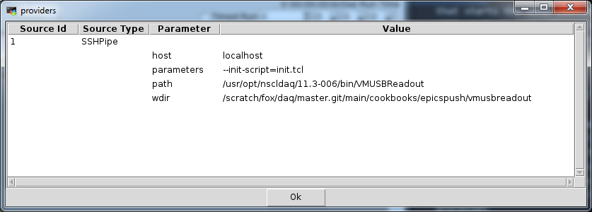

|  |  |  |
| --- | --- | --- |
| The NSCLDAQ cookbook |
| Prev | Chapter 6. Including EPICS data in event files. |  |


---

# <a name="sec.epicsvmusb"></a>6.2. The VMUSBReadout program.

If you've plowed through the previous section, much of what we
                do for the VMUSBReadout is identical.  The rest is similar.
                The differences arise because:


- What SBSReadout calls a **runvar**,
                          VMUSBReadout calls a **monvar**.
- The only Tcl server the VMUSBReadout has, built in is
                          for its slow control server thread.  We're going to need
                          to do a bit of extra work in init.tcl
                          to get one started in the main thread's interpreter.
- Less interesting, the title and run number are not
                          pre-declared as movar (though you can certainly add)
                          them and, when we describe init.tcl
                          I'll mention how to do that.

For completeness, and in case you didn't read the previous
                section, we'll describe ab initio how to get EPICS data pushed into
                a VMUSBReadout.

Here's the checklist that describes what you need to do again:

You need to:


- Create a text file that has the names of the EPICS channels
                          you want logged, one per line.  This file,
                          channels.dat, will be used as input
                          by controlpush to decide which
                          channels to monitor.  It will also be used when Readout
                          is initialized to setup the variables to be monitored.
- An `--init-script` to define the set of
                          variables that will be logged in ring items.  This script
                          will also need to start a Tcl server that the
                          controlpush program will connect
                          to to push its **set** commands.
- A ReadoutCallouts.tcl file
                          that starts the controlpush
                          application in the system running one of the readouts.
- A shell script to run controlpush
                          with the appropriate environment variables defined
                          to support access to EPICS.  This script is
                          controlpush.sh

All of the files described in this section are installed at
                $DAQROOT/share/recipes/epicspush/vmsusbreadout.

Lets start with channels.dat. For our example,
                it only specifies a single channel:

<a name="AEN887"></a>```

Z001F-C
                
```

You can edit this file to meet your needs, just put one channel
                per line with no trailing whitespace. You can also break up the
                file with empty lines.  Many of these restrictions are just
                the result of our simplistic parse of that file in
                init.tcl which we'll cover next.
                A more sophisticated parse of that file could make it suport
                all of the features supported by controlpush.

When VMUSBReadout starts, it must turn
                the contents channels.dat into  monitored
                variables.  It must also start a Tcl server that will accept
                connection from controlpush.

Let's annotate init.tcl:

<a name="AEN897"></a>```

set f [open channels.dat r]
while {![eof $f]} {
    set line [gets $f]
    if {$line ne ""} {
        monvar add EPICS_DATA($line)      
        monvar add EPICS_UNITS($line)
        monvar add EPICS_UPDATED($line)
    }
}
puts "Monitored variables:"
puts [monvar list]
close $f


#   Start a Tcl server:
lappend auto_path /usr/opt/daq/11.3-006/TclLibs 
package require TclServer                 

proc printError {ch cmd msg} {
    puts "Error : $msg executing '$cmd'"    
}

proc printConnection {sock ip port} {
    puts "Accepting connection from $ip on $port"  
    return 1
}

                                      

set server [TclServer %AUTO% -port 12000 -onconnect printConnection -onerror printError]
$server start

                
```

Bear with me as I take things a bit out of order.

[[|x848#epics.vmusb.monvars]]
                        This section of code creates **monvar**
                        variables for each of the three arrays that
                        controlpush will create for
                        each channel in the channels.dat.
                        If this part of the script is unclear, see the
                        discussion of init.tcl
                        in
                        [[*The SBS readout program.*|c665#sec.epicssbs]]
Note that the run title and run number are
                        held in the Tcl variables
                        `title` and
                        `run` respectively.  You can,
                        if you want, add these are **monvar**'s
                        so that they will be logged as with SBS Readout..

[[|x848#epics.vmusb.pkgpath]]
                        We're going to load a package from the NSCLDAQ
                        we are using.  Unfortunately, environment variables
                        are not propagated into data source programs by
                        ReadoutShell, so in this
                        **lappend** we specifically
                        choose a version of NSCLDAQ whose Tcl packages we'll
                        add to the package load path for Tcl.
                    An alternative is to run VMUSBReadout from inside
                        a script that source your ~/.bashrc
                        which, presumably sources script to define
                        $DAQROOT.  Then the path
                        in lappend can be specified by $::env(DAQROOT)/TclLibs.
                        (The `env` global array is indexed by
                        environment variable name and contains corresponding
                        environment variable values).

[[|x848#epics.vmusb.tclserverpkg]]
                        Here we include the TclServer
                        package.  This package provides an object oriented,
                        completely Tcl tcl server implementation.
                        We'll use that package to get a Tcl server started in the
                        main thread of the VMUSBReadout as that's the thread
                        that runs init.tcl (
                        `--init-script` files actually
                        ).
                    Next we'll skip ahead a bit first.

[[|x848#epics.vmusb.tclserverstart]]
                        The two lines below create a Tcl server.
                        The `-port` option indicates
                        it will listen on port 12000.
                        The script specified by `-onconnect` is called to
                        allow a connection.  Similarly, the script
                        specified by `-onerror` is called when
                        a tclserver client pushes a command that completes in error.
                    The **TclServer** command generates a
                        new command %AUTO% lets it choose the name
                        of this command, which is returned and stored in
                        `server`.  This new command is
                        how Tcl object oriented packages implement classes/objects.
                        The commansd returned is a command ensemble whose
                        subcommands invoke object methods.

The $server start line, asks the object
                        to run its `start` method and
                        that starts the server.  All server functions are driven
                        by the Tcl event loop which VMUSBReadout's main thread
                        runs.

Now we can skip back in the code to look at the scripts
                        that are called `-onconnect` and
                        `-onerror`

[[|x848#epics.vmusb.errorhandler]]
                        We specified this proc as the script to call
                        when a tclserver client pushed a command that completed in
                        error.  The Tclserver package appends three parameters
                        to this command (which just prints out an error message
                         on stdout):
                    

`ch`The channel open on the socket through which
                                    the tclserver client pushed the command.
                                    This allows the error handler to decide
                                    that the client is dangerous enough that
                                    the connection to it should be dropped.

`cmd`The full text of the command that
                                    caused the error.

`msg`The error message describing the error
                                    the command threw.

[[|x848#epics.vmusb.connectionhandler]]
                        This proc is specified as the `-onconnection`
                        script.  The Tclserver code calls this proc whenever
                        a connection is formed.  If the proc returns a Tcl false
                        value, the server code will close the connection.
                        If true,the Tcl server keeps the connection open.
                    This allows authentication, permission, challenge/response
                        to be implemented as a gatekeeper to connecting to the
                        Tclserver.  We do none of these.  We just
                        print out a message describing the connection.

The following values are appended to the
                        `-onconnection` script when it's called:


`sock`The socket that is connected with the
                                    client.  If a challenge response is implemented
                                    (e.g. using the Tcl SASL package), the
                                    challenges and resulting responses should
                                    go over this file descriptor.

Note that any challenge response scheme that
                                    is not event driven or lacks a timeout
                                    is vulnerable to a denial of service attack
                                    (suppose the client never responds to a challenge).

`ip`The IP address of the connecting client.

`port`The IP port on which the dataflow will occur..

To ensure that **controlpush** runs with appropriate
                environment variables defined,we need to  run it from a script
                that defines both EPICS and NSCLDAQ environment variables:

<a name="AEN992"></a>```

#!/bin/bash

. /etc/profile             # Define epics vars.
. /usr/opt/daq/11.3-006/daqsetup.bash  # Pick the version of NSCLDAQ

printenv |grep EPICS

$DAQBIN/controlpush -p12000 -i5 -nlocalhost /scratch/fox/daq/master.git/main/cookbooks/epicspush/vmusbreadout/channels.dat

                
```

Note that if the user's ~/.bashrc sources
                a daqsetup.bash from a specific
                version of NSCLDAQ it's better to source that rather than
                doing what we're doing here because then you'll automatically
                match whichever version of NSCLDAQ the experiment is using.

Next let's look at the ReadoutCalouts.tcl.  This is identical to
                the ReadoutCallouts.tcl of the SBS readout:

<a name="AEN998"></a>```

package require Process                   

set readoutHost charlie                   

set here [file dirname [info script]]    

proc OnStart {} {                        
    puts "Killing old proc"
    Process ctlkill -command [list ssh $::readoutHost killall controlpush] 
    puts "Starting chanlog in host charlie - where Readout is"
    Process ctlpush -command [list  \         
       ssh $::readoutHost $::here/controlpush.sh
    ]
    puts "Running"
}

                    
```

Let's dissect this script line by line.

[[|x848#epics.vmusb.process]]
                            the Process package is a package
                            that allows you to easily start subprocesses from
                            Tcl in a way that they are tracked and killed on normal
                            exit.  Subprocesses are run in a way that  also makes
                            it possible and easy to capture the xit of the program
                            you run.
                        This line includes the code for the
                            Process package in your script.

[[|x848#epics.vmusb.readouthost]]
                            I've parameterized where the readout will run so that
                            it's easy for you to change this script to suit your own
                            needs.  Just set `readoutHost`
                            to the host in which the Readout will run into which
                            you are going to push Epics channel values.
                        [[|x848#epics.vmusb.here]]
                            The script that starts controlpush
                            will be located in the same directory as this script.
                            The code here figures out which directory this script
                            is located in.  Thus, for example, if you put this
                            script in ~/stagearea/experiment/current
                            but run $DAQBIN/ReadoutShell while
                            your current working directory is different,
                            the variable `here` will still
                            contain the name of the directory that holds the
                            script.
                        `here` is global.  If you use this
                            trick for other scripts you might want to investigate
                            the Tcl **namespace** command which would
                            allow you to qualify the name of the variable with
                            a namespace name to make variable name collisions
                            less likely.  Similarly with `readoutHost`.

[[|x848#epics.vmusb.onstart]] `OnStart` is invoked when the
                            ReadoutShell is transitioning from Not Ready
                            to Halted.  This is the transition
                            that starts the data sources (readout programs).  We
                            will us it to kill off any stale instances of
                            controlpush and to start our new
                            instance.
                        [[|x848#epics.vmusb.kill]]
                            This line spawns off a process to kill off any instances
                            of controlpush running in
                            the readout program's host that we've started.  This
                            is because while the Process package
                            does its best to do that on script exit it's not perfect
                            and there can be stranded controlpush
                            processes.
                        [[|c665#epics.sbs.start]]
                            This line starts the contrlpush.sh.
                            It's run over ssh
                            to place it in the same host as the
                            Readout program it will push into.
                        Note that to reiterate the  the discussion of
                            controlpush.sh, running an ssh
                            pipe in this way, starts the script off in the user's
                            home directory, unless their login scripts change
                            that.

Tying this all togehter, we need to make the correct
                    data source.  See the figure below for how we created
                    this event source:

<a name="AEN1044"></a>

Note the use of `-init-script` to get the
                    readoout program to source our init.tcl
                    during its initialization process.   Note as well that
                    we're not using the `--port` option as
                    for VMUSBReadout, that
                    controls the port the slow controls server listens on if
                    we're using it.

Finally all of this results in text items like:

<a name="AEN1053"></a>```

-----------------------------------------------------------
Wed Oct 31 15:17:55 2018 : Documentation item Monitored VariablesBody Header:
Timestamp:    18446744073709551615
SourceID:     0
Barrier Type: 0
0 seconds in to the run
set EPICS_DATA(Z001F-C) 1.93342e-07
set EPICS_UNITS(Z001F-C) Amps
set EPICS_UPDATED(Z001F-C) {2018-10-31 15:17:51}
                    
```

Note that the time listed is zero seconds into the run.
                    This is because we are not running a scaler stack and the
                    run timing is based off of that.

---

|  |  |  |
| --- | --- | --- |
| Prev | Home |  |
| Including EPICS data in event files. | Up |  |
