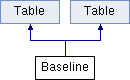

do not remove this div, it is closed by doxygen! 
|  |
| --- |
| NSCL DDAS1.0Support for XIA DDAS at the NSCL |

 end header part 
 Generated by Doxygen 1.8.1.2 

- [Main Page](https://github.com/FRIBDAQ/docs/tree/main/ddas-1.0-000/index.md)
- [User Guides](https://github.com/FRIBDAQ/docs/tree/main/ddas-1.0-000/pages.md)
- [Classes](https://github.com/FRIBDAQ/docs/tree/main/ddas-1.0-000/annotated.md)
- [Files](https://github.com/FRIBDAQ/docs/tree/main/ddas-1.0-000/files.md)
- 
  .md)

- [Class List](https://github.com/FRIBDAQ/docs/tree/main/ddas-1.0-000/annotated.md)
- [Class Index](https://github.com/FRIBDAQ/docs/tree/main/ddas-1.0-000/classes.md)
- [Class Hierarchy](https://github.com/FRIBDAQ/docs/tree/main/ddas-1.0-000/hierarchy.md)
- [Class Members](https://github.com/FRIBDAQ/docs/tree/main/ddas-1.0-000/functions.md)

 window showing the filter options 
[All](https://github.com/FRIBDAQ/docs/tree/main/ddas-1.0-000/javascript:void(0).md)[Classes](https://github.com/FRIBDAQ/docs/tree/main/ddas-1.0-000/javascript:void(0).md)[Files](https://github.com/FRIBDAQ/docs/tree/main/ddas-1.0-000/javascript:void(0).md)[Functions](https://github.com/FRIBDAQ/docs/tree/main/ddas-1.0-000/javascript:void(0).md)[Variables](https://github.com/FRIBDAQ/docs/tree/main/ddas-1.0-000/javascript:void(0).md)[Macros](https://github.com/FRIBDAQ/docs/tree/main/ddas-1.0-000/javascript:void(0).md)[Pages](https://github.com/FRIBDAQ/docs/tree/main/ddas-1.0-000/javascript:void(0).md)

 iframe showing the search results (closed by default)

 top 
[Public Member Functions](#pub-methods) |
[Public Attributes](#pub-attribs) |
[List of all members](https://github.com/FRIBDAQ/docs/tree/main/ddas-1.0-000/classBaseline-members.md)

Baseline Class Reference

header
Inheritance diagram for Baseline:

|  |  |
| --- | --- |
| Public Member Functions |
|  | Baseline(const TGWindow *p, const TGWindow *main, string name, int columns=3, int rows=16, int NumModules=13) |
| int | change_values(Long_t mod) |
| int | load_info(Long_t mod) |
| Bool_t | ProcessMessage(Long_t msg, Long_t parm1, Long_t parm2) |
| void | SetModuleNumber(int moduleNr) |
|  | Baseline(const TGWindow *p, const TGWindow *main, string name, int columns=3, int rows=16, int NumModules=13) |
| int | change_values(Long_t mod) |
| int | load_info(Long_t mod) |
| Bool_t | ProcessMessage(Long_t msg, Long_t parm1, Long_t parm2) |
| void | SetModuleNumber(int moduleNr) |
| Public Member Functions inherited fromTable |
|  | Table(const TGWindow *p, const TGWindow *main, int columns, int rows, string name, int NumModules=13) |
| virtual int | LoadInfo(Long_t mod, TGNumberEntryField ***NumEntry, int column, char *parameter) |
|  | Table(const TGWindow *p, const TGWindow *main, int columns, int rows, string name, int NumModules=13) |
| virtual int | LoadInfo(Long_t mod, TGNumberEntryField ***NumEntry, int column, char *parameter) |

|  |  |
| --- | --- |
| Public Attributes |
| short int | modNumber |
| bool | Load_Once |
| TGNumberEntry * | chanCopy |
| float | blcut |
| float | blpercent |
| unsigned short | chanNumber |
| Public Attributes inherited fromTable |
| TGVerticalFrame * | mn_vert |
| TGHorizontalFrame * | mn |
| int | Rows |
| TGVerticalFrame ** | Column |
| TGTextEntry * | cl0 |
| TGTextEntry ** | CLabel |
| TGNumberEntryField *** | NumEntry |
| TGTextEntry ** | Labels |
| int | numModules |
| TGNumberEntry * | numericMod |
| TGHorizontalFrame * | Buttons |

|  |  |
| --- | --- |
| Additional Inherited Members |
| Public Types inherited fromTable |
| enum | Commands{LOAD,APPLY,CANCEL,MODNUMBER,FILTER,COPYBUTTON,LOAD,APPLY,CANCEL,MODNUMBER,FILTER,COPYBUTTON} |
| enum | Commands{LOAD,APPLY,CANCEL,MODNUMBER,FILTER,COPYBUTTON,LOAD,APPLY,CANCEL,MODNUMBER,FILTER,COPYBUTTON} |

## Member Function Documentation

|  |  |  |  |
| --- | --- | --- | --- |
| Bool_t Baseline::ProcessMessage | ( | Long_t | msg, |
|  |  | Long_t | parm1, |
|  |  | Long_t | parm2 |
|  | ) |  |  |

Cancel Button

---

The documentation for this class was generated from the following files:- nscope/[Baseline.h](https://github.com/FRIBDAQ/docs/tree/main/ddas-1.0-000/Baseline_8h_source.md)
- nscope_extcl/[Baseline.h](https://github.com/FRIBDAQ/docs/tree/main/ddas-1.0-000/extcl_2Baseline_8h_source.md)
- nscope/Baseline.cpp
- nscope_extcl/Baseline.cpp

 contents 
 start footer part 

---

Generated on Mon Aug 1 2016 11:33:25 for NSCL DDAS by   1.8.1.2
