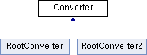

do not remove this div, it is closed by doxygen! 
|  |
| --- |
| NSCL DDAS1.0Support for XIA DDAS at the NSCL |

 end header part 
 Generated by Doxygen 1.8.1.2 

- [Main Page](https://github.com/FRIBDAQ/docs/tree/main/ddas-1.0-000/index.md)
- [User Guides](https://github.com/FRIBDAQ/docs/tree/main/ddas-1.0-000/pages.md)
- [Classes](https://github.com/FRIBDAQ/docs/tree/main/ddas-1.0-000/annotated.md)
- [Files](https://github.com/FRIBDAQ/docs/tree/main/ddas-1.0-000/files.md)
- 
  .md)

- [Class List](https://github.com/FRIBDAQ/docs/tree/main/ddas-1.0-000/annotated.md)
- [Class Index](https://github.com/FRIBDAQ/docs/tree/main/ddas-1.0-000/classes.md)
- [Class Hierarchy](https://github.com/FRIBDAQ/docs/tree/main/ddas-1.0-000/hierarchy.md)
- [Class Members](https://github.com/FRIBDAQ/docs/tree/main/ddas-1.0-000/functions.md)

 window showing the filter options 
[All](https://github.com/FRIBDAQ/docs/tree/main/ddas-1.0-000/javascript:void(0).md)[Classes](https://github.com/FRIBDAQ/docs/tree/main/ddas-1.0-000/javascript:void(0).md)[Files](https://github.com/FRIBDAQ/docs/tree/main/ddas-1.0-000/javascript:void(0).md)[Functions](https://github.com/FRIBDAQ/docs/tree/main/ddas-1.0-000/javascript:void(0).md)[Variables](https://github.com/FRIBDAQ/docs/tree/main/ddas-1.0-000/javascript:void(0).md)[Macros](https://github.com/FRIBDAQ/docs/tree/main/ddas-1.0-000/javascript:void(0).md)[Pages](https://github.com/FRIBDAQ/docs/tree/main/ddas-1.0-000/javascript:void(0).md)

 iframe showing the search results (closed by default)

 top 
[Public Member Functions](#pub-methods) |
[Protected Attributes](#pro-attribs) |
[List of all members](https://github.com/FRIBDAQ/docs/tree/main/ddas-1.0-000/classConverter-members.md)

Converter Class Reference

header
Base class for all converter objects.  
 [More...](https://github.com/FRIBDAQ/docs/tree/main/ddas-1.0-000/classConverter.md#details)

`#include <Converter.h>`

Inheritance diagram for Converter:

|  |  |
| --- | --- |
| Public Member Functions |
|  | Converter() |
|  | Default constructor. |
| virtual | ~Converter() |
|  | Default destructor. |
| virtual void | Initialize(std::string in_fname, std::string fileout) |
|  | Open output root file and creates the tree structure. |
| virtual void | DumpData(const CRingItem &item)=0 |
|  | Dump the data from ring into a object in a root file. |
| virtual void | Close() |
|  | Close ROOT file. |
| TFile * | GetFile() |
|  | Access the output file. |
| TTree * | GetTree() |
|  | Access the output tree. |

|  |  |
| --- | --- |
| Protected Attributes |
| TFile * | m_fileout |
| TTree * | m_treeout |

## Detailed Description

Base class for all converter objects.

This is an abstract class and cannot be instantiated. It provides the interface that must be implemented by all derived classes. At the moment these are the [RootConverter](https://github.com/FRIBDAQ/docs/tree/main/ddas-1.0-000/classRootConverter.md) and [RootConverter2](https://github.com/FRIBDAQ/docs/tree/main/ddas-1.0-000/classRootConverter2.md) classes. The [BufdumpMain](https://github.com/FRIBDAQ/docs/tree/main/ddas-1.0-000/classBufdumpMain.md) class only deals with the interface defined here such that the use of different conversion objects in the ddasdumper program is transparent to the remainder of the program.

There is one pure virtual member, [DumpData(const CRingItem&)](https://github.com/FRIBDAQ/docs/tree/main/ddas-1.0-000/classConverter.md#a9ff35398f215af687593e4785f3ecf19), that exists because there is no sensible default implementation.

This base class does not merely define an interface though, instead it provides some basic functionality that will promote consistency between output data of all concretely defined classes. The basic functionality defined by this class is the generation of the TFile that will be used to store the outputted data and also the TTree that contains the converted data. The actual structure of the TTree is not defined here and its definition is left as a responsibility derived classes.

## Constructor & Destructor Documentation

|  |  |  |  |  |  |  |
| --- | --- | --- | --- | --- | --- | --- |
| Converter::Converter() | Converter::Converter | ( |  | ) |  | inline |
| Converter::Converter | ( |  | ) |  |

Default constructor.

This initializes the pointers to both member pointers as null.

|  |  |  |  |  |  |  |
| --- | --- | --- | --- | --- | --- | --- |
| virtual Converter::~Converter() | virtual Converter::~Converter | ( |  | ) |  | inlinevirtual |
| virtual Converter::~Converter | ( |  | ) |  |

Default destructor.

Calls the [Close()](https://github.com/FRIBDAQ/docs/tree/main/ddas-1.0-000/classConverter.md#adb69816928d0687e023007801193d726) method if the object's file pointer is not null. Because this object's tree pointer is owned by the the file it lives in, it is not deleted. Closing the file is enough to free the memory block associated with it. Note that any time this class closes the file, the file pointer is set to null.

## Member Function Documentation

|  |  |  |  |  |  |  |
| --- | --- | --- | --- | --- | --- | --- |
| void Converter::Close() | void Converter::Close | ( |  | ) |  | virtual |
| void Converter::Close | ( |  | ) |  |

Close ROOT file.

Closes the root file if it exists. When the file is closed, the pointer is reset to null.

|  |  |  |  |  |  |  |  |
| --- | --- | --- | --- | --- | --- | --- | --- |
| virtual void Converter::DumpData(const CRingItem &item) | virtual void Converter::DumpData | ( | const CRingItem & | item | ) |  | pure virtual |
| virtual void Converter::DumpData | ( | const CRingItem & | item | ) |  |

Dump the data from ring into a object in a root file.

Conversion method. This is a purely virtual method. All derived classes must implement this to support the conversion of the data stored in the CRingItem. This method is also where data is added to the TTree by means of the TTree::Fill() method. The user is presented with the full CRingItem, including its header. The structure of these can be found in in the file /path/to/nscldaq/version/./include/DataFormat.h

- Parameters
  |  |  |
  | --- | --- |
  | item | is a reference to the data |

Implemented in [RootConverter2](https://github.com/FRIBDAQ/docs/tree/main/ddas-1.0-000/classRootConverter2.md#a8b5461e30739b427669f7aa1942614af), and [RootConverter](https://github.com/FRIBDAQ/docs/tree/main/ddas-1.0-000/classRootConverter.md#ae13972969e6fac531cf12da8ac1847be).

|  |  |  |  |  |  |  |  |  |  |  |  |  |  |
| --- | --- | --- | --- | --- | --- | --- | --- | --- | --- | --- | --- | --- | --- |
| void Converter::Initialize(std::stringin_fname,std::stringfileout) | void Converter::Initialize | ( | std::string | in_fname, |  |  | std::string | fileout |  | ) |  |  | virtual |
| void Converter::Initialize | ( | std::string | in_fname, |
|  |  | std::string | fileout |
|  | ) |  |  |

Open output root file and creates the tree structure.

Creates and opens the root file in which the tree will be stored and creates the tree. There are no branches added to the tree. Adding the branches is left as a responsibility to the derived classes.

*** Derived classes MUST CALL THIS METHOD BEFORE ADDING TO THE TREE! ***

- Parameters
  |  |  |
  | --- | --- |
  | in_fname | does not serve any functional purpose |
  | fileout | name of the root file to create for output |

Reimplemented in [RootConverter2](https://github.com/FRIBDAQ/docs/tree/main/ddas-1.0-000/classRootConverter2.md#a82cbffa4f3553d099824c216731d269d), and [RootConverter](https://github.com/FRIBDAQ/docs/tree/main/ddas-1.0-000/classRootConverter.md#a35d0678f9622196fd7caecf43e76bc65).

## Member Data Documentation

|  |  |  |
| --- | --- | --- |
| TFile* Converter::m_fileout | TFile* Converter::m_fileout | protected |
| TFile* Converter::m_fileout |

pointer to output root file

|  |  |  |
| --- | --- | --- |
| TTree* Converter::m_treeout | TTree* Converter::m_treeout | protected |
| TTree* Converter::m_treeout |

pointer to output tree

---

The documentation for this class was generated from the following files:- ddasdumper/[Converter.h](https://github.com/FRIBDAQ/docs/tree/main/ddas-1.0-000/Converter_8h_source.md)
- ddasdumper/Converter.cpp

 contents 
 start footer part 

---

Generated on Mon Aug 1 2016 11:33:25 for NSCL DDAS by   1.8.1.2
