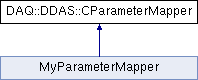

do not remove this div, it is closed by doxygen! 
|  |
| --- |
| NSCL DDAS1.0Support for XIA DDAS at the NSCL |

 end header part 
 Generated by Doxygen 1.8.1.2 

- [[index]]
- [[pages]]
- [[annotated]]
- [[files]]
- 
  [[javascript:searchBox.CloseResultsWindow()]]

- [[annotated]]
- [[classes]]
- [[hierarchy]]
- [[functions]]

 window showing the filter options 
[[javascript:void(0)]][[javascript:void(0)]][[javascript:void(0)]][[javascript:void(0)]][[javascript:void(0)]][[javascript:void(0)]][[javascript:void(0)]]

 iframe showing the search results (closed by default) 

- **DAQ**
- **DDAS**
- [[classDAQ_1_1DDAS_1_1CParameterMapper]]

 top 
[Public Member Functions](#pub-methods) |
[[classDAQ_1_1DDAS_1_1CParameterMapper-members]]

DAQ::DDAS::CParameterMapper Class Reference

header
Inheritance diagram for DAQ::DDAS::CParameterMapper:

|  |  |
| --- | --- |
| Public Member Functions |
| virtual void | mapToParameters(const std::vector<DDASHit> &data, CEvent &rEvent)=0 |

---

The documentation for this class was generated from the following file:- spectcl/[[ParameterMapper_8h_source]]

 contents 
 start footer part 

---

Generated on Mon Aug 1 2016 11:33:25 for NSCL DDAS by   1.8.1.2
