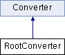

do not remove this div, it is closed by doxygen! 
|  |
| --- |
| NSCL DDAS1.0Support for XIA DDAS at the NSCL |

 end header part 
 Generated by Doxygen 1.8.1.2 

- [[index]]
- [[pages]]
- [[annotated]]
- [[files]]
- 
  [[javascript:searchBox.CloseResultsWindow()]]

- [[annotated]]
- [[classes]]
- [[hierarchy]]
- [[functions]]

 window showing the filter options 
[[javascript:void(0)]][[javascript:void(0)]][[javascript:void(0)]][[javascript:void(0)]][[javascript:void(0)]][[javascript:void(0)]][[javascript:void(0)]]

 iframe showing the search results (closed by default)

 top 
[Public Member Functions](#pub-methods) |
[[classRootConverter-members]]

RootConverter Class Reference

header
[[classConverter]] for data formats < NSCLDAQ 10.2.  
 [[classRootConverter#details]]

`#include <RootConvert.h>`

Inheritance diagram for RootConverter:

|  |  |
| --- | --- |
| Public Member Functions |
|  | RootConverter() |
|  | Default constructor. |
| virtual | ~RootConverter() |
|  | Default destructor. |
| virtual void | Initialize(std::string filein, std::string fileout) |
|  | Adds dchan branch to tree and associates it with the local ddaschannel object. |
| virtual void | DumpData(const CRingItem &item) |
|  | Conversion of CRingItem data and filling of the tree. |
| Public Member Functions inherited fromConverter |
|  | Converter() |
|  | Default constructor. |
| virtual | ~Converter() |
|  | Default destructor. |
| virtual void | Close() |
|  | Close ROOT file. |
| TFile * | GetFile() |
|  | Access the output file. |
| TTree * | GetTree() |
|  | Access the output tree. |

|  |  |
| --- | --- |
| Additional Inherited Members |
| Protected Attributes inherited fromConverter |
| TFile * | m_fileout |
| TTree * | m_treeout |

## Detailed Description

[[classConverter]] for data formats < NSCLDAQ 10.2.

A concrete implementation of the [[classConverter]] base class to support the conversion of data built with NSCLDAQ versions prior to 10.2. This class expects a simple physics data structure defined as follows:

struct data_structure { uint32_t size_in_bytes uint32_t* pointer to Pixie16 data format }

The Pixie-16 data format is defined by the Pixie-16 digitizer module. It consists of a minimum of 4 32-bit words for the Pixie16 data header followed by any subsequent optional data. The optional data may include trace data, energy sum data, or QDC data.

The [[classRootConverter]] object creates a branch in the tree referenced by Converter::m_treepointer named dchan. It holds the ddaschannel objects produced by every call to the [[classRootConverter#ae13972969e6fac531cf12da8ac1847be]] method.

## Constructor & Destructor Documentation

|  |  |  |  |  |  |  |
| --- | --- | --- | --- | --- | --- | --- |
| RootConverter::~RootConverter() | RootConverter::~RootConverter | ( |  | ) |  | virtual |
| RootConverter::~RootConverter | ( |  | ) |  |

Default destructor.

Constructs the ddaschannel object pointed to by this class's dchan pointer with its default constructor.

## Member Function Documentation

|  |  |  |  |  |  |  |  |
| --- | --- | --- | --- | --- | --- | --- | --- |
| void RootConverter::DumpData(const CRingItem &item) | void RootConverter::DumpData | ( | const CRingItem & | item | ) |  | virtual |
| void RootConverter::DumpData | ( | const CRingItem & | item | ) |  |

Conversion of CRingItem data and filling of the tree.

Responsible for converting the data stored in the CRingItem into the ddaschannel object. The majority of the conversion is actually performed by the ddaschannel::UnpackData method, so that this merely strips away the nscldaq information that encloses the Pixie-16 data format (which is what is understood by the ddaschannel::UnpackData method). In this implementation, only the ring item size is stripped away before delegating the remainder of the unpacking task to the ddaschannel object. Following the unpacking, the ddaschannel object holds the data it extracted and this same object is used to fill the tree.

Implements [[classConverter#a9ff35398f215af687593e4785f3ecf19]].

|  |  |  |  |  |  |  |  |  |  |  |  |  |  |
| --- | --- | --- | --- | --- | --- | --- | --- | --- | --- | --- | --- | --- | --- |
| void RootConverter::Initialize(std::stringfilein,std::stringfileout) | void RootConverter::Initialize | ( | std::string | filein, |  |  | std::string | fileout |  | ) |  |  | virtual |
| void RootConverter::Initialize | ( | std::string | filein, |
|  |  | std::string | fileout |
|  | ) |  |  |

Adds dchan branch to tree and associates it with the local ddaschannel object.

First calls the [[classConverter#a7bc5c097d0bc9b7e1afdeffb18644cc1]] method to create the output file and the tree, then adds the dchan branch to the tree. This branch holds the ddaschannel objects produced by the [[classRootConverter#ae13972969e6fac531cf12da8ac1847be]] method.

Parameters
|  |  |
| --- | --- |
| filein | currently not implemented |
| fileout | name of the root file to store the outputted data tree |

Reimplemented from [[classConverter#a7bc5c097d0bc9b7e1afdeffb18644cc1]].

---

The documentation for this class was generated from the following files:- ddasdumper/[[RootConvert_8h_source]]
- ddasdumper/RootConvert.cpp

 contents 
 start footer part 

---

Generated on Mon Aug 1 2016 11:33:25 for NSCL DDAS by   1.8.1.2
