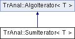

do not remove this div, it is closed by doxygen! 
|  |
| --- |
| NSCL DDAS1.0Support for XIA DDAS at the NSCL |

 end header part 
 Generated by Doxygen 1.8.1.2 

- [Main Page](https://github.com/FRIBDAQ/docs/tree/main/ddas-1.0-000/index.md)
- [User Guides](https://github.com/FRIBDAQ/docs/tree/main/ddas-1.0-000/pages.md)
- [Classes](https://github.com/FRIBDAQ/docs/tree/main/ddas-1.0-000/annotated.md)
- [Files](https://github.com/FRIBDAQ/docs/tree/main/ddas-1.0-000/files.md)
- 
  .md)

- [Class List](https://github.com/FRIBDAQ/docs/tree/main/ddas-1.0-000/annotated.md)
- [Class Index](https://github.com/FRIBDAQ/docs/tree/main/ddas-1.0-000/classes.md)
- [Class Hierarchy](https://github.com/FRIBDAQ/docs/tree/main/ddas-1.0-000/hierarchy.md)
- [Class Members](https://github.com/FRIBDAQ/docs/tree/main/ddas-1.0-000/functions.md)

 window showing the filter options 
[All](https://github.com/FRIBDAQ/docs/tree/main/ddas-1.0-000/javascript:void(0).md)[Classes](https://github.com/FRIBDAQ/docs/tree/main/ddas-1.0-000/javascript:void(0).md)[Files](https://github.com/FRIBDAQ/docs/tree/main/ddas-1.0-000/javascript:void(0).md)[Functions](https://github.com/FRIBDAQ/docs/tree/main/ddas-1.0-000/javascript:void(0).md)[Variables](https://github.com/FRIBDAQ/docs/tree/main/ddas-1.0-000/javascript:void(0).md)[Macros](https://github.com/FRIBDAQ/docs/tree/main/ddas-1.0-000/javascript:void(0).md)[Pages](https://github.com/FRIBDAQ/docs/tree/main/ddas-1.0-000/javascript:void(0).md)

 iframe showing the search results (closed by default) 

- **TrAnal**
- [SumIterator](https://github.com/FRIBDAQ/docs/tree/main/ddas-1.0-000/classTrAnal_1_1SumIterator.md)

 top 
[Public Types](#pub-types) |
[Public Member Functions](#pub-methods) |
[List of all members](https://github.com/FRIBDAQ/docs/tree/main/ddas-1.0-000/classTrAnal_1_1SumIterator-members.md)

TrAnal::SumIterator< T > Class Template Reference

header
Summing iterator.  
 [More...](https://github.com/FRIBDAQ/docs/tree/main/ddas-1.0-000/classTrAnal_1_1SumIterator.md#details)

`#include <SumIterator.hpp>`

Inheritance diagram for TrAnal::SumIterator< T >:

|  |  |
| --- | --- |
| Public Types |
| typedef T | value_type |
| typedef ptrdiff_t | difference_type |
| typedef T * | pointer |
| typedef T & | reference |
| typedef std::input_iterator_tag | iterator_category |

|  |  |
| --- | --- |
| Public Member Functions |
|  | SumIterator(constTrRange< T > &range) |
|  | SumIterator(constSumIterator&that) |
| SumIterator& | operator=(constSumIterator&that) |
| bool | operator==(constSumIterator&that) const |
| bool | operator!=(constSumIterator&that) const |
| virtual bool | operator<(constTrIterator< T > &it) const |
|  | Comparison operator. |
| bool | operator<(constSumIterator&that) const |
| bool | operator>(constSumIterator&that) const |
| bool | operator<=(constSumIterator&that) const |
| bool | operator>=(constSumIterator&that) const |
| virtualSumIterator& | operator++() |
|  | Prefixed incrementation Supports ++x style incrementing. Default implementation does nothing. |
| SumIterator | operator++(int) |
| virtual double | operator*() const |
|  | Dereference operator. |
| virtualTrIterator< T > | min_extent() const |
|  | Min extent To implement the minimum iterator extent for the range This default implementation returns an iterator to address 0x0. |
| virtualTrIterator< T > | max_extent() const |
|  | Max extent To implement the maximum iterator extent for the range This default implementation returns an iterator to address 0x0. |
| Public Member Functions inherited fromTrAnal::AlgoIterator< T > |
|  | AlgoIterator() |
|  | Default constructor. |
|  | AlgoIterator(constAlgoIterator&) |
|  | Copy constructor. |
| AlgoIterator& | operator=(constAlgoIterator&) |
|  | Assignment operator. |

## Detailed Description

### template<class T>  

class TrAnal::SumIterator< T >

Summing iterator.

Implements the [AlgoIterator](https://github.com/FRIBDAQ/docs/tree/main/ddas-1.0-000/classTrAnal_1_1AlgoIterator.md) interface but extends the functionality to provide richer comparisons.

The summing region is semi-inclusive, i.e. [low,high) . As a result, out-of-bounds can be reliable checked before attempting to access an invalid memory location.

## Member Function Documentation

template<class T>

|  |  |  |  |  |  |  |
| --- | --- | --- | --- | --- | --- | --- |
| virtualTrIterator<T>TrAnal::SumIterator< T >::max_extent()const | virtualTrIterator<T>TrAnal::SumIterator< T >::max_extent | ( |  | ) | const | inlinevirtual |
| virtualTrIterator<T>TrAnal::SumIterator< T >::max_extent | ( |  | ) | const |

Max extent To implement the maximum iterator extent for the range This default implementation returns an iterator to address 0x0.

- Returns
  null iterator

Reimplemented from [TrAnal::AlgoIterator< T >](https://github.com/FRIBDAQ/docs/tree/main/ddas-1.0-000/classTrAnal_1_1AlgoIterator.md#a0dbc4f0ead2ebcfc84e1d0fbb72b8ac2).

template<class T>

|  |  |  |  |  |  |  |
| --- | --- | --- | --- | --- | --- | --- |
| virtualTrIterator<T>TrAnal::SumIterator< T >::min_extent()const | virtualTrIterator<T>TrAnal::SumIterator< T >::min_extent | ( |  | ) | const | inlinevirtual |
| virtualTrIterator<T>TrAnal::SumIterator< T >::min_extent | ( |  | ) | const |

Min extent To implement the minimum iterator extent for the range This default implementation returns an iterator to address 0x0.

- Returns
  null iterator

Reimplemented from [TrAnal::AlgoIterator< T >](https://github.com/FRIBDAQ/docs/tree/main/ddas-1.0-000/classTrAnal_1_1AlgoIterator.md#a56711604a816cbad586f4ff5847251e3).

template<class T>

|  |  |  |  |  |  |  |
| --- | --- | --- | --- | --- | --- | --- |
| virtual doubleTrAnal::SumIterator< T >::operator*()const | virtual doubleTrAnal::SumIterator< T >::operator* | ( |  | ) | const | inlinevirtual |
| virtual doubleTrAnal::SumIterator< T >::operator* | ( |  | ) | const |

Dereference operator.

- Returns
  sum of values pointed to by the range [min_extent,max_extent)

Reimplemented from [TrAnal::AlgoIterator< T >](https://github.com/FRIBDAQ/docs/tree/main/ddas-1.0-000/classTrAnal_1_1AlgoIterator.md#a1787d8ec53cd8abc15702d151cb1f32d).

template<class T>

|  |  |  |  |  |  |  |
| --- | --- | --- | --- | --- | --- | --- |
| virtualSumIterator&TrAnal::SumIterator< T >::operator++() | virtualSumIterator&TrAnal::SumIterator< T >::operator++ | ( |  | ) |  | inlinevirtual |
| virtualSumIterator&TrAnal::SumIterator< T >::operator++ | ( |  | ) |  |

Prefixed incrementation Supports ++x style incrementing. Default implementation does nothing.

- Returns
  const reference to this

Reimplemented from [TrAnal::AlgoIterator< T >](https://github.com/FRIBDAQ/docs/tree/main/ddas-1.0-000/classTrAnal_1_1AlgoIterator.md#a75685e1588f1edb85045c6897bda2173).

template<class T>

|  |  |  |  |  |  |  |  |
| --- | --- | --- | --- | --- | --- | --- | --- |
| virtual boolTrAnal::SumIterator< T >::operator<(constTrIterator< T > &it)const | virtual boolTrAnal::SumIterator< T >::operator< | ( | constTrIterator< T > & | it | ) | const | inlinevirtual |
| virtual boolTrAnal::SumIterator< T >::operator< | ( | constTrIterator< T > & | it | ) | const |

Comparison operator.

Compares whether max_extent is less than the the argument.

- Parameters
  |  |  |
  | --- | --- |
  | it | the iterator to compare to |

Reimplemented from [TrAnal::AlgoIterator< T >](https://github.com/FRIBDAQ/docs/tree/main/ddas-1.0-000/classTrAnal_1_1AlgoIterator.md).

---

The documentation for this class was generated from the following file:- traiter/src/[SumIterator.hpp](https://github.com/FRIBDAQ/docs/tree/main/ddas-1.0-000/SumIterator_8hpp_source.md)

 contents 
 start footer part 

---

Generated on Mon Aug 1 2016 11:33:25 for NSCL DDAS by   1.8.1.2
