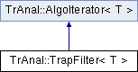

do not remove this div, it is closed by doxygen! 
|  |
| --- |
| NSCL DDAS1.0Support for XIA DDAS at the NSCL |

 end header part 
 Generated by Doxygen 1.8.1.2 

- [[Main Page|index]]
- [[User Guides|pages]]
- [[Classes|annotated]]
- [[Files|files]]
- 
  [[|javascript:searchBox.CloseResultsWindow()]]

- [[Class List|annotated]]
- [[Class Index|classes]]
- [[Class Hierarchy|hierarchy]]
- [[Class Members|functions]]

 window showing the filter options 
[[All|javascript:void(0)]][[Classes|javascript:void(0)]][[Files|javascript:void(0)]][[Functions|javascript:void(0)]][[Variables|javascript:void(0)]][[Macros|javascript:void(0)]][[Pages|javascript:void(0)]]

 iframe showing the search results (closed by default) 

- **TrAnal**
- [[TrapFilter|classTrAnal_1_1TrapFilter]]

 top 
[Public Member Functions](#pub-methods) |
[[List of all members|classTrAnal_1_1TrapFilter-members]]

TrAnal::TrapFilter< T > Class Template Reference

header
A simple fast filter (lead sum - trail sum)  
 [[More...|classTrAnal_1_1TrapFilter#details]]

`#include <TrapFilter.hpp>`

Inheritance diagram for TrAnal::TrapFilter< T >:

|  |  |
| --- | --- |
| Public Member Functions |
|  | TrapFilter(constTrIterator< T > &begin, int rise_range, int gap_range) |
|  | Constructs a symmetric trap filter. |
|  | TrapFilter(constTrRange< T > &trail_range, constTrRange< T > &lead_range) |
|  | Constructs an arbitrary trap filter. |
| TrapFilter& | operator=(constTrapFilter&that) |
|  | Assignment operator. |
| virtual | ~TrapFilter() |
|  | Virtual destructor. |
| virtualTrapFilter& | operator++() |
|  | ++filter style increment |
| TrapFilter | operator++(int) |
|  | filter++ style increment |
| virtual bool | operator<(constTrIterator< T > &it) const |
|  | Less than comparison toTrIterator. |
| bool | operator>(constTrIterator< T > &it) const |
|  | Greater than comparison toTrIterator. |
| virtualTrIterator< T > | max_extent() const |
|  | Gets the most advanced iterator position of the summing regions. |
| virtualTrIterator< T > | min_extent() const |
|  | Gets the minimum iterator position of the summing regions. |
| virtual double | operator*() const |
|  | Dereference operator <==> evaluates to current filter value. |
| Public Member Functions inherited fromTrAnal::AlgoIterator< T > |
|  | AlgoIterator() |
|  | Default constructor. |
|  | AlgoIterator(constAlgoIterator&) |
|  | Copy constructor. |
| AlgoIterator& | operator=(constAlgoIterator&) |
|  | Assignment operator. |

## Detailed Description

### template<class T>  

class TrAnal::TrapFilter< T >

A simple fast filter (lead sum - trail sum)

A simple trapezoidal filter is implemented that evaluates the difference between a leading sum and a trailing sum. It is naturally composed of two [[SumIterator|classTrAnal_1_1SumIterator]] objects. The filter implements the [[AlgoIterator|classTrAnal_1_1AlgoIterator]] interface and functionally is like an input iterator. When this is dereferenced, the difference between the current values of the two summing regions is returned. When it is incremented, the two summing regions are also incremented.

## Constructor & Destructor Documentation

template<class T>

|  |  |  |  |  |  |  |  |  |  |  |  |  |  |  |  |  |  |
| --- | --- | --- | --- | --- | --- | --- | --- | --- | --- | --- | --- | --- | --- | --- | --- | --- | --- |
| TrAnal::TrapFilter< T >::TrapFilter(constTrIterator< T > &begin,intrise_range,intgap_range) | TrAnal::TrapFilter< T >::TrapFilter | ( | constTrIterator< T > & | begin, |  |  | int | rise_range, |  |  | int | gap_range |  | ) |  |  | inline |
| TrAnal::TrapFilter< T >::TrapFilter | ( | constTrIterator< T > & | begin, |
|  |  | int | rise_range, |
|  |  | int | gap_range |
|  | ) |  |  |

Constructs a symmetric trap filter.

Given a starting position, the symmetric filter is built from the rise_range and gap_range provided. These make use of the offset definitions of a [[TrRange|classTrAnal_1_1TrRange]]. The trailing sum is defined as a region [begin, begin+rise_range) and the leading sum is defined as [begin+rise_range+gap_range, begin+ 2*rise_range+gap_range).

- Parameters
  |  |  |
  | --- | --- |
  | begin | the iterator defining the starting position of the trailing sum |
  | rise_range | the range of the summing region and the length of the filter rise |
  | gap_range | the distance between the max_extent of the trailing sum and min_extent of leading sum |

template<class T>

|  |  |  |  |  |  |  |  |  |  |  |  |  |  |
| --- | --- | --- | --- | --- | --- | --- | --- | --- | --- | --- | --- | --- | --- |
| TrAnal::TrapFilter< T >::TrapFilter(constTrRange< T > &trail_range,constTrRange< T > &lead_range) | TrAnal::TrapFilter< T >::TrapFilter | ( | constTrRange< T > & | trail_range, |  |  | constTrRange< T > & | lead_range |  | ) |  |  | inline |
| TrAnal::TrapFilter< T >::TrapFilter | ( | constTrRange< T > & | trail_range, |
|  |  | constTrRange< T > & | lead_range |
|  | ) |  |  |

Constructs an arbitrary trap filter.

Construct an arbitrary fast trapezoidal filter by providing the summing ranges

- Parameters
  |  |  |
  | --- | --- |
  | trail_range | the initial trailing sum range |
  | lead_range | the initial leading sum range |

template<class T>

|  |  |  |  |  |  |  |
| --- | --- | --- | --- | --- | --- | --- |
| virtualTrAnal::TrapFilter< T >::~TrapFilter() | virtualTrAnal::TrapFilter< T >::~TrapFilter | ( |  | ) |  | inlinevirtual |
| virtualTrAnal::TrapFilter< T >::~TrapFilter | ( |  | ) |  |

Virtual destructor.

Does nothing b/c no memory has been allocated dynamically

## Member Function Documentation

template<class T>

|  |  |  |  |  |  |  |
| --- | --- | --- | --- | --- | --- | --- |
| virtualTrIterator<T>TrAnal::TrapFilter< T >::max_extent()const | virtualTrIterator<T>TrAnal::TrapFilter< T >::max_extent | ( |  | ) | const | inlinevirtual |
| virtualTrIterator<T>TrAnal::TrapFilter< T >::max_extent | ( |  | ) | const |

Gets the most advanced iterator position of the summing regions.

Returns the most advanced iterator between the two summing regions. This most likely points to the first value outside of the leading sum's range. However, no assumption is made about which summing region comes before the other because no logic is in place to ensure proper ordering.

- Returns
  iterator pointing to the most advanced iterator of the two summing regions

Reimplemented from [[TrAnal::AlgoIterator< T >|classTrAnal_1_1AlgoIterator#a0dbc4f0ead2ebcfc84e1d0fbb72b8ac2]].

template<class T>

|  |  |  |  |  |  |  |
| --- | --- | --- | --- | --- | --- | --- |
| virtualTrIterator<T>TrAnal::TrapFilter< T >::min_extent()const | virtualTrIterator<T>TrAnal::TrapFilter< T >::min_extent | ( |  | ) | const | inlinevirtual |
| virtualTrIterator<T>TrAnal::TrapFilter< T >::min_extent | ( |  | ) | const |

Gets the minimum iterator position of the summing regions.

Returns the minimum iterator position between the two summing regions. This most likely points to the first valid value of the trailing sum's range. However, no assumption is made about which summing region comes before the other because no logic is in place to ensure proper ordering.

- Returns
  iterator pointing to the minimum iterator position of the two summing regions

Reimplemented from [[TrAnal::AlgoIterator< T >|classTrAnal_1_1AlgoIterator#a56711604a816cbad586f4ff5847251e3]].

template<class T>

|  |  |  |  |  |  |  |
| --- | --- | --- | --- | --- | --- | --- |
| virtual doubleTrAnal::TrapFilter< T >::operator*()const | virtual doubleTrAnal::TrapFilter< T >::operator* | ( |  | ) | const | inlinevirtual |
| virtual doubleTrAnal::TrapFilter< T >::operator* | ( |  | ) | const |

Dereference operator <==> evaluates to current filter value.

- Returns
  difference between leading and trailing sums.

Reimplemented from [[TrAnal::AlgoIterator< T >|classTrAnal_1_1AlgoIterator#a1787d8ec53cd8abc15702d151cb1f32d]].

template<class T>

|  |  |  |  |  |  |  |
| --- | --- | --- | --- | --- | --- | --- |
| virtualTrapFilter&TrAnal::TrapFilter< T >::operator++() | virtualTrapFilter&TrAnal::TrapFilter< T >::operator++ | ( |  | ) |  | inlinevirtual |
| virtualTrapFilter&TrAnal::TrapFilter< T >::operator++ | ( |  | ) |  |

++filter style increment

Increments the two summing regions together as ++sum

- Returns
  a reference to this after incrementing

Reimplemented from [[TrAnal::AlgoIterator< T >|classTrAnal_1_1AlgoIterator#a75685e1588f1edb85045c6897bda2173]].

template<class T>

|  |  |  |  |  |  |  |  |
| --- | --- | --- | --- | --- | --- | --- | --- |
| TrapFilterTrAnal::TrapFilter< T >::operator++(int) | TrapFilterTrAnal::TrapFilter< T >::operator++ | ( | int |  | ) |  | inline |
| TrapFilterTrAnal::TrapFilter< T >::operator++ | ( | int |  | ) |  |

filter++ style increment

Increments the two summing regions together as sum++

- Returns
  a copy of filter before incrementing

template<class T>

|  |  |  |  |  |  |  |  |
| --- | --- | --- | --- | --- | --- | --- | --- |
| virtual boolTrAnal::TrapFilter< T >::operator<(constTrIterator< T > &it)const | virtual boolTrAnal::TrapFilter< T >::operator< | ( | constTrIterator< T > & | it | ) | const | inlinevirtual |
| virtual boolTrAnal::TrapFilter< T >::operator< | ( | constTrIterator< T > & | it | ) | const |

Less than comparison to [[TrIterator|classTrAnal_1_1TrIterator]].

Comparison against a simple iterator (useful for checking whether next dereference will be a valid and safe). Literally compares whether the iterator returned by [[max_extent()|classTrAnal_1_1TrapFilter#a0793799d43dcbfe21a018c7907c4d768]] is less than the argument. In normal situations, this is analogous to checking whether the [[max_extent()|classTrAnal_1_1TrapFilter#a0793799d43dcbfe21a018c7907c4d768]] of the leading sum comes before the argument.

- Parameters
  |  |  |
  | --- | --- |
  | it | the iterator to compare to |

- Returns
  true if it<[[max_extent()|classTrAnal_1_1TrapFilter#a0793799d43dcbfe21a018c7907c4d768]], false otherwise

Reimplemented from [[TrAnal::AlgoIterator< T >|classTrAnal_1_1AlgoIterator]].

template<class T>

|  |  |  |  |  |  |  |  |
| --- | --- | --- | --- | --- | --- | --- | --- |
| TrapFilter&TrAnal::TrapFilter< T >::operator=(constTrapFilter< T > &that) | TrapFilter&TrAnal::TrapFilter< T >::operator= | ( | constTrapFilter< T > & | that | ) |  | inline |
| TrapFilter&TrAnal::TrapFilter< T >::operator= | ( | constTrapFilter< T > & | that | ) |  |

Assignment operator.

Copy the two summing regions.

- Parameters
  |  |  |
  | --- | --- |
  | that | the object whose state will be copied |

- Returns
  a reference to this after assignment

template<class T>

|  |  |  |  |  |  |  |  |
| --- | --- | --- | --- | --- | --- | --- | --- |
| boolTrAnal::TrapFilter< T >::operator>(constTrIterator< T > &it)const | boolTrAnal::TrapFilter< T >::operator> | ( | constTrIterator< T > & | it | ) | const | inline |
| boolTrAnal::TrapFilter< T >::operator> | ( | constTrIterator< T > & | it | ) | const |

Greater than comparison to [[TrIterator|classTrAnal_1_1TrIterator]].

Comparison against a simple iterator. Literally compares whether the iterator returned by [[min_extent()|classTrAnal_1_1TrapFilter#a69b62c45160b76b81be8f34df77a419a]] is greater than the argument. In normal situations, this is analogous to checking whether the [[min_extent()|classTrAnal_1_1TrapFilter#a69b62c45160b76b81be8f34df77a419a]] of the trailing sum comes after the argument.

- Parameters
  |  |  |
  | --- | --- |
  | it | the iterator to compare to |

- Returns
  true if [[min_extent()|classTrAnal_1_1TrapFilter#a69b62c45160b76b81be8f34df77a419a]] > it, false otherwise

---

The documentation for this class was generated from the following file:- traiter/src/[[TrapFilter.hpp|TrapFilter_8hpp_source]]

 contents 
 start footer part 

---

Generated on Mon Aug 1 2016 11:33:25 for NSCL DDAS by   1.8.1.2
