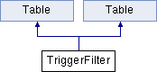

do not remove this div, it is closed by doxygen! 
|  |
| --- |
| NSCL DDAS1.0Support for XIA DDAS at the NSCL |

 end header part 
 Generated by Doxygen 1.8.1.2 

- [[index]]
- [[pages]]
- [[annotated]]
- [[files]]
- 
  [[javascript:searchBox.CloseResultsWindow()]]

- [[annotated]]
- [[classes]]
- [[hierarchy]]
- [[functions]]

 window showing the filter options 
[[javascript:void(0)]][[javascript:void(0)]][[javascript:void(0)]][[javascript:void(0)]][[javascript:void(0)]][[javascript:void(0)]][[javascript:void(0)]]

 iframe showing the search results (closed by default)

 top 
[Public Member Functions](#pub-methods) |
[Public Attributes](#pub-attribs) |
[[classTriggerFilter-members]]

TriggerFilter Class Reference

header
Inheritance diagram for TriggerFilter:

|  |  |
| --- | --- |
| Public Member Functions |
|  | TriggerFilter(const TGWindow *p, const TGWindow *main, string name, int columns=4, int rows=16, int NumModules=13) |
| Bool_t | ProcessMessage(Long_t msg, Long_t parm1, Long_t parm2) |
| int | change_values(Long_t mod) |
| int | load_info(Long_t mod) |
| void | SetModuleNumber(int moduleNr) |
|  | TriggerFilter(const TGWindow *p, const TGWindow *main, string name, int columns=4, int rows=16, int NumModules=13) |
| Bool_t | ProcessMessage(Long_t msg, Long_t parm1, Long_t parm2) |
| int | change_values(Long_t mod) |
| int | load_info(Long_t mod) |
| void | SetModuleNumber(int moduleNr) |
| Public Member Functions inherited fromTable |
|  | Table(const TGWindow *p, const TGWindow *main, int columns, int rows, string name, int NumModules=13) |
| virtual int | LoadInfo(Long_t mod, TGNumberEntryField ***NumEntry, int column, char *parameter) |
|  | Table(const TGWindow *p, const TGWindow *main, int columns, int rows, string name, int NumModules=13) |
| virtual int | LoadInfo(Long_t mod, TGNumberEntryField ***NumEntry, int column, char *parameter) |

|  |  |
| --- | --- |
| Public Attributes |
| short int | chanNumber |
| short int | modNumber |
| TGNumberEntry * | chanCopy |
| bool | Load_Once |
| char | tmp[10] |
| float | tpeak |
| float | tgap |
| float | thresh |
| Public Attributes inherited fromTable |
| TGVerticalFrame * | mn_vert |
| TGHorizontalFrame * | mn |
| int | Rows |
| TGVerticalFrame ** | Column |
| TGTextEntry * | cl0 |
| TGTextEntry ** | CLabel |
| TGNumberEntryField *** | NumEntry |
| TGTextEntry ** | Labels |
| int | numModules |
| TGNumberEntry * | numericMod |
| TGHorizontalFrame * | Buttons |

|  |  |
| --- | --- |
| Additional Inherited Members |
| Public Types inherited fromTable |
| enum | Commands{LOAD,APPLY,CANCEL,MODNUMBER,FILTER,COPYBUTTON,LOAD,APPLY,CANCEL,MODNUMBER,FILTER,COPYBUTTON} |
| enum | Commands{LOAD,APPLY,CANCEL,MODNUMBER,FILTER,COPYBUTTON,LOAD,APPLY,CANCEL,MODNUMBER,FILTER,COPYBUTTON} |

## Member Function Documentation

|  |  |  |  |
| --- | --- | --- | --- |
| Bool_t TriggerFilter::ProcessMessage | ( | Long_t | msg, |
|  |  | Long_t | parm1, |
|  |  | Long_t | parm2 |
|  | ) |  |  |

Cancel Button

---

The documentation for this class was generated from the following files:- nscope/[[TriggerFilter_8h_source]]
- nscope_extcl/[[extcl_2TriggerFilter_8h_source]]
- nscope/TriggerFilter.cpp
- nscope_extcl/TriggerFilter.cpp

 contents 
 start footer part 

---

Generated on Mon Aug 1 2016 11:33:25 for NSCL DDAS by   1.8.1.2
