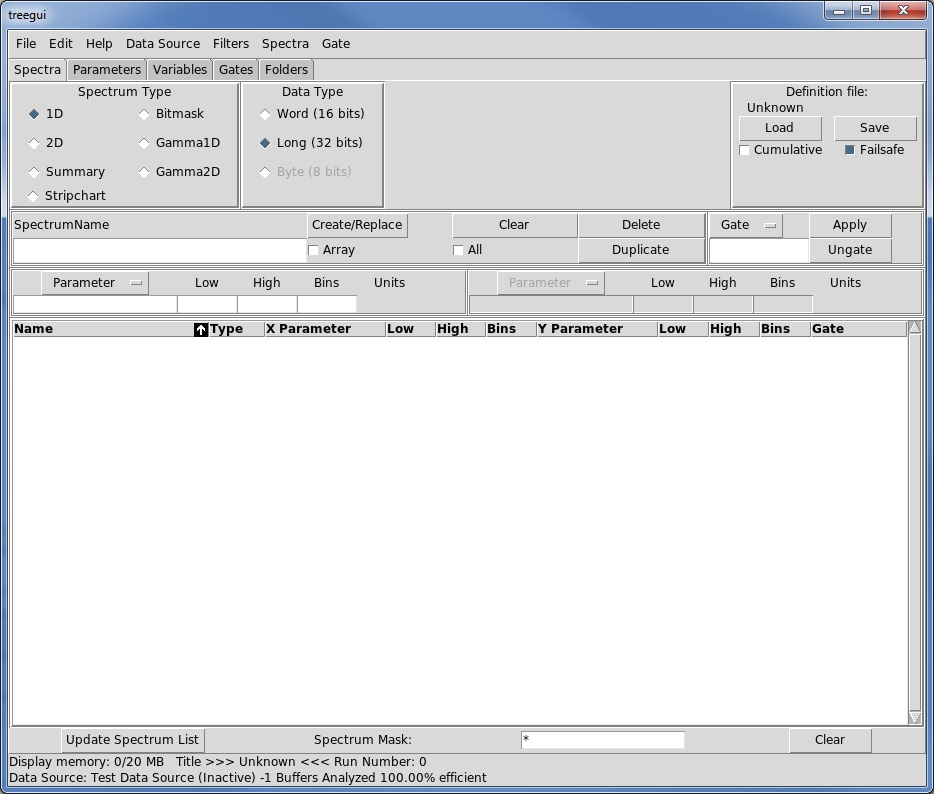
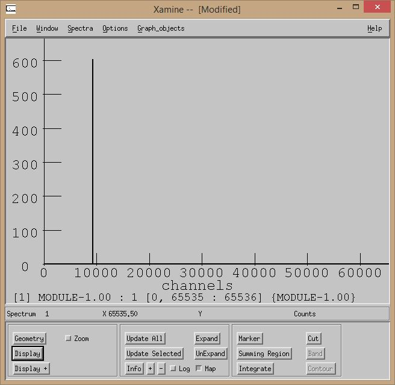

do not remove this div, it is closed by doxygen! 
|  |
| --- |
| NSCL DDAS1.0Support for XIA DDAS at the NSCL |


 end header part 
 Generated by Doxygen 1.8.1.2 

- [[Main Page|index]]
- [[User Guides|pages]]
- [[Classes|annotated]]
- [[Files|files]]
- 
  [[|javascript:searchBox.CloseResultsWindow()]]


 window showing the filter options 
[[All|javascript:void(0)]][[Classes|javascript:void(0)]][[Files|javascript:void(0)]][[Functions|javascript:void(0)]][[Variables|javascript:void(0)]][[Macros|javascript:void(0)]][[Pages|javascript:void(0)]]


 iframe showing the search results (closed by default)

 top 
Analyzing DDAS Data in SpecTcl Tutorial

header
### Table of Contents


- [Introduction](#ddas_spectcl_intro)
- [Constructing the Parameter Tree](#ddas_spectcl_parameters)
- [Constructing the ParameterMapper](#ddas_spectcl_parammapper_sec)
- [Integrating Code into MySpecTclApp](#ddas_spectcl_myspectclapp_sec)
- [Building and Running SpecTcl](#ddas_spectcl_make)
- [Creating spectra](#ddas_1crate_spectra)


AuthorJeromy Tompkins and Ron Fox 
Date4/21/2016
# Introduction


Every experiment is different and produces data in different format. For this reason, there is no precompiled version of SpecTcl provided to deal with DDAS data. Rather there are two unpackers that are provided to use, DAQ::DDAS::DDASUnpacker and DAQ::DDAS::DDASBuiltUnpacker. The difference between the two is that the latter unpacks data that has been built with the event builder. The former unpacks data as it would be outputted from the Readout program. Both provide consistent interfaces for interacting with the DDAS data. In this section, you will learn how to incorporate these into a SpecTcl. The source code of the final product is available installed at /usr/opt/ddas/VERSION/share/src/multicrate_src on NSCL spdaq machines. For other machines that choose to install to a different prefix, it is installed at @prefix@/share/src/multicrate_src.


The user does not have deal with the low-level raw data when building a SpecTcl. Rather, they just need to implement a class that uses the unpacked DDAS data to set TreeParameters for histogramming. In this way, the user from the details of the DDAS data structure. In fact, **you should never need to write your own DDAS event parser**. We provide tools for this for SpecTcl and other raw data. In any case, let's get down to business constructing a tailored SpecTcl.


First you need to copy the SpecTcl skeleton files into a directory where you will build your tailored SpecTcl. You can find the skeleton files at /usr/opt/spectcl/VERSION/Skel. This would be done with something like:


```
mkdir myDevelopmentDir
cp /usr/opt/spectcl/3.4-005/Skel/* .

```

Any SpecTcl version newer than 3.4 will be suitable.


# Constructing the Parameter Tree


The first thing that you need to do is decide how we want to structure our TreeParameters. TreeParameters are the typical mechanism that a user will use to update a spectrum. For each event, if the TreeParameter has been assigned a value, it will be histogrammed unless the event is marked as bad. Typically, experimenters like to structure their TreeParameters in a tree-like structure. In this tutorial, we will do similar. We are going to concern ourselves with the energy and timestamp values for each channel as well as how many channels had data in each event (i.e. multiplicity). Because there are three modules in our setup and each has sixteen channels, there are 48 channels we need to allocate TreeParameters for. I will layout the structure of the data in a tree structure where there is a top-level event structure called [[MyParameters|structMyParameters]] that holds the multiplicity information as well as all of the channel data object. The code in the header file is:


#ifndef MYPARAMETERS_H


#define MYPARAMETERS_H


#include <config.h>


#include <TreeParameter.h>


#include <string>


// The tree-like structure of data will be :


//


//  MyParameters


//  |


//  +-- multiplicity


//  |


//  +-- ChannelData (chan[0])


//  |   +-- energy


//  |   \-- timestamp


//  |


//  +-- ChannelData (chan[1])


//  |   +-- energy


//  |   \-- timestamp


//  |


//  ... (45 more channel data objects)


//  |


//  \-- ChannelData (chan[47])


//      +-- energy


//      \-- timestamp


//


//


struct [[ChannelData|structChannelData]] {


CTreeParameter energy;


CTreeParameter timestamp;


// Method to initialize the CTreeParameters


void Initialize(std::string name);


};


//____________________________________________________________


// Struct for top-level events


//


struct [[MyParameters|structMyParameters]] {


[[ChannelData|structChannelData]]          chan[48];


CTreeParameter   multiplicity;


// Constructor


[[MyParameters|structMyParameters]](std::string name);


};


#endif

 fragment The implementation file is very simple:


#include "MyParameters.h"


void ChannelData::Initialize(string name) {


// Initialize the energy TreeParameter to hold a value between 0 and 4095


// with unit bin increments. Units for the parameters are given as "a.u."


// or "arbitrary units".


energy.Initialize(name + ".energy", 4096, 0, 4095, "a.u.");


// Initialize the timestamp TreeParameter. This is to hold a 48 bit timestamp.


timestamp.Initialize(name + ".timestamp", 48, 0, pow(2., 48),


"ns",true);


}


// Construct the top-level structure


MyParameters::MyParameters(string name)


{


// For each of the 48 channels in the system, initialize each.


for (size_t i=0; i<48; ++i) {


chan[i].Initialize(name + to_string(i));


}


// Initialize the multiplicity TreeParameter to have 32 bins essentially between 0 and 31.


multiplicity.Initialize(name + ".mult", 32, -0.5, 30.5, "a.u.");


}

 fragment # Constructing the ParameterMapper


Now that we have laid out the structure of the TreeParameters we will turn our attention to assigning data to them. Normally, users would be required to parse raw data in their SpecTcl and then assign values to the tree parameters. In the DDAS support, we parse the raw data for you. We will name the header file for our mapper [[MyParameterMapper.h|MyParameterMapper_8h_source]]. It has the following contents:


#ifndef MYPARAMETERMAPPER_H


#define MYPARAMETERMAPPER_H


#include <ParameterMapper.h>


#include <map>


// SpecTcl event, we don't use it


class CEvent;


// The structure of tree parameters


class [[MyParameters|structMyParameters]];


// Class responsible for mapping DDAS hit data to SpecTcl TreeParameters


//


// It operates on a MyParameters structure containing TreeParameters but


// does not own it.


class [[MyParameterMapper|classMyParameterMapper]] : public [[DAQ::DDAS::CParameterMapper|classDAQ_1_1DDAS_1_1CParameterMapper]]


{


private:


[[MyParameters|structMyParameters]]& m_params;          // reference to the tree parameter structure


std::map<int, int> m_chanMap;    // global channel index for crates


public:


// Constructor.


//


//  \param params   the data structure


[[MyParameterMapper|classMyParameterMapper]]([[MyParameters|structMyParameters]]& params);


// Map raw hit data to TreeParameters


//


// \param channelData   the hit data


// \param rEvent        the SpecTcl event


virtual void mapToParameters(const std::vector<DAQ::DDAS::DDASHit>& channelData,


CEvent& rEvent);


// Compute channel index from crate, slot, and channel information


//


// \param hit   the ddas hit


int computeGlobalIndex(const [[DAQ::DDAS::DDASHit|classDAQ_1_1DDAS_1_1DDASHit]]& hit);


};


#endif

 fragment Note that there is not much to this class. The class maintains a reference to our parameters and an m_chanMap data member, which we will talk about a little later. As far as methods, there is a constructor, the mapToParameters(), and computeGlobalIndex() methods. The guts of the logic for the class is in the mapToParameters method.


So what does the mapToParameters() method do? Well, let's consider what is passed into the method as arguments. The most important of these is the first, which is a vector (vector = resizable array) of DDASHit objects. A DDASHit object encapsulates the data contained in a single channel event. It has things like the energy, timestamp, raw data elements, geographic information, trace data, as well as QDC and energy sum / baseline data. It is essentially just a vehicle to access data elements at a higher level. The provided unpacker will parse the raw data and fill the vector with all of the data in each event. If more than one DDAS hit was in an event, there will be more than one DDASHit object in the vector.


NoteIf you have experience with DDAS prior to its lab-supported reincarnation, then you should think of DDASHit as a ddaschannel object. In fact, it has the same interface for accessing data through methods. The differences are that it has no bindings to ROOT or SpecTcl and can be used easily in independent code. Furthermore, some refactoring has been done to separate raw data parsing into a separate class called [[DAQ::DDAS::DDASHitUnpacker|classDAQ_1_1DDAS_1_1DDASHitUnpacker]].
Here is the implementation of the mapToParameters() method:


void MyParameterMapper::mapToParameters(const std::vector<DDASHit>& channelData,


CEvent& rEvent)


{


size_t nHits = channelData.size();


// assign number of hits as event multiplicity


m_params.multiplicity = nHits;


// loop over all hits in event


for (size_t i=0; i<nHits; ++i) {


// convenience variable declared to refer to the i^th hit


auto& hit = channelData[i];


// Use the crate, slot, and channel to figure out the global


// channel index.


int globalChanIdx = computeGlobalIndex(hit);


// Assign values to appropriate channel


m_params.chan[globalChanIdx].energy    = hit.[[GetEnergy|classDAQ_1_1DDAS_1_1DDASHit#a123d68755f678cd1eec6f5320a39b629]]();


m_params.chan[globalChanIdx].timestamp = hit.[[GetTime|classDAQ_1_1DDAS_1_1DDASHit#a930e45be2c50eaf4a90988b0bd8c4a74]]();


}


}

 fragment Let's think a little about the computeGlobalIndex() method. The responsibility of this method is to map the hit to a global channel index, index in range [0, 47], using the crate, module, and channel information. To do this, we need to input some information concerning the layout of the modules in the crates. What is most beneficial is to know the global index of the first channel of the first module in each crate. Now I set the crate id of my first crate as 0 and the second crate as 2. That is where the m_chanMap comes in. The first crate has 2 modules in it, so the first channel of the second crate will begin at 32. See how this is defined in the constructor:


MyParameterMapper::MyParameterMapper([[MyParameters|structMyParameters]]& params)


: m_params(params),


m_chanMap()


{


// initialize the mapping to global channel index


m_chanMap[0] = 0;


m_chanMap[2] = 32;


}

 fragment The mapToChannels method then uses this m_chanMap in the following way:


int MyParameterMapper::computeGlobalIndex(const DDASHit& hit)


{


int crateId = hit.GetCrateID();


int slotIdx = hit.GetSlotID()-2;  // correct for fact that 1st card in crate is in slot 2


int chanIdx = hit.GetChannelID();


const int nChanPerSlot = 16;


// compute the global index


return m_chanMap[crateId] + slotIdx*nChanPerSlot + chanIdx;


}

 fragment That is it for defining our parameters and mapping. We will now turn to incorporating this into SpecTcl.


# Integrating Code into MySpecTclApp


The MySpecTclApp.cpp and Makefiles both need to be modified. First we will consider the MySpecTclApp.cpp. In MySpecTclApp.cpp, locate the MySpecTclApp::CreateAnalysisPipeline() method, which will have an implementation already. We will replace the implementation with a simpler one that look like this:


void


CMySpecTclApp::CreateAnalysisPipeline(CAnalyzer& rAnalyzer)


{


RegisterEventProcessor(Stage1, "Raw");


}

 fragment We will also redefine the definition of "Stage1" in the global scope. Locate where it says:


static CFixedEventUnpacker Stage1;


static CAddFirst2          Stage2;

 fragment Replace this with


// Create the structure of parameters


[[MyParameters|structMyParameters]] params("raw");


// Create the unpacker and pass it our parameter mapper. Be aware that the


// parameter mapper was passed the parameters we just created.


// Also tell the unpacker that it should only operate on fragments labeled with


// source ids 0, 1, or 2 and to ignore the rest.


[[DAQ::DDAS::CDDASBuiltUnpacker|classDAQ_1_1DDAS_1_1CDDASBuiltUnpacker]] Stage1( {0, 1, 2 }, *(new [[MyParameterMapper|classMyParameterMapper]](params)));

 fragment To round out our work on MySpecTclApp.cpp, you simply need to add some include directives to the top of the file. These will bring the [[MyParameters|structMyParameters]], [[MyParameterMapper|classMyParameterMapper]], [[DAQ::DDAS::CDDASBuiltUnpacker|classDAQ_1_1DDAS_1_1CDDASBuiltUnpacker]] classes into scope. Add these lines to the top:


#include "DDASBuiltUnpacker.h"


#include "MyParameterMapper.h"


#include "MyParameters.h"

 fragment # Building and Running SpecTcl


The final work that needs to be done is to modify the Makefile. Add the [[MyParameters|structMyParameters]] and [[MyParameterMapper|classMyParameterMapper]] class to the build by adding MyParameters.o and MyParameterMapper.o to the OBJECTS variable. It should look like this when you are done:


OBJECTS=MySpecTclApp.o [[MyParameters|structMyParameters]].o [[MyParameterMapper|classMyParameterMapper]].o

 fragment Next the compiler needs to be told where to find the [[DDASBuiltUnpacker.h|DDASBuiltUnpacker_8h_source]] file and that we need c++11 mode. That is done by adding to the USERCXXFLAGS so it looks like this:


USERCXXFLAGS=-std=c++11 -I/usr/opt/ddas/VERSION/include

 fragment Finally, we need to tell the linker where the precompiled DDAS code is. Add to USERLDFLAGS so it looks like this:


USERLDFLAGS=-L/usr/opt/ddas/VERSION/lib -lDDASUnpacker -lddasformat -Wl,-rpath=/usr/opt/ddas/VERSION/lib

 fragment where VERSION is the same as in the very beginning of this tutorial.


With those changes, you should be able to build your SpecTcl. This is accomplished by typing:


```
make 

```

To run the compiled SpecTcl, execute the command:


```
./SpecTcl

```

To remind you, the source code for the example can be found at /usr/opt/ddas/VERSION/share/src/multicrate_src.


# Creating spectra


The simplest way to create spectra is to run your tailored SpecTcl and use its user interface to create an array of spectra for the parameters we created.


Here's the SpecTcl treeparameter user interface after we start our SpecTcl:



The Tree parameter gui


- Check the array box to tell the GUI we are creating an array of spectra
- Use the parameter pull down to select module-1.00 as the parameter.
- Set the Bins value to the 65536 for a full resolution spectrum.
- Type `module-1` in the spectrum name entry to set the base spectrum name.
- Click the Create/Replace button. The Spectrum list region should populate with information about the spectra we just created.
- Use the `File->Save`... menu command to save these definitions.


You can now attach SpecTcl to the online system using the `Data` `Source->Online`... Menu entry. In the resulting dialog:


- Set the Host to the host in which the Readout program is running
- Select ring11 as the data format.
- If the event builder ring name does not match the default ring in the dialog type in the event builder name.
- Click Ok to attach SpecTcl to the online system.


Start a run. Once data starts making its way out of the event builder, you should be able to see counts in the histograms that have valid inputs. Here's a sample pulser spectrum from my tests:



Pulser spectrum in Xamine

 contents 
 start footer part 

---


Generated on Thu Aug 4 2016 08:51:13 for NSCL DDAS by  [](http://www.doxygen.org/index.html) 1.8.1.2
