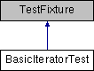

do not remove this div, it is closed by doxygen! 
|  |
| --- |
| NSCL DDAS1.0Support for XIA DDAS at the NSCL |

 end header part 
 Generated by Doxygen 1.8.8 

- [Main Page](https://github.com/FRIBDAQ/docs/tree/main/ddas-1.1/index.md)
- [Related Pages](https://github.com/FRIBDAQ/docs/tree/main/ddas-1.1/pages.md)
- [Namespaces](https://github.com/FRIBDAQ/docs/tree/main/ddas-1.1/namespaces.md)
- [Classes](https://github.com/FRIBDAQ/docs/tree/main/ddas-1.1/annotated.md)
- [Files](https://github.com/FRIBDAQ/docs/tree/main/ddas-1.1/files.md)
- 
  .md)

- [Class List](https://github.com/FRIBDAQ/docs/tree/main/ddas-1.1/annotated.md)
- [Class Index](https://github.com/FRIBDAQ/docs/tree/main/ddas-1.1/classes.md)
- [Class Hierarchy](https://github.com/FRIBDAQ/docs/tree/main/ddas-1.1/hierarchy.md)
- [Class Members](https://github.com/FRIBDAQ/docs/tree/main/ddas-1.1/functions.md)

 window showing the filter options 
[All](https://github.com/FRIBDAQ/docs/tree/main/ddas-1.1/javascript:void(0).md)[Classes](https://github.com/FRIBDAQ/docs/tree/main/ddas-1.1/javascript:void(0).md)[Namespaces](https://github.com/FRIBDAQ/docs/tree/main/ddas-1.1/javascript:void(0).md)[Files](https://github.com/FRIBDAQ/docs/tree/main/ddas-1.1/javascript:void(0).md)[Functions](https://github.com/FRIBDAQ/docs/tree/main/ddas-1.1/javascript:void(0).md)[Variables](https://github.com/FRIBDAQ/docs/tree/main/ddas-1.1/javascript:void(0).md)[Macros](https://github.com/FRIBDAQ/docs/tree/main/ddas-1.1/javascript:void(0).md)[Pages](https://github.com/FRIBDAQ/docs/tree/main/ddas-1.1/javascript:void(0).md)

 iframe showing the search results (closed by default)

 top 
[Public Member Functions](#pub-methods) |
[List of all members](https://github.com/FRIBDAQ/docs/tree/main/ddas-1.1/classBasicIteratorTest-members.md)

BasicIteratorTest Class Reference

header
Inheritance diagram for BasicIteratorTest:

|  |  |
| --- | --- |
| Public Member Functions |
|  | CPPUNIT_TEST_SUITE(BasicIteratorTest) |
|  |
|  | CPPUNIT_TEST(testConstructor) |
|  |
|  | CPPUNIT_TEST(testCopyConstructor) |
|  |
|  | CPPUNIT_TEST(testAssignment) |
|  |
|  | CPPUNIT_TEST(testEquality) |
|  |
|  | CPPUNIT_TEST(testComparisons) |
|  |
|  | CPPUNIT_TEST(testIncrements) |
|  |
|  | CPPUNIT_TEST(testRandomAccess) |
|  |
|  | CPPUNIT_TEST(testIsDoneOnNullTrace) |
|  |
|  | CPPUNIT_TEST(testMoveToInBounds) |
|  |
|  | CPPUNIT_TEST(testMoveToOutOfBounds) |
|  |
|  | CPPUNIT_TEST(testIncrementInBounds) |
|  |
|  | CPPUNIT_TEST(testIncrementOutOfBounds) |
|  |
|  | CPPUNIT_TEST(testIteratorSubtraction) |
|  |
|  | CPPUNIT_TEST_SUITE_END() |
|  |
| void | setUp() |
|  |
| void | tearDown() |
|  |
| void | testConstructor() |
|  |
| void | testCopyConstructor() |
|  |
| void | testAssignment() |
|  |
| void | testEquality() |
|  |
| void | testIncrements() |
|  |
| void | testRandomAccess() |
|  |
| void | testComparisons() |
|  |
| void | testIsDoneOnNullTrace() |
|  |
| void | testMoveToInBounds() |
|  |
| void | testMoveToOutOfBounds() |
|  |
| void | testIncrementInBounds() |
|  |
| void | testIncrementOutOfBounds() |
|  |
| void | testIteratorSubtraction() |
|  |

---

The documentation for this class was generated from the following files:- traiter/test/[BasicIteratorTest.h](https://github.com/FRIBDAQ/docs/tree/main/ddas-1.1/BasicIteratorTest_8h_source.md)
- traiter/test/BasicIteratorTest.cpp

 contents 
 start footer part 

---

Generated on Tue Mar 31 2020 13:10:44 for NSCL DDAS by   1.8.8
