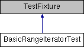

do not remove this div, it is closed by doxygen! 
|  |
| --- |
| NSCL DDAS1.0Support for XIA DDAS at the NSCL |

 end header part 
 Generated by Doxygen 1.8.8 

- [[index]]
- [[pages]]
- [[namespaces]]
- [[annotated]]
- [[files]]
- 
  [[javascript:searchBox.CloseResultsWindow()]]

- [[annotated]]
- [[classes]]
- [[hierarchy]]
- [[functions]]

 window showing the filter options 
[[javascript:void(0)]][[javascript:void(0)]][[javascript:void(0)]][[javascript:void(0)]][[javascript:void(0)]][[javascript:void(0)]][[javascript:void(0)]][[javascript:void(0)]]

 iframe showing the search results (closed by default)

 top 
[Public Member Functions](#pub-methods) |
[[classBasicRangeIteratorTest-members]]

BasicRangeIteratorTest Class Reference

header
Inheritance diagram for BasicRangeIteratorTest:

|  |  |
| --- | --- |
| Public Member Functions |
|  | CPPUNIT_TEST_SUITE(BasicRangeIteratorTest) |
|  |
|  | CPPUNIT_TEST(testConstructor) |
|  |
|  | CPPUNIT_TEST(testConstructor2) |
|  |
|  | CPPUNIT_TEST(testCopyConstructor) |
|  |
|  | CPPUNIT_TEST(testAssignment) |
|  |
|  | CPPUNIT_TEST(testEquality) |
|  |
|  | CPPUNIT_TEST(testIsDoneOnNullTrace) |
|  |
|  | CPPUNIT_TEST(testMoveToInBounds) |
|  |
|  | CPPUNIT_TEST(testMoveToOutOfBounds) |
|  |
|  | CPPUNIT_TEST(testIncrementInBounds) |
|  |
|  | CPPUNIT_TEST(testIncrementOutOfBounds) |
|  |
|  | CPPUNIT_TEST_SUITE_END() |
|  |
| void | setUp() |
|  |
| void | tearDown() |
|  |
| void | testConstructor() |
|  |
| void | testConstructor2() |
|  |
| void | testCopyConstructor() |
|  |
| void | testAssignment() |
|  |
| void | testEquality() |
|  |
| void | testIsDoneOnNullTrace() |
|  |
| void | testMoveToInBounds() |
|  |
| void | testMoveToOutOfBounds() |
|  |
| void | testIncrementInBounds() |
|  |
| void | testIncrementOutOfBounds() |
|  |
| void | testRandomAccess() |
|  |

---

The documentation for this class was generated from the following files:- traiter/test/[[BasicRangeIteratorTest_8h_source]]
- traiter/test/BasicRangeIteratorTest.cpp

 contents 
 start footer part 

---

Generated on Tue Mar 31 2020 13:10:44 for NSCL DDAS by   1.8.8
