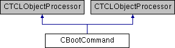

do not remove this div, it is closed by doxygen! 
|  |
| --- |
| NSCL DDAS1.0Support for XIA DDAS at the NSCL |


 end header part 
 Generated by Doxygen 1.8.8 

- [[index]]
- [[pages]]
- [[namespaces]]
- [[annotated]]
- [[files]]
- 
  [[javascript:searchBox.CloseResultsWindow()]]


- [[annotated]]
- [[classes]]
- [[hierarchy]]
- [[functions]]


 window showing the filter options 
[[javascript:void(0)]][[javascript:void(0)]][[javascript:void(0)]][[javascript:void(0)]][[javascript:void(0)]][[javascript:void(0)]][[javascript:void(0)]][[javascript:void(0)]]


 iframe showing the search results (closed by default)

 top 
[Public Member Functions](#pub-methods) |
[[classCBootCommand-members]]


CBootCommand Class Reference

header
`#include <CBootCommand.h>`


Inheritance diagram for CBootCommand:





|  |  |
| --- | --- |
| Public Member Functions |
|  | CBootCommand(CTCLInterpreter &interp, const char *pCmd,CMyEventSegment*pSeg) |
|  |
| virtual | ~CBootCommand() |
|  |
| virtual int | operator()(CTCLInterpreter &interp, std::vector< CTCLObject > &objv) |
|  |
|  | CBootCommand(CTCLInterpreter &interp, const char *pCmd,CMyEventSegment*pSeg) |
|  |
| virtual int | operator()(CTCLInterpreter &interp, std::vector< CTCLObject > &objv) |
|  |


<a name="details"></a>## Detailed Description


This class implements the ddasboot command. It is added to to the Tcl interpreter that runs ddasreadout so that the DDAS modules can be booted on demand rather than every time the Readout program starts.


Syntax:

```
*       ddasboot
*    
```

## Constructor & Destructor Documentation


|  |  |  |  |
| --- | --- | --- | --- |
| CBootCommand::CBootCommand | ( | CTCLInterpreter & | interp, |
|  |  | const char * | pCmd, |
|  |  | CMyEventSegment* | pSeg |
|  | ) |  |  |

constructor

Parameters
|  |  |
| --- | --- |
| interp | - Reference to the interpreter. |
| pCmd | - Command string. |
| pSeg | - Event segment to manipulate. |


|  |  |  |  |  |  |  |
| --- | --- | --- | --- | --- | --- | --- |
| CBootCommand::~CBootCommand() | CBootCommand::~CBootCommand | ( |  | ) |  | virtual |
| CBootCommand::~CBootCommand | ( |  | ) |  |

Destructor:


## Member Function Documentation


|  |  |  |  |  |  |  |  |  |  |  |  |  |  |
| --- | --- | --- | --- | --- | --- | --- | --- | --- | --- | --- | --- | --- | --- |
| int CBootCommand::operator()(CTCLInterpreter &interp,std::vector< CTCLObject > &objv) | int CBootCommand::operator() | ( | CTCLInterpreter & | interp, |  |  | std::vector< CTCLObject > & | objv |  | ) |  |  | virtual |
| int CBootCommand::operator() | ( | CTCLInterpreter & | interp, |
|  |  | std::vector< CTCLObject > & | objv |
|  | ) |  |  |

operator() Gets control when the command is invoked.

- Ensures there are no additional command parameters.
- Invokes the segments's boot method.


Parameters
|  |  |
| --- | --- |
| interp | - interpreter executing the command. |
| objv | - command words. |


Returnsint - Status of the command:- TCL_OK - successful completion.
- TCL_ERROR - failure. Human readable reason is in the intepreter result.


---

The documentation for this class was generated from the following files:- readout/[[CBootCommand_8h_source]]
- readout/CBootCommand.cpp

 contents 
 start footer part 

---


Generated on Wed Feb 20 2019 06:39:52 for NSCL DDAS by  [](http://www.doxygen.org/index.html) 1.8.8
