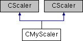

do not remove this div, it is closed by doxygen! 
|  |
| --- |
| NSCL DDAS1.0Support for XIA DDAS at the NSCL |

 end header part 
 Generated by Doxygen 1.8.8 

- [[index]]
- [[pages]]
- [[namespaces]]
- [[annotated]]
- [[files]]
- 
  [[javascript:searchBox.CloseResultsWindow()]]

- [[annotated]]
- [[classes]]
- [[hierarchy]]
- [[functions]]

 window showing the filter options 
[[javascript:void(0)]][[javascript:void(0)]][[javascript:void(0)]][[javascript:void(0)]][[javascript:void(0)]][[javascript:void(0)]][[javascript:void(0)]][[javascript:void(0)]]

 iframe showing the search results (closed by default)

 top 
[Public Member Functions](#pub-methods) |
[[classCMyScaler-members]]

CMyScaler Class Reference

header
Inheritance diagram for CMyScaler:

|  |  |
| --- | --- |
| Public Member Functions |
|  | CMyScaler(unsigned short moduleNr, unsigned short crateid) |
|  |
| virtual void | initialize() |
|  |
| virtual vector< uint32_t > | read() |
|  |
| virtual void | clear() |
|  |
| virtual void | disable() |
|  |
| virtual unsigned int | size() |
|  |
|  | CMyScaler(unsigned short moduleNr, unsigned short crateid) |
|  |
| virtual void | initialize() |
|  |
| virtual vector< uint32_t > | read() |
|  |
| virtual void | clear() |
|  |
| virtual void | disable() |
|  |
| virtual unsigned int | size() |
|  |

---

The documentation for this class was generated from the following files:- readout/[[CMyScaler_8h_source]]
- readout/CMyScaler.cpp

 contents 
 start footer part 

---

Generated on Wed Feb 20 2019 06:39:52 for NSCL DDAS by   1.8.8
