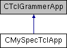

do not remove this div, it is closed by doxygen! 
|  |
| --- |
| NSCL DDAS1.0Support for XIA DDAS at the NSCL |

 end header part 
 Generated by Doxygen 1.8.8 

- [[Main Page|index]]
- [[Related Pages|pages]]
- [[Namespaces|namespaces]]
- [[Classes|annotated]]
- [[Files|files]]
- 
  [[|javascript:searchBox.CloseResultsWindow()]]

- [[Class List|annotated]]
- [[Class Index|classes]]
- [[Class Hierarchy|hierarchy]]
- [[Class Members|functions]]

 window showing the filter options 
[[All|javascript:void(0)]][[Classes|javascript:void(0)]][[Namespaces|javascript:void(0)]][[Files|javascript:void(0)]][[Functions|javascript:void(0)]][[Variables|javascript:void(0)]][[Macros|javascript:void(0)]][[Pages|javascript:void(0)]]

 iframe showing the search results (closed by default)

 top 
[Public Member Functions](#pub-methods) |
[[List of all members|classCMySpecTclApp-members]]

CMySpecTclApp Class Reference

header
Inheritance diagram for CMySpecTclApp:

|  |  |
| --- | --- |
| Public Member Functions |
| virtual void | BindTCLVariables(CTCLInterpreter &rInterp) |
|  |
| virtual void | SourceLimitScripts(CTCLInterpreter &rInterpreter) |
|  |
| virtual void | SetLimits() |
|  |
| virtual void | CreateHistogrammer() |
|  |
| virtual void | SelectDisplayer(UInt_t nDisplaySize, CHistogrammer &rHistogrammer) |
|  |
| virtual void | SetupTestDataSource() |
|  |
| virtual void | CreateAnalyzer(CEventSink *pSink) |
|  |
| virtual void | SelectDecoder(CAnalyzer &rAnalyzer) |
|  |
| virtual void | CreateAnalysisPipeline(CAnalyzer &rAnalyzer) |
|  |
| virtual void | AddCommands(CTCLInterpreter &rInterp) |
|  |
| virtual void | SetupRunControl() |
|  |
| virtual void | SourceFunctionalScripts(CTCLInterpreter &rInterp) |
|  |
| virtual int | operator()() |
|  |

---

The documentation for this class was generated from the following files:- simple_setups/multicrate_src/[[MySpecTclApp.h|MySpecTclApp_8h_source]]
- simple_setups/multicrate_src/MySpecTclApp.cpp

 contents 
 start footer part 

---

Generated on Tue Mar 31 2020 13:10:45 for NSCL DDAS by   1.8.8
