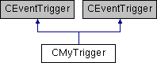

do not remove this div, it is closed by doxygen! 
|  |
| --- |
| NSCL DDAS1.0Support for XIA DDAS at the NSCL |

 end header part 
 Generated by Doxygen 1.8.8 

- [[Main Page|index]]
- [[User Guides|pages]]
- [[Namespaces|namespaces]]
- [[Classes|annotated]]
- [[Files|files]]
- 
  [[|javascript:searchBox.CloseResultsWindow()]]

- [[Class List|annotated]]
- [[Class Index|classes]]
- [[Class Hierarchy|hierarchy]]
- [[Class Members|functions]]

 window showing the filter options 
[[All|javascript:void(0)]][[Classes|javascript:void(0)]][[Namespaces|javascript:void(0)]][[Files|javascript:void(0)]][[Functions|javascript:void(0)]][[Variables|javascript:void(0)]][[Macros|javascript:void(0)]][[Pages|javascript:void(0)]]

 iframe showing the search results (closed by default)

 top 
[Public Member Functions](#pub-methods) |
[Public Attributes](#pub-attribs) |
[[List of all members|classCMyTrigger-members]]

CMyTrigger Class Reference

header
Inheritance diagram for CMyTrigger:

|  |  |
| --- | --- |
| Public Member Functions |
|  | CMyTrigger() |
|  | Default constructor. |
|  |
|  | ~CMyTrigger() |
|  | Destructor. |
|  |
| virtual void | setup() |
|  |
| virtual void | teardown() |
|  |
| virtual bool | operator()() |
|  |
| virtual void | Initialize(int nummod) |
|  |
| void | Reset() |
|  |
|  | CMyTrigger() |
|  | Default constructor. |
|  |
|  | ~CMyTrigger() |
|  | Destructor. |
|  |
| virtual void | setup() |
|  |
| virtual void | teardown() |
|  |
| virtual bool | operator()() |
|  |
| virtual void | Initialize(int nummod) |
|  |
| void | Reset() |
|  |

|  |  |
| --- | --- |
| Public Attributes |
| time_t | start |
|  |
| time_t | end |
|  |

---

The documentation for this class was generated from the following files:- readout/[[CMyTrigger.h|CMyTrigger_8h_source]]
- readout/CMyTrigger.cpp

 contents 
 start footer part 

---

Generated on Wed Feb 20 2019 06:39:52 for NSCL DDAS by   1.8.8
