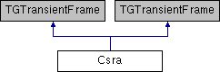

do not remove this div, it is closed by doxygen! 
|  |
| --- |
| NSCL DDAS1.0Support for XIA DDAS at the NSCL |

 end header part 
 Generated by Doxygen 1.8.8 

- [[index]]
- [[pages]]
- [[namespaces]]
- [[annotated]]
- [[files]]
- 
  [[javascript:searchBox.CloseResultsWindow()]]

- [[annotated]]
- [[classes]]
- [[hierarchy]]
- [[functions]]

 window showing the filter options 
[[javascript:void(0)]][[javascript:void(0)]][[javascript:void(0)]][[javascript:void(0)]][[javascript:void(0)]][[javascript:void(0)]][[javascript:void(0)]][[javascript:void(0)]]

 iframe showing the search results (closed by default)

 top 
[Public Member Functions](#pub-methods) |
[Static Public Member Functions](#pub-static-methods) |
[[classCsra-members]]

Csra Class Reference

header
Inheritance diagram for Csra:

|  |  |
| --- | --- |
| Public Member Functions |
|  | Csra(const TGWindow *p, const TGWindow *main, int NumModules=13) |
|  |
| void | RegisterMultCoincDialogue(MultCoincDialogue*mcd) |
|  |
| int | load_info(Long_t, Bool_t verbose=true) |
|  |
| void | SetModuleNumber(int moduleNr) |
|  |
|  | Csra(const TGWindow *p, const TGWindow *main, int NumModules=13) |
|  |
| void | RegisterMultCoincDialogue(MultCoincDialogue*mcd) |
|  |
| int | load_info(Long_t, Bool_t verbose=true) |
|  |
| void | SetModuleNumber(int moduleNr) |
|  |

|  |  |
| --- | --- |
| Static Public Member Functions |
| static int | GetNBitsOn(unsigned int module, unsigned int bit) |
|  |
| static int | GetNBitsOn(unsigned int module, unsigned int bit) |
|  |

---

The documentation for this class was generated from the following files:- nscope/[[Csra_8h_source]]
- nscope/Csra.cpp

 contents 
 start footer part 

---

Generated on Tue Mar 31 2020 13:10:45 for NSCL DDAS by   1.8.8
