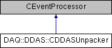

do not remove this div, it is closed by doxygen! 
|  |
| --- |
| NSCL DDAS1.0Support for XIA DDAS at the NSCL |

 end header part 
 Generated by Doxygen 1.8.8 

- [[Main Page|index]]
- [[User Guides|pages]]
- [[Namespaces|namespaces]]
- [[Classes|annotated]]
- [[Files|files]]
- 
  [[|javascript:searchBox.CloseResultsWindow()]]

- [[Class List|annotated]]
- [[Class Index|classes]]
- [[Class Hierarchy|hierarchy]]
- [[Class Members|functions]]

 window showing the filter options 
[[All|javascript:void(0)]][[Classes|javascript:void(0)]][[Namespaces|javascript:void(0)]][[Files|javascript:void(0)]][[Functions|javascript:void(0)]][[Variables|javascript:void(0)]][[Macros|javascript:void(0)]][[Pages|javascript:void(0)]]

 iframe showing the search results (closed by default) 

- **DAQ**
- **DDAS**
- [[CDDASUnpacker|classDAQ_1_1DDAS_1_1CDDASUnpacker]]

 top 
[Public Member Functions](#pub-methods) |
[Protected Member Functions](#pro-methods) |
[[List of all members|classDAQ_1_1DDAS_1_1CDDASUnpacker-members]]

DAQ::DDAS::CDDASUnpacker Class Reference

header
Raw data unpacker for unbuilt data.  
 [[More...|classDAQ_1_1DDAS_1_1CDDASUnpacker#details]]

`#include <DDASUnpacker.h>`

Inheritance diagram for DAQ::DDAS::CDDASUnpacker:

|  |  |
| --- | --- |
| Public Member Functions |
|  | CDDASUnpacker(CParameterMapper&rParameterMapper) |
|  | Constructor.More... |
|  |
|  | ~CDDASUnpacker() |
|  |
| void | setParameterMapper(CParameterMapper&pParameterMapper) |
|  | Pass in a different parameter mapper.More... |
|  |
| CParameterMapper& | getParameterMapper() const |
|  |
| virtual Bool_t | operator()(const Address_t pEvent, CEvent &rEvent, CAnalyzer &rAnalyzer, CBufferDecoder &rDecoder) |
|  | Process the raw data and call user's mapper.More... |
|  |

|  |  |
| --- | --- |
| Protected Member Functions |
| void | setEventSize(const Address_t pEvent, CBufferDecoder &rDecoder, CAnalyzer &rAnalyzer) |
|  |

## Detailed Description

Raw data unpacker for unbuilt data.

The user should use this to process data upstream of or in the absence of the event builder. This processes raw data and generates one [[DDASHit|classDAQ_1_1DDAS_1_1DDASHit]] object per event. The user is expected to derive a class from the ParameterMapper base class and pass that object to this unpacker to call at the end of parsing each event. In that way, this class will deal with the raw data and allow the user to interact with it at a much higher level. This class will take ownership of the user's mapper and will attempt to delete it at the time of destruction. For that reason, it is important that the user dynamically allocates their mapper on the heap. A proper way to do this is:

[[MyParameterMapper|classMyParameterMapper]]* pMapper = new [[MyParameterMapper|classMyParameterMapper]];

[[CDDASUnpacker|classDAQ_1_1DDAS_1_1CDDASUnpacker#ac67d7b7dbfb9d3130215df9f9e631136]] unpacker(*pMapper);

 fragment This unpacker does not support byte-swapping. Don't worry, it is not likely to be an issue in the future unless you try to analyze your system on a computer with a strange architecture.

## Constructor & Destructor Documentation

|  |  |  |  |  |  |
| --- | --- | --- | --- | --- | --- |
| DAQ::DDAS::CDDASUnpacker::CDDASUnpacker | ( | CParameterMapper& | rParameterMapper | ) |  |

Constructor.

- Parameters
  |  |  |
  | --- | --- |
  | rParameterMapper | user's mapper (must be dynamically allocated, ownership transfers to class) |

|  |  |  |  |  |
| --- | --- | --- | --- | --- |
| DAQ::DDAS::CDDASUnpacker::~CDDASUnpacker | ( |  | ) |  |

Destructor

## Member Function Documentation

|  |  |  |  |  |
| --- | --- | --- | --- | --- |
| CParameterMapper& DAQ::DDAS::CDDASUnpacker::getParameterMapper | ( |  | ) | const |

Retrieve the active parameter

|  |  |  |  |  |  |  |  |  |  |  |  |  |  |  |  |  |  |  |  |  |  |
| --- | --- | --- | --- | --- | --- | --- | --- | --- | --- | --- | --- | --- | --- | --- | --- | --- | --- | --- | --- | --- | --- |
| Bool_t DAQ::DDAS::CDDASUnpacker::operator()(const Address_tpEvent,CEvent &rEvent,CAnalyzer &rAnalyzer,CBufferDecoder &rDecoder) | Bool_t DAQ::DDAS::CDDASUnpacker::operator() | ( | const Address_t | pEvent, |  |  | CEvent & | rEvent, |  |  | CAnalyzer & | rAnalyzer, |  |  | CBufferDecoder & | rDecoder |  | ) |  |  | virtual |
| Bool_t DAQ::DDAS::CDDASUnpacker::operator() | ( | const Address_t | pEvent, |
|  |  | CEvent & | rEvent, |
|  |  | CAnalyzer & | rAnalyzer, |
|  |  | CBufferDecoder & | rDecoder |
|  | ) |  |  |

Process the raw data and call user's mapper.

This is designed to process data from the DDAS readout program. See the documentation in [[readout|readout]] to understand the structure.

This sets the event size in the CEvent.

- Parameters
  |  |  |
  | --- | --- |
  | pEvent | address in buffer to begin parsing at |
  | rEvent | current SpecTcl event |
  | rAnalyzer | the analyzer |
  | rDecoder | current buffer decoder |

|  |  |  |  |  |  |
| --- | --- | --- | --- | --- | --- |
| void DAQ::DDAS::CDDASUnpacker::setParameterMapper | ( | CParameterMapper& | pParameterMapper | ) |  |

Pass in a different parameter mapper.

The user must allocate the parameter dynamically before passing it in. For example:

auto pMapper = new [[MyParameterMapper|classMyParameterMapper]];

unpacker.setParameterMapper(*pMapper);

 fragment Ownership of the mapper is transferred into this object.

- Parameters
  |  |  |
  | --- | --- |
  | rParameterMapper | the user's parameter mapper |

---

The documentation for this class was generated from the following files:- spectcl/[[DDASUnpacker.h|DDASUnpacker_8h_source]]
- spectcl/DDASUnpacker.cpp

 contents 
 start footer part 

---

Generated on Wed Feb 20 2019 06:39:52 for NSCL DDAS by   1.8.8
