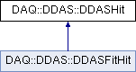

do not remove this div, it is closed by doxygen! 
|  |
| --- |
| NSCL DDAS1.0Support for XIA DDAS at the NSCL |

 end header part 
 Generated by Doxygen 1.8.8 

- [[Main Page|https://github.com/FRIBDAQ/docs/tree/main/ddas-1.1/index.md]]
- [[Related Pages|https://github.com/FRIBDAQ/docs/tree/main/ddas-1.1/pages.md]]
- [[Namespaces|https://github.com/FRIBDAQ/docs/tree/main/ddas-1.1/namespaces.md]]
- [[Classes|https://github.com/FRIBDAQ/docs/tree/main/ddas-1.1/annotated.md]]
- [[Files|https://github.com/FRIBDAQ/docs/tree/main/ddas-1.1/files.md]]
- 
  [[|https://github.com/FRIBDAQ/docs/tree/main/ddas-1.1/javascript:searchBox.CloseResultsWindow().md]]

- [[Class List|https://github.com/FRIBDAQ/docs/tree/main/ddas-1.1/annotated.md]]
- [[Class Index|https://github.com/FRIBDAQ/docs/tree/main/ddas-1.1/classes.md]]
- [[Class Hierarchy|https://github.com/FRIBDAQ/docs/tree/main/ddas-1.1/hierarchy.md]]
- [[Class Members|https://github.com/FRIBDAQ/docs/tree/main/ddas-1.1/functions.md]]

 window showing the filter options 
[[All|https://github.com/FRIBDAQ/docs/tree/main/ddas-1.1/javascript:void(0).md]][[Classes|https://github.com/FRIBDAQ/docs/tree/main/ddas-1.1/javascript:void(0).md]][[Namespaces|https://github.com/FRIBDAQ/docs/tree/main/ddas-1.1/javascript:void(0).md]][[Files|https://github.com/FRIBDAQ/docs/tree/main/ddas-1.1/javascript:void(0).md]][[Functions|https://github.com/FRIBDAQ/docs/tree/main/ddas-1.1/javascript:void(0).md]][[Variables|https://github.com/FRIBDAQ/docs/tree/main/ddas-1.1/javascript:void(0).md]][[Macros|https://github.com/FRIBDAQ/docs/tree/main/ddas-1.1/javascript:void(0).md]][[Pages|https://github.com/FRIBDAQ/docs/tree/main/ddas-1.1/javascript:void(0).md]]

 iframe showing the search results (closed by default) 

- **DAQ**
- **DDAS**
- [[DDASHit|https://github.com/FRIBDAQ/docs/tree/main/ddas-1.1/classDAQ_1_1DDAS_1_1DDASHit.md]]

 top 
[Public Member Functions](#pub-methods) |
[[List of all members|https://github.com/FRIBDAQ/docs/tree/main/ddas-1.1/classDAQ_1_1DDAS_1_1DDASHit-members.md]]

DAQ::DDAS::DDASHit Class Reference

header
Encapsulation of a generic DDAS event.  
 [[More...|https://github.com/FRIBDAQ/docs/tree/main/ddas-1.1/classDAQ_1_1DDAS_1_1DDASHit.md#details]]

`#include <DDASHit.h>`

Inheritance diagram for DAQ::DDAS::DDASHit:

|  |  |
| --- | --- |
| Public Member Functions |
|  | DDASHit() |
|  | Default constructor.More... |
|  |
|  | DDASHit(constDDASHit&obj) |
|  | Copy constructor. |
|  |
| DDASHit& | operator=(constDDASHit&obj) |
|  | Assignment operator. |
|  |
| virtual | ~DDASHit() |
|  | Destructor. |
|  |
| void | Reset() |
|  | Resets the state of all member data to that of initialization.More... |
|  |
| uint32_t | GetEnergy() const |
|  | Retrieve the energy.More... |
|  |
| uint32_t | GetTimeHigh() const |
|  | Retrieve most significant 16-bits of raw timestamp. |
|  |
| uint32_t | GetTimeLow() const |
|  | Retrieve least significant 32-bit of raw timestamp. |
|  |
| uint32_t | GetTimeCFD() const |
|  | Retrieve the raw cfd time. |
|  |
| double | GetTime() const |
|  | Retrieve computed time.More... |
|  |
| uint64_t | GetCoarseTime() const |
|  | Retrieve the 48-bit timestamp in nanoseconds without anyCFDcorrection. |
|  |
| uint32_t | GetFinishCode() const |
|  | Retrieve finish code.More... |
|  |
| uint32_t | GetChannelLength() const |
|  | Retrieve number of 32-bit words that were in original data packet.More... |
|  |
| uint32_t | GetChannelLengthHeader() const |
|  | Retrieve length of header in original data packet. |
|  |
| uint32_t | GetOverflowCode() const |
|  | Retrieve the overflow code. |
|  |
| uint32_t | GetSlotID() const |
|  | Retrieve the slot that the module resided in. |
|  |
| uint32_t | GetCrateID() const |
|  | Retrieve the index of the crate the module resided in. |
|  |
| uint32_t | GetChannelID() const |
|  | Retrieve the channel index. |
|  |
| uint32_t | GetModMSPS() const |
|  | Retrieve the ADC frequency of the module. |
|  |
| int | GetHardwareRevision() const |
|  | Retrieve the hardware revision. |
|  |
| int | GetADCResolution() const |
|  | Retrieve the adc resolution. |
|  |
| uint32_t | GetCFDTrigSource() const |
|  |
| uint32_t | GetCFDFailBit() const |
|  |
| uint32_t | GetTraceLength() const |
|  |
| std::vector< uint16_t > & | GetTrace() |
|  |
| const std::vector< uint16_t > & | GetTrace() const |
|  |
| std::vector< uint32_t > & | GetEnergySums() |
|  |
| const std::vector< uint32_t > & | GetEnergySums() const |
|  |
| std::vector< uint32_t > & | GetQDCSums() |
|  |
| const std::vector< uint32_t > & | GetQDCSums() const |
|  |
| uint64_t | GetExternalTimestamp() const |
|  |
| bool | GetADCOverflowUnderflow() const |
|  | Return the adc overflow/underflow status.More... |
|  |
| void | setChannel(uint32_t channel) |
|  |
| void | setSlot(uint32_t slot) |
|  |
| void | setCrate(uint32_t crate) |
|  |
| void | setChannelHeaderLength(uint32_t channelHeaderLength) |
|  |
| void | setChannelLength(uint32_t channelLength) |
|  |
| void | setOverflowCode(uint32_t overflow) |
|  |
| void | setFinishCode(bool finishCode) |
|  |
| void | setCoarseTime(uint64_t time) |
|  |
| void | setRawCFDTime(uint32_t data) |
|  |
| void | setCFDTrigSourceBit(uint32_t bit) |
|  |
| void | setCFDFailBit(uint32_t bit) |
|  |
| void | setTimeLow(uint32_t datum) |
|  |
| void | setTimeHigh(uint32_t datum) |
|  |
| void | setTime(double time) |
|  |
| void | setEnergy(uint32_t value) |
|  |
| void | setTraceLength(uint32_t trace) |
|  |
| void | setADCFrequency(uint32_t value) |
|  |
| void | setADCResolution(int value) |
|  |
| void | setHardwareRevision(int value) |
|  |
| void | appendEnergySum(uint32_t value) |
|  |
| void | appendQDCSum(uint32_t value) |
|  |
| void | appendTraceSample(uint16_t value) |
|  |
| void | setExternalTimestamp(uint64_t tstamp) |
|  |
| void | setADCOverflowUnderflow(bool state) |
|  |

## Detailed Description

Encapsulation of a generic DDAS event.

The [[DDASHit|https://github.com/FRIBDAQ/docs/tree/main/ddas-1.1/classDAQ_1_1DDAS_1_1DDASHit.md]] class is intended to encapsulate the information that is emitted by the Pixie-16 dgitizer for a single event. It contains information for a single channel only. It is generic because it can store data for the 100 MSPS, 250 MSPS, and 500 MSPS Pixie-16 digitizers used at the lab. In general all of these contain the same set of information, however, the meaning of the [[CFD|https://github.com/FRIBDAQ/docs/tree/main/ddas-1.1/classCFD.md]] data is different for each. The [[DDASHit|https://github.com/FRIBDAQ/docs/tree/main/ddas-1.1/classDAQ_1_1DDAS_1_1DDASHit.md]] class abstracts these differences away from the user.

This class does not provide any parsing capabilities likes its companion class ddasdumper. To fill this with data, you should use the associated [[DDASHitUnpacker|https://github.com/FRIBDAQ/docs/tree/main/ddas-1.1/classDAQ_1_1DDAS_1_1DDASHitUnpacker.md]] class. Here is how you use it.

[[DDASHit|https://github.com/FRIBDAQ/docs/tree/main/ddas-1.1/classDAQ_1_1DDAS_1_1DDASHit.md#a25aeada46ad749645868ce52e57b692d]] channel;

DDASHitUnpacker unpacker;

unpacker.unpack(pData, pData+sizeOfData, channel);

 fragment

## Constructor & Destructor Documentation

|  |  |  |  |  |
| --- | --- | --- | --- | --- |
| DAQ::DDAS::DDASHit::DDASHit | ( |  | ) |  |

Default constructor.

All member data are zero initialized.

## Member Function Documentation

|  |  |  |  |  |  |  |
| --- | --- | --- | --- | --- | --- | --- |
| bool DAQ::DDAS::DDASHit::GetADCOverflowUnderflow()const | bool DAQ::DDAS::DDASHit::GetADCOverflowUnderflow | ( |  | ) | const | inline |
| bool DAQ::DDAS::DDASHit::GetADCOverflowUnderflow | ( |  | ) | const |

Return the adc overflow/underflow status.

In the 12 and 14 bit modules, this is value of bit 15 in the 4th header word. In the 16 bit modules, this is the value of bit 31 in the 4th header word.

|  |  |  |  |  |  |  |
| --- | --- | --- | --- | --- | --- | --- |
| uint32_t DAQ::DDAS::DDASHit::GetCFDFailBit()const | uint32_t DAQ::DDAS::DDASHit::GetCFDFailBit | ( |  | ) | const | inline |
| uint32_t DAQ::DDAS::DDASHit::GetCFDFailBit | ( |  | ) | const |

Retreive failure bit from cfd data

|  |  |  |  |  |  |  |
| --- | --- | --- | --- | --- | --- | --- |
| uint32_t DAQ::DDAS::DDASHit::GetCFDTrigSource()const | uint32_t DAQ::DDAS::DDASHit::GetCFDTrigSource | ( |  | ) | const | inline |
| uint32_t DAQ::DDAS::DDASHit::GetCFDTrigSource | ( |  | ) | const |

Retrieve trig source from cfd data

|  |  |  |  |  |  |  |
| --- | --- | --- | --- | --- | --- | --- |
| uint32_t DAQ::DDAS::DDASHit::GetChannelLength()const | uint32_t DAQ::DDAS::DDASHit::GetChannelLength | ( |  | ) | const | inline |
| uint32_t DAQ::DDAS::DDASHit::GetChannelLength | ( |  | ) | const |

Retrieve number of 32-bit words that were in original data packet.

Note that this only really makes sense to be used if the object was filled with data using UnpackChannelData().

|  |  |  |  |  |  |  |
| --- | --- | --- | --- | --- | --- | --- |
| uint32_t DAQ::DDAS::DDASHit::GetEnergy()const | uint32_t DAQ::DDAS::DDASHit::GetEnergy | ( |  | ) | const | inline |
| uint32_t DAQ::DDAS::DDASHit::GetEnergy | ( |  | ) | const |

Retrieve the energy.

With the advent of Pixie16 modules with 16-bit ADCs, the [[GetEnergy()|https://github.com/FRIBDAQ/docs/tree/main/ddas-1.1/classDAQ_1_1DDAS_1_1DDASHit.md#a123d68755f678cd1eec6f5320a39b629]] method no longer includes the ADC overflow/underflow bit. The overflow/underflow bit can be accessed via the [[GetADCOverflowUnderflow()|https://github.com/FRIBDAQ/docs/tree/main/ddas-1.1/classDAQ_1_1DDAS_1_1DDASHit.md#a0613ff2e15842d02064488eb17fd3847]] method instead.

|  |  |  |  |  |  |  |
| --- | --- | --- | --- | --- | --- | --- |
| std::vector<uint32_t>& DAQ::DDAS::DDASHit::GetEnergySums() | std::vector<uint32_t>& DAQ::DDAS::DDASHit::GetEnergySums | ( |  | ) |  | inline |
| std::vector<uint32_t>& DAQ::DDAS::DDASHit::GetEnergySums | ( |  | ) |  |

Access the energy/baseline sum data

|  |  |  |  |  |  |  |
| --- | --- | --- | --- | --- | --- | --- |
| uint64_t DAQ::DDAS::DDASHit::GetExternalTimestamp()const | uint64_t DAQ::DDAS::DDASHit::GetExternalTimestamp | ( |  | ) | const | inline |
| uint64_t DAQ::DDAS::DDASHit::GetExternalTimestamp | ( |  | ) | const |

- - Returns
    Retrieve the external timestamp

|  |  |  |  |  |  |  |
| --- | --- | --- | --- | --- | --- | --- |
| uint32_t DAQ::DDAS::DDASHit::GetFinishCode()const | uint32_t DAQ::DDAS::DDASHit::GetFinishCode | ( |  | ) | const | inline |
| uint32_t DAQ::DDAS::DDASHit::GetFinishCode | ( |  | ) | const |

Retrieve finish code.

The finish code will be set to 1 if pileup was detected.

|  |  |  |  |  |  |  |
| --- | --- | --- | --- | --- | --- | --- |
| std::vector<uint32_t>& DAQ::DDAS::DDASHit::GetQDCSums() | std::vector<uint32_t>& DAQ::DDAS::DDASHit::GetQDCSums | ( |  | ) |  | inline |
| std::vector<uint32_t>& DAQ::DDAS::DDASHit::GetQDCSums | ( |  | ) |  |

Access the qdc data

|  |  |  |  |  |  |  |
| --- | --- | --- | --- | --- | --- | --- |
| double DAQ::DDAS::DDASHit::GetTime()const | double DAQ::DDAS::DDASHit::GetTime | ( |  | ) | const | inline |
| double DAQ::DDAS::DDASHit::GetTime | ( |  | ) | const |

Retrieve computed time.

This method performs a computation that depends on the type of the digitizer that produced the data. In each case, the coarse timestamp is formed using the timelow and timehigh. This is coarse timestamp is then corrected using any [[CFD|https://github.com/FRIBDAQ/docs/tree/main/ddas-1.1/classCFD.md]] time that exists.

The calculations for the various modules are as follows:

For the 100 MSPS module:

time = 10*((timehigh << 32) + timelow)

For the 250 MSPS module...

time = 8*(timehigh << 32 + timelow) + 4*(timecfd/(2^14) - cfdtrigsourcebit)

For the 500 MSPS module,

time = 10*(timehigh << 32 + timelow) + 2*(timecfd/(2^13) + cfdtrigsourcebit - 1)

- Return values
  |  |  |
  | --- | --- |
  | timestamp | (units of nanoseconds) |

|  |  |  |  |  |  |  |
| --- | --- | --- | --- | --- | --- | --- |
| std::vector<uint16_t>& DAQ::DDAS::DDASHit::GetTrace() | std::vector<uint16_t>& DAQ::DDAS::DDASHit::GetTrace | ( |  | ) |  | inline |
| std::vector<uint16_t>& DAQ::DDAS::DDASHit::GetTrace | ( |  | ) |  |

Access the trace data

|  |  |  |  |  |  |  |
| --- | --- | --- | --- | --- | --- | --- |
| uint32_t DAQ::DDAS::DDASHit::GetTraceLength()const | uint32_t DAQ::DDAS::DDASHit::GetTraceLength | ( |  | ) | const | inline |
| uint32_t DAQ::DDAS::DDASHit::GetTraceLength | ( |  | ) | const |

Retrieve trace length

|  |  |  |  |  |
| --- | --- | --- | --- | --- |
| void DAQ::DDAS::DDASHit::Reset | ( |  | ) |  |

Resets the state of all member data to that of initialization.

For primitive types, this sets the values to 0. For vector data (i.e. trace), the vector is cleared and resized to 0.

---

The documentation for this class was generated from the following files:- format/[[DDASHit.h|https://github.com/FRIBDAQ/docs/tree/main/ddas-1.1/DDASHit_8h_source.md]]
- format/DDASHit.cpp

 contents 
 start footer part 

---

Generated on Tue Mar 31 2020 13:10:45 for NSCL DDAS by   1.8.8
