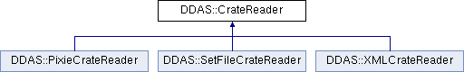

do not remove this div, it is closed by doxygen! 
|  |
| --- |
| NSCL DDAS1.0Support for XIA DDAS at the NSCL |

 end header part 
 Generated by Doxygen 1.8.8 

- [[Main Page|index]]
- [[Related Pages|pages]]
- [[Namespaces|namespaces]]
- [[Classes|annotated]]
- [[Files|files]]
- 
  [[|javascript:searchBox.CloseResultsWindow()]]

- [[Class List|annotated]]
- [[Class Index|classes]]
- [[Class Hierarchy|hierarchy]]
- [[Class Members|functions]]

 window showing the filter options 
[[All|javascript:void(0)]][[Classes|javascript:void(0)]][[Namespaces|javascript:void(0)]][[Files|javascript:void(0)]][[Functions|javascript:void(0)]][[Variables|javascript:void(0)]][[Macros|javascript:void(0)]][[Pages|javascript:void(0)]]

 iframe showing the search results (closed by default) 

- **DDAS**
- [[CrateReader|classDDAS_1_1CrateReader]]

 top 
[Public Member Functions](#pub-methods) |
[Protected Attributes](#pro-attribs) |
[[List of all members|classDDAS_1_1CrateReader-members]]

DDAS::CrateReader Class Referenceabstract

header
`#include <CrateReader.h>`

Inheritance diagram for DDAS::CrateReader:

|  |  |
| --- | --- |
| Public Member Functions |
|  | CrateReader(unsigned crate, const std::vector< unsigned short > &slots) |
|  |
| virtual | ~CrateReader() |
|  |
| virtualCrate | readCrate() |
|  |
| virtualSettingsReader* | createReader(unsigned short slot)=0 |
|  |

|  |  |
| --- | --- |
| Protected Attributes |
| std::vector< unsigned short > | m_slots |
|  |
| unsigned | m_crateId |
|  |

## Detailed Description

This class is able to read and process a crate The first <slot> element is id 0 and so on. This is an abstract base class that is used to fetch the configuration of a crate from any of a number of types of places depending on the type of concrete subclass.

## Constructor & Destructor Documentation

|  |  |  |  |
| --- | --- | --- | --- |
| DDAS::CrateReader::CrateReader | ( | unsigned | crate, |
|  |  | const std::vector< unsigned short > & | slots |
|  | ) |  |  |

constructor Save the slots we're reading in.

- Parameters
  |  |  |
  | --- | --- |
  | crate | - Id of the crate we're reading. |
  | slots | - the slotst to read. |

|  |  |  |  |  |  |  |
| --- | --- | --- | --- | --- | --- | --- |
| DDAS::CrateReader::~CrateReader() | DDAS::CrateReader::~CrateReader | ( |  | ) |  | virtual |
| DDAS::CrateReader::~CrateReader | ( |  | ) |  |

destructor

## Member Function Documentation

|  |  |  |  |  |  |  |
| --- | --- | --- | --- | --- | --- | --- |
| CrateDDAS::CrateReader::readCrate() | CrateDDAS::CrateReader::readCrate | ( |  | ) |  | virtual |
| CrateDDAS::CrateReader::readCrate | ( |  | ) |  |

readCrate This is a strategy driver for the reader. It has helpers that must be implemented to function:

- crateReader - must return a dynamically allocated reader for the data in a slot.
- getEvtLen - must return the expected event length for a slot These are called in that order for each slot. - Returns
    [[Crate|structDDAS_1_1Crate]] - the processed crate description.

---

The documentation for this class was generated from the following files:- xml/[[CrateReader.h|CrateReader_8h_source]]
- xml/[[CrateReader.cpp|CrateReader_8cpp]]

 contents 
 start footer part 

---

Generated on Tue Mar 31 2020 13:10:45 for NSCL DDAS by   1.8.8
