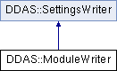

do not remove this div, it is closed by doxygen! 
|  |
| --- |
| NSCL DDAS1.0Support for XIA DDAS at the NSCL |

 end header part 
 Generated by Doxygen 1.8.8 

- [[Main Page|https://github.com/FRIBDAQ/docs/tree/main/ddas-1.1/index.md]]
- [[Related Pages|https://github.com/FRIBDAQ/docs/tree/main/ddas-1.1/pages.md]]
- [[Namespaces|https://github.com/FRIBDAQ/docs/tree/main/ddas-1.1/namespaces.md]]
- [[Classes|https://github.com/FRIBDAQ/docs/tree/main/ddas-1.1/annotated.md]]
- [[Files|https://github.com/FRIBDAQ/docs/tree/main/ddas-1.1/files.md]]
- 
  [[|https://github.com/FRIBDAQ/docs/tree/main/ddas-1.1/javascript:searchBox.CloseResultsWindow().md]]

- [[Class List|https://github.com/FRIBDAQ/docs/tree/main/ddas-1.1/annotated.md]]
- [[Class Index|https://github.com/FRIBDAQ/docs/tree/main/ddas-1.1/classes.md]]
- [[Class Hierarchy|https://github.com/FRIBDAQ/docs/tree/main/ddas-1.1/hierarchy.md]]
- [[Class Members|https://github.com/FRIBDAQ/docs/tree/main/ddas-1.1/functions.md]]

 window showing the filter options 
[[All|https://github.com/FRIBDAQ/docs/tree/main/ddas-1.1/javascript:void(0).md]][[Classes|https://github.com/FRIBDAQ/docs/tree/main/ddas-1.1/javascript:void(0).md]][[Namespaces|https://github.com/FRIBDAQ/docs/tree/main/ddas-1.1/javascript:void(0).md]][[Files|https://github.com/FRIBDAQ/docs/tree/main/ddas-1.1/javascript:void(0).md]][[Functions|https://github.com/FRIBDAQ/docs/tree/main/ddas-1.1/javascript:void(0).md]][[Variables|https://github.com/FRIBDAQ/docs/tree/main/ddas-1.1/javascript:void(0).md]][[Macros|https://github.com/FRIBDAQ/docs/tree/main/ddas-1.1/javascript:void(0).md]][[Pages|https://github.com/FRIBDAQ/docs/tree/main/ddas-1.1/javascript:void(0).md]]

 iframe showing the search results (closed by default) 

- **DDAS**
- [[ModuleWriter|https://github.com/FRIBDAQ/docs/tree/main/ddas-1.1/classDDAS_1_1ModuleWriter.md]]

 top 
[Public Member Functions](#pub-methods) |
[[List of all members|https://github.com/FRIBDAQ/docs/tree/main/ddas-1.1/classDDAS_1_1ModuleWriter-members.md]]

DDAS::ModuleWriter Class Reference

header
Inheritance diagram for DDAS::ModuleWriter:

|  |  |
| --- | --- |
| Public Member Functions |
|  | ModuleWriter(unsigned crate, unsigned slot, unsigned module) |
|  |
| virtual | ~ModuleWriter() |
|  |
| virtual void | write(constModuleSettings&dspSettings) |
|  |

## Constructor & Destructor Documentation

|  |  |  |  |
| --- | --- | --- | --- |
| DDAS::ModuleWriter::ModuleWriter | ( | unsigned | crate, |
|  |  | unsigned | slot, |
|  |  | unsigned | module |
|  | ) |  |  |

constructor Saves the information about which module we're loading and some of the global parameters that are not in the module configuration because they are really experimental configuration items.

- Parameters
  |  |  |
  | --- | --- |
  | crate | - the crate id of the modules (which crate it's in). |
  | slot | - slotId of the module (normally the slot its in). |
  | module | - moduleId of the module used to specify the module to the API. |

|  |  |  |  |  |  |  |
| --- | --- | --- | --- | --- | --- | --- |
| DDAS::ModuleWriter::~ModuleWriter() | DDAS::ModuleWriter::~ModuleWriter | ( |  | ) |  | virtual |
| DDAS::ModuleWriter::~ModuleWriter | ( |  | ) |  |

destructor

## Member Function Documentation

|  |  |  |  |  |  |  |  |
| --- | --- | --- | --- | --- | --- | --- | --- |
| void DDAS::ModuleWriter::write(constModuleSettings&dspSettings) | void DDAS::ModuleWriter::write | ( | constModuleSettings& | dspSettings | ) |  | virtual |
| void DDAS::ModuleWriter::write | ( | constModuleSettings& | dspSettings | ) |  |

write Write module settings to the crate. This assumes that the Pixie16 API has already been initialized and booted sufficiently to have read in the apropriate VAR files.

- Parameters
  |  |  |
  | --- | --- |
  | dspSettings | the vector of module settings that describes what to load. |

Implements [[DDAS::SettingsWriter|https://github.com/FRIBDAQ/docs/tree/main/ddas-1.1/classDDAS_1_1SettingsWriter.md]].

---

The documentation for this class was generated from the following files:- xml/[[ModuleWriter.h|https://github.com/FRIBDAQ/docs/tree/main/ddas-1.1/ModuleWriter_8h_source.md]]
- xml/[[ModuleWriter.cpp|https://github.com/FRIBDAQ/docs/tree/main/ddas-1.1/ModuleWriter_8cpp.md]]

 contents 
 start footer part 

---

Generated on Tue Mar 31 2020 13:10:45 for NSCL DDAS by   1.8.8
