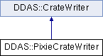

do not remove this div, it is closed by doxygen! 
|  |
| --- |
| NSCL DDAS1.0Support for XIA DDAS at the NSCL |

 end header part 
 Generated by Doxygen 1.8.8 

- [[index]]
- [[pages]]
- [[namespaces]]
- [[annotated]]
- [[files]]
- 
  [[javascript:searchBox.CloseResultsWindow()]]

- [[annotated]]
- [[classes]]
- [[hierarchy]]
- [[functions]]

 window showing the filter options 
[[javascript:void(0)]][[javascript:void(0)]][[javascript:void(0)]][[javascript:void(0)]][[javascript:void(0)]][[javascript:void(0)]][[javascript:void(0)]][[javascript:void(0)]]

 iframe showing the search results (closed by default) 

- **DDAS**
- [[classDDAS_1_1PixieCrateWriter]]

 top 
[Public Member Functions](#pub-methods) |
[[classDDAS_1_1PixieCrateWriter-members]]

DDAS::PixieCrateWriter Class Reference

header
`#include <PixieCrateWriter.h>`

Inheritance diagram for DDAS::PixieCrateWriter:

|  |  |
| --- | --- |
| Public Member Functions |
|  | PixieCrateWriter(constCrate&settings) |
|  |
| virtual | ~PixieCrateWriter() |
|  |
| virtual void | startCrate(int id, const std::vector< unsigned short > &slots) |
|  |
| virtual void | endCrate(int id, const std::vector< unsigned short > &slots) |
|  |
| virtualSettingsWriter* | getWriter(unsigned short slotNum) |
|  |
| Public Member Functions inherited fromDDAS::CrateWriter |
|  | CrateWriter(constCrate&settings) |
|  |
| virtual void | write() |
|  |

|  |  |
| --- | --- |
| Additional Inherited Members |
| Protected Attributes inherited fromDDAS::CrateWriter |
| Crate | m_settings |
|  |

## Detailed Description

[[structDDAS_1_1Crate]] writer that provides strategy methods to support writing a crate full of Pixie16 digitizers. This software uses a [[classDDAS_1_1CrateManager]] to ensure the API is initialized and that the digitizer DSP parameter address maps get loaded.

## Constructor & Destructor Documentation

|  |  |  |  |  |  |
| --- | --- | --- | --- | --- | --- |
| DDAS::PixieCrateWriter::PixieCrateWriter | ( | constCrate& | settings | ) |  |

constructor Construct the crate writer. We just pass the settings on to the base class.

Parameters
|  |  |
| --- | --- |
| settings | - crate settings. |

|  |  |  |  |  |  |  |
| --- | --- | --- | --- | --- | --- | --- |
| DDAS::PixieCrateWriter::~PixieCrateWriter() | DDAS::PixieCrateWriter::~PixieCrateWriter | ( |  | ) |  | virtual |
| DDAS::PixieCrateWriter::~PixieCrateWriter | ( |  | ) |  |

destructor ensure the crate manager is destroyed. That does an exit system.

## Member Function Documentation

|  |  |  |  |  |  |  |  |  |  |  |  |  |  |
| --- | --- | --- | --- | --- | --- | --- | --- | --- | --- | --- | --- | --- | --- |
| void DDAS::PixieCrateWriter::endCrate(intid,const std::vector< unsigned short > &slots) | void DDAS::PixieCrateWriter::endCrate | ( | int | id, |  |  | const std::vector< unsigned short > & | slots |  | ) |  |  | virtual |
| void DDAS::PixieCrateWriter::endCrate | ( | int | id, |
|  |  | const std::vector< unsigned short > & | slots |
|  | ) |  |  |

endCrate ALl modules are now programmed with their crate ids. The crate manager is also deleted, which does a Pixie16ExitSystem.

Parameters
|  |  |
| --- | --- |
| id | - the crate id. |
| slots | - the slot map. |

Implements [[classDDAS_1_1CrateWriter]].

|  |  |  |  |  |  |  |  |
| --- | --- | --- | --- | --- | --- | --- | --- |
| SettingsWriter* DDAS::PixieCrateWriter::getWriter(unsigned shortslot) | SettingsWriter* DDAS::PixieCrateWriter::getWriter | ( | unsigned short | slot | ) |  | virtual |
| SettingsWriter* DDAS::PixieCrateWriter::getWriter | ( | unsigned short | slot | ) |  |

getWriter Produce a [[classDDAS_1_1ModuleWriter]] which will write the settings to a module. Note that we'll write the slotid and the module id parameters directly ourselves.

Parameters
|  |  |
| --- | --- |
| slot | - the slot number to write. |

Notethe crate manager must have been instantiated already. 
Implements [[classDDAS_1_1CrateWriter]].

|  |  |  |  |  |  |  |  |  |  |  |  |  |  |
| --- | --- | --- | --- | --- | --- | --- | --- | --- | --- | --- | --- | --- | --- |
| void DDAS::PixieCrateWriter::startCrate(intid,const std::vector< unsigned short > &slots) | void DDAS::PixieCrateWriter::startCrate | ( | int | id, |  |  | const std::vector< unsigned short > & | slots |  | ) |  |  | virtual |
| void DDAS::PixieCrateWriter::startCrate | ( | int | id, |
|  |  | const std::vector< unsigned short > & | slots |
|  | ) |  |  |

startCrate Called before the crate is written. Save the crate id. Save the slots so we can compute ids. Create the crate manager.

Parameters
|  |  |
| --- | --- |
| id | - the crate id. |
| slots | - The slot map. |

Implements [[classDDAS_1_1CrateWriter]].

---

The documentation for this class was generated from the following files:- xml/[[PixieCrateWriter_8h_source]]
- xml/[[PixieCrateWriter_8cpp]]

 contents 
 start footer part 

---

Generated on Tue Mar 31 2020 13:10:45 for NSCL DDAS by   1.8.8
