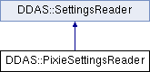

do not remove this div, it is closed by doxygen! 
|  |
| --- |
| NSCL DDAS1.0Support for XIA DDAS at the NSCL |

 end header part 
 Generated by Doxygen 1.8.8 

- [[Main Page|index]]
- [[Related Pages|pages]]
- [[Namespaces|namespaces]]
- [[Classes|annotated]]
- [[Files|files]]
- 
  [[|javascript:searchBox.CloseResultsWindow()]]

- [[Class List|annotated]]
- [[Class Index|classes]]
- [[Class Hierarchy|hierarchy]]
- [[Class Members|functions]]

 window showing the filter options 
[[All|javascript:void(0)]][[Classes|javascript:void(0)]][[Namespaces|javascript:void(0)]][[Files|javascript:void(0)]][[Functions|javascript:void(0)]][[Variables|javascript:void(0)]][[Macros|javascript:void(0)]][[Pages|javascript:void(0)]]

 iframe showing the search results (closed by default) 

- **DDAS**
- [[PixieSettingsReader|classDDAS_1_1PixieSettingsReader]]

 top 
[Public Member Functions](#pub-methods) |
[[List of all members|classDDAS_1_1PixieSettingsReader-members]]

DDAS::PixieSettingsReader Class Reference

header
Inheritance diagram for DDAS::PixieSettingsReader:

|  |  |
| --- | --- |
| Public Member Functions |
|  | PixieSettingsReader(unsigned id) |
|  |
| virtual | ~PixieSettingsReader() |
|  |
| DDAS::ModuleSettings | get() |
|  |

## Constructor & Destructor Documentation

|  |  |  |  |  |  |
| --- | --- | --- | --- | --- | --- |
| DDAS::PixieSettingsReader::PixieSettingsReader | ( | unsigned | id | ) |  |

constructor

- Initialize access to the PXI crate
- We assume there are 14 slots (maximum) and 13 modules in slots 2-14 respectively.
- We probe for the set of modules actually in the crate by getting module information. If a requested module is not present, std::invalid_argument is thrown

- Parameters
  |  |  |
  | --- | --- |
  | id | - id of the module we want to read from. |

|  |  |  |  |  |  |  |
| --- | --- | --- | --- | --- | --- | --- |
| DDAS::PixieSettingsReader::~PixieSettingsReader() | DDAS::PixieSettingsReader::~PixieSettingsReader | ( |  | ) |  | virtual |
| DDAS::PixieSettingsReader::~PixieSettingsReader | ( |  | ) |  |

destructor does nothing for now:

## Member Function Documentation

|  |  |  |  |  |  |  |
| --- | --- | --- | --- | --- | --- | --- |
| ModuleSettingsDDAS::PixieSettingsReader::get() | ModuleSettingsDDAS::PixieSettingsReader::get | ( |  | ) |  | virtual |
| ModuleSettingsDDAS::PixieSettingsReader::get | ( |  | ) |  |

get Get the settings from the hardware

- Returns
  std::vector<ModuleSettings> - the module settings.

Implements [[DDAS::SettingsReader|classDDAS_1_1SettingsReader]].

---

The documentation for this class was generated from the following files:- xml/[[PixieSettingsReader.h|PixieSettingsReader_8h_source]]
- xml/[[PixieSettingsReader.cpp|PixieSettingsReader_8cpp]]

 contents 
 start footer part 

---

Generated on Tue Mar 31 2020 13:10:45 for NSCL DDAS by   1.8.8
