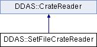

do not remove this div, it is closed by doxygen! 
|  |
| --- |
| NSCL DDAS1.0Support for XIA DDAS at the NSCL |

 end header part 
 Generated by Doxygen 1.8.8 

- [Main Page](https://github.com/FRIBDAQ/docs/tree/main/ddas-1.1/index.md)
- [Related Pages](https://github.com/FRIBDAQ/docs/tree/main/ddas-1.1/pages.md)
- [Namespaces](https://github.com/FRIBDAQ/docs/tree/main/ddas-1.1/namespaces.md)
- [Classes](https://github.com/FRIBDAQ/docs/tree/main/ddas-1.1/annotated.md)
- [Files](https://github.com/FRIBDAQ/docs/tree/main/ddas-1.1/files.md)
- 
  .md)

- [Class List](https://github.com/FRIBDAQ/docs/tree/main/ddas-1.1/annotated.md)
- [Class Index](https://github.com/FRIBDAQ/docs/tree/main/ddas-1.1/classes.md)
- [Class Hierarchy](https://github.com/FRIBDAQ/docs/tree/main/ddas-1.1/hierarchy.md)
- [Class Members](https://github.com/FRIBDAQ/docs/tree/main/ddas-1.1/functions.md)

 window showing the filter options 
[All](https://github.com/FRIBDAQ/docs/tree/main/ddas-1.1/javascript:void(0).md)[Classes](https://github.com/FRIBDAQ/docs/tree/main/ddas-1.1/javascript:void(0).md)[Namespaces](https://github.com/FRIBDAQ/docs/tree/main/ddas-1.1/javascript:void(0).md)[Files](https://github.com/FRIBDAQ/docs/tree/main/ddas-1.1/javascript:void(0).md)[Functions](https://github.com/FRIBDAQ/docs/tree/main/ddas-1.1/javascript:void(0).md)[Variables](https://github.com/FRIBDAQ/docs/tree/main/ddas-1.1/javascript:void(0).md)[Macros](https://github.com/FRIBDAQ/docs/tree/main/ddas-1.1/javascript:void(0).md)[Pages](https://github.com/FRIBDAQ/docs/tree/main/ddas-1.1/javascript:void(0).md)

 iframe showing the search results (closed by default) 

- **DDAS**
- [SetFileCrateReader](https://github.com/FRIBDAQ/docs/tree/main/ddas-1.1/classDDAS_1_1SetFileCrateReader.md)

 top 
[Public Member Functions](#pub-methods) |
[List of all members](https://github.com/FRIBDAQ/docs/tree/main/ddas-1.1/classDDAS_1_1SetFileCrateReader-members.md)

DDAS::SetFileCrateReader Class Reference

header
`#include <SetFileCrateReader.h>`

Inheritance diagram for DDAS::SetFileCrateReader:

|  |  |
| --- | --- |
| Public Member Functions |
|  | SetFileCrateReader(const char *setFile, unsigned crateId, std::vector< unsigned short > slots, std::vector< std::string > varFiles, std::vector< unsigned short > MHz) |
|  |
| virtualSettingsReader* | createReader(unsigned short slot) |
|  |
| Public Member Functions inherited fromDDAS::CrateReader |
|  | CrateReader(unsigned crate, const std::vector< unsigned short > &slots) |
|  |
| virtual | ~CrateReader() |
|  |
| virtualCrate | readCrate() |
|  |

|  |  |
| --- | --- |
| Additional Inherited Members |
| Protected Attributes inherited fromDDAS::CrateReader |
| std::vector< unsigned short > | m_slots |
|  |
| unsigned | m_crateId |
|  |

## Detailed Description

Provides a crate readerthat can read the module settings for a crate from a set file. Set files don't, by themselves, provide sufficient information to read them into a [ModuleSettings](https://github.com/FRIBDAQ/docs/tree/main/ddas-1.1/structDDAS_1_1ModuleSettings.md) struct. In addtion we need the digitizer speed and a .VAR file that describes the layout of DSP Parameters in memory. These are per module items. The .set file, however is a per crate item...as we use it here.

## Constructor & Destructor Documentation

|  |  |  |  |
| --- | --- | --- | --- |
| DDAS::SetFileCrateReader::SetFileCrateReader | ( | const char * | setFile, |
|  |  | unsigned | crateId, |
|  |  | std::vector< unsigned short > | slots, |
|  |  | std::vector< std::string > | varFiles, |
|  |  | std::vector< unsigned short > | MHz |
|  | ) |  |  |

constructor

- Construct the base class passing our slot map vector.
- Build the maps for the var file an speeds.

- Parameters
  |  |  |
  | --- | --- |
  | crateId | - Id of the crate. |
  | slots | - map of slots to read. |
  | varFiles | - vector of corresponding var files. |
  | MHz | - Vector of corresponding speeds. |

## Member Function Documentation

|  |  |  |  |  |  |  |  |
| --- | --- | --- | --- | --- | --- | --- | --- |
| SettingsReader* DDAS::SetFileCrateReader::createReader(unsigned shortslot) | SettingsReader* DDAS::SetFileCrateReader::createReader | ( | unsigned short | slot | ) |  | virtual |
| SettingsReader* DDAS::SetFileCrateReader::createReader | ( | unsigned short | slot | ) |  |

createReader Create the reader for a slot.

- Parameters
  |  |  |
  | --- | --- |
  | slot | - slot number to read. |

- Returns
  SettingsReader* - pointer to the new'd [SetFileReader](https://github.com/FRIBDAQ/docs/tree/main/ddas-1.1/classDDAS_1_1SetFileReader.md) object.

Implements [DDAS::CrateReader](https://github.com/FRIBDAQ/docs/tree/main/ddas-1.1/classDDAS_1_1CrateReader.md).

---

The documentation for this class was generated from the following files:- xml/[SetFileCrateReader.h](https://github.com/FRIBDAQ/docs/tree/main/ddas-1.1/SetFileCrateReader_8h_source.md)
- xml/[SetFileCrateReader.cpp](https://github.com/FRIBDAQ/docs/tree/main/ddas-1.1/SetFileCrateReader_8cpp.md)

 contents 
 start footer part 

---

Generated on Tue Mar 31 2020 13:10:45 for NSCL DDAS by   1.8.8
