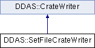

do not remove this div, it is closed by doxygen! 
|  |
| --- |
| NSCL DDAS1.0Support for XIA DDAS at the NSCL |

 end header part 
 Generated by Doxygen 1.8.8 

- [[Main Page|index]]
- [[Related Pages|pages]]
- [[Namespaces|namespaces]]
- [[Classes|annotated]]
- [[Files|files]]
- 
  [[|javascript:searchBox.CloseResultsWindow()]]

- [[Class List|annotated]]
- [[Class Index|classes]]
- [[Class Hierarchy|hierarchy]]
- [[Class Members|functions]]

 window showing the filter options 
[[All|javascript:void(0)]][[Classes|javascript:void(0)]][[Namespaces|javascript:void(0)]][[Files|javascript:void(0)]][[Functions|javascript:void(0)]][[Variables|javascript:void(0)]][[Macros|javascript:void(0)]][[Pages|javascript:void(0)]]

 iframe showing the search results (closed by default) 

- **DDAS**
- [[SetFileCrateWriter|classDDAS_1_1SetFileCrateWriter]]

 top 
[Public Member Functions](#pub-methods) |
[[List of all members|classDDAS_1_1SetFileCrateWriter-members]]

DDAS::SetFileCrateWriter Class Reference

header
Inheritance diagram for DDAS::SetFileCrateWriter:

|  |  |
| --- | --- |
| Public Member Functions |
|  | SetFileCrateWriter(const char *setFileName, constCrate&settings, const std::vector< std::pair< uint16_t, uint16_t >> &slotspeeds) |
|  |
| virtual | ~SetFileCrateWriter() |
|  |
| virtual void | startCrate(int id, const std::vector< unsigned short > &slots) |
|  |
| virtual void | endCrate(int id, const std::vector< unsigned short > &slots) |
|  |
| virtualSettingsWriter* | getWriter(unsigned short slotNum) |
|  |
| Public Member Functions inherited fromDDAS::CrateWriter |
|  | CrateWriter(constCrate&settings) |
|  |
| virtual void | write() |
|  |

|  |  |
| --- | --- |
| Additional Inherited Members |
| Protected Attributes inherited fromDDAS::CrateWriter |
| Crate | m_settings |
|  |

## Constructor & Destructor Documentation

|  |  |  |  |
| --- | --- | --- | --- |
| DDAS::SetFileCrateWriter::SetFileCrateWriter | ( | const char * | setFileName, |
|  |  | constCrate& | settings, |
|  |  | const std::vector< std::pair< uint16_t, uint16_t >> & | slotspeeds |
|  | ) |  |  |

constructor Construct the base class, Save the filename Create the editor If necessary copy the filename from the setfile template file.

Parameters
|  |  |
| --- | --- |
| setFileName | - Path to the output setfile. |
| settings | - The settings to write. |
| slotspeeds | - Vector of slot/speed pairs. |

|  |  |  |  |  |  |  |
| --- | --- | --- | --- | --- | --- | --- |
| DDAS::SetFileCrateWriter::~SetFileCrateWriter() | DDAS::SetFileCrateWriter::~SetFileCrateWriter | ( |  | ) |  | virtual |
| DDAS::SetFileCrateWriter::~SetFileCrateWriter | ( |  | ) |  |

destructor.

## Member Function Documentation

|  |  |  |  |  |  |  |  |  |  |  |  |  |  |
| --- | --- | --- | --- | --- | --- | --- | --- | --- | --- | --- | --- | --- | --- |
| void DDAS::SetFileCrateWriter::endCrate(intid,const std::vector< unsigned short > &slots) | void DDAS::SetFileCrateWriter::endCrate | ( | int | id, |  |  | const std::vector< unsigned short > & | slots |  | ) |  |  | virtual |
| void DDAS::SetFileCrateWriter::endCrate | ( | int | id, |
|  |  | const std::vector< unsigned short > & | slots |
|  | ) |  |  |

endCrate After the settings have been written, each slot's crate id is also set:

Parameters
|  |  |
| --- | --- |
| id | - crate id. |
| slots | - slot vector. |

Implements [[DDAS::CrateWriter|classDDAS_1_1CrateWriter]].

|  |  |  |  |  |  |  |  |
| --- | --- | --- | --- | --- | --- | --- | --- |
| SettingsWriter* DDAS::SetFileCrateWriter::getWriter(unsigned shortslotNum) | SettingsWriter* DDAS::SetFileCrateWriter::getWriter | ( | unsigned short | slotNum | ) |  | virtual |
| SettingsWriter* DDAS::SetFileCrateWriter::getWriter | ( | unsigned short | slotNum | ) |  |

getWriter Returns the settings writer to be used by the base class to write a slot worth of settings.

Parameters
|  |  |
| --- | --- |
| slotnum | - the number of the slot being written. |

Implements [[DDAS::CrateWriter|classDDAS_1_1CrateWriter]].

|  |  |  |  |  |  |  |  |  |  |  |  |  |  |
| --- | --- | --- | --- | --- | --- | --- | --- | --- | --- | --- | --- | --- | --- |
| void DDAS::SetFileCrateWriter::startCrate(intid,const std::vector< unsigned short > &slots) | void DDAS::SetFileCrateWriter::startCrate | ( | int | id, |  |  | const std::vector< unsigned short > & | slots |  | ) |  |  | virtual |
| void DDAS::SetFileCrateWriter::startCrate | ( | int | id, |
|  |  | const std::vector< unsigned short > & | slots |
|  | ) |  |  |

startCrate Flip through the slots and set their speeds in the editor.

Parameters
|  |  |
| --- | --- |
| id | - crate id. |
| slots | - vector of slots.  slots that have not been explicitly assigned a speed are assigned 250. |

Implements [[DDAS::CrateWriter|classDDAS_1_1CrateWriter]].

---

The documentation for this class was generated from the following files:- xml/[[SetFileCrateWriter.h|SetFileCrateWriter_8h_source]]
- xml/[[SetFileCrateWriter.cpp|SetFileCrateWriter_8cpp]]

 contents 
 start footer part 

---

Generated on Tue Mar 31 2020 13:10:45 for NSCL DDAS by   1.8.8
