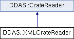

do not remove this div, it is closed by doxygen! 
|  |
| --- |
| NSCL DDAS1.0Support for XIA DDAS at the NSCL |


 end header part 
 Generated by Doxygen 1.8.8 

- [Main Page](https://github.com/FRIBDAQ/docs/tree/main/ddas-1.1/index.md)
- [Related Pages](https://github.com/FRIBDAQ/docs/tree/main/ddas-1.1/pages.md)
- [Namespaces](https://github.com/FRIBDAQ/docs/tree/main/ddas-1.1/namespaces.md)
- [Classes](https://github.com/FRIBDAQ/docs/tree/main/ddas-1.1/annotated.md)
- [Files](https://github.com/FRIBDAQ/docs/tree/main/ddas-1.1/files.md)
- 
  [](https://github.com/FRIBDAQ/docs/tree/main/ddas-1.1/javascript:searchBox.CloseResultsWindow().md)


- [Class List](https://github.com/FRIBDAQ/docs/tree/main/ddas-1.1/annotated.md)
- [Class Index](https://github.com/FRIBDAQ/docs/tree/main/ddas-1.1/classes.md)
- [Class Hierarchy](https://github.com/FRIBDAQ/docs/tree/main/ddas-1.1/hierarchy.md)
- [Class Members](https://github.com/FRIBDAQ/docs/tree/main/ddas-1.1/functions.md)


 window showing the filter options 
[All](https://github.com/FRIBDAQ/docs/tree/main/ddas-1.1/javascript:void(0).md)[Classes](https://github.com/FRIBDAQ/docs/tree/main/ddas-1.1/javascript:void(0).md)[Namespaces](https://github.com/FRIBDAQ/docs/tree/main/ddas-1.1/javascript:void(0).md)[Files](https://github.com/FRIBDAQ/docs/tree/main/ddas-1.1/javascript:void(0).md)[Functions](https://github.com/FRIBDAQ/docs/tree/main/ddas-1.1/javascript:void(0).md)[Variables](https://github.com/FRIBDAQ/docs/tree/main/ddas-1.1/javascript:void(0).md)[Macros](https://github.com/FRIBDAQ/docs/tree/main/ddas-1.1/javascript:void(0).md)[Pages](https://github.com/FRIBDAQ/docs/tree/main/ddas-1.1/javascript:void(0).md)


 iframe showing the search results (closed by default) 


- **DDAS**
- [XMLCrateReader](https://github.com/FRIBDAQ/docs/tree/main/ddas-1.1/classDDAS_1_1XMLCrateReader.md)

 top 
[Classes](#nested-classes) |
[Public Member Functions](#pub-methods) |
[List of all members](https://github.com/FRIBDAQ/docs/tree/main/ddas-1.1/classDDAS_1_1XMLCrateReader-members.md)


DDAS::XMLCrateReader Class Reference

header
`#include <XMLCrateReader.h>`


Inheritance diagram for DDAS::XMLCrateReader:





|  |  |
| --- | --- |
| Classes |
| struct | SlotInformation |
|  |

|  |  |
| --- | --- |
| Public Member Functions |
|  | XMLCrateReader(const char *configFile) |
|  |
| virtual | ~XMLCrateReader() |
|  |
| virtualSettingsReader* | createReader(unsigned short slot) |
|  |
| unsigned short | getCrateId() const |
|  |
| unsigned | getEvtLen(unsigned short slot) |
|  |
| unsigned | getFifoThreshold(unsigned short slot) |
|  |
| bool | isInfinityClock(unsigned short slot) |
|  |
| double | getTimestampScale(unsigned short slot) |
|  |
| bool | isExternalClock(unsigned short slot) |
|  |
| const std::map< unsigned short,SlotInformation> & | getSlotInformation() const |
|  |
| Public Member Functions inherited fromDDAS::CrateReader |
|  | CrateReader(unsigned crate, const std::vector< unsigned short > &slots) |
|  |
| virtual | ~CrateReader() |
|  |
| virtualCrate | readCrate() |
|  |

|  |  |
| --- | --- |
| Additional Inherited Members |
| Protected Attributes inherited fromDDAS::CrateReader |
| std::vector< unsigned short > | m_slots |
|  |
| unsigned | m_crateId |
|  |


<a name="details"></a>## Detailed Description


This class specializes the [CrateReader](https://github.com/FRIBDAQ/docs/tree/main/ddas-1.1/classDDAS_1_1CrateReader.md) class to work with a set of XML specifications of the crate, modules and their settings. The top level is a crate xml file which is of the form

```
*  <crate id="1">
*      <slot number="2" ... configfile="/user/fox/configs/Ge.xml" />
*      <slot number="5" ... configfile="/user/fox/configs/Ge-short-trace.xml />
*  </crate>
*
* 
```

I've only shown the <slot> attributes we care/check for. The other attributes at this time are:


- evtlen - Number of longwords expected for a hit from this module.
- fifo_threshold - Minimum # of longs in the module fifo before declaring an trigger.
- infinity_clock - does not re-synchrnoize at the start of each run.
- timestamp_scale - Scale factor to apply to the timestamp, whatever its source, to compute the event builder timestamp.
- external_clock - Indicates the timestamp source is the external clock. What we care about in <slot tags>="">:- number - the slot number.
  - configfile - Where the module settings xml file is. We have extra methods to make all this other stuff available.

## Constructor & Destructor Documentation


|  |  |  |  |  |  |
| --- | --- | --- | --- | --- | --- |
| DDAS::XMLCrateReader::XMLCrateReader | ( | const char * | configFile | ) |  |

constructor Given the crate information file, process it and use the resulting information to fill in the base class attributes:


- m_slots - The slot map.
- m_crateId - the id of this crate.


- Parameters
  |  |  |
  | --- | --- |
  | configFile | - the crate configuration file. |


- Exceptions
  |  |  |
  | --- | --- |
  | std::invalid_argument | if there are errors:Opening the file.Parsing it to XMLSemantics of the XML file. |


|  |  |  |  |  |  |  |
| --- | --- | --- | --- | --- | --- | --- |
| DDAS::XMLCrateReader::~XMLCrateReader() | DDAS::XMLCrateReader::~XMLCrateReader | ( |  | ) |  | virtual |
| DDAS::XMLCrateReader::~XMLCrateReader | ( |  | ) |  |

destructor just let the map destroy itself


## Member Function Documentation


|  |  |  |  |  |  |  |  |
| --- | --- | --- | --- | --- | --- | --- | --- |
| SettingsReader* DDAS::XMLCrateReader::createReader(unsigned shortslot) | SettingsReader* DDAS::XMLCrateReader::createReader | ( | unsigned short | slot | ) |  | virtual |
| SettingsReader* DDAS::XMLCrateReader::createReader | ( | unsigned short | slot | ) |  |

createReader Given a slot number:

- Get the slot information.
- Create an [XMLSettingsReader](https://github.com/FRIBDAQ/docs/tree/main/ddas-1.1/classDDAS_1_1XMLSettingsReader.md) on the filename that's in the [SlotInformation](https://github.com/FRIBDAQ/docs/tree/main/ddas-1.1/structDDAS_1_1XMLCrateReader_1_1SlotInformation.md) struct for that slot. - Parameters
    |  |  |
    | --- | --- |
    | slot | - slot number. |
  - Returns
    SettingsReader* pointer to a dynamically created [XMLSettingsReader](https://github.com/FRIBDAQ/docs/tree/main/ddas-1.1/classDDAS_1_1XMLSettingsReader.md)


Implements [DDAS::CrateReader](https://github.com/FRIBDAQ/docs/tree/main/ddas-1.1/classDDAS_1_1CrateReader.md).


|  |  |  |  |  |  |
| --- | --- | --- | --- | --- | --- |
| unsigned DDAS::XMLCrateReader::getEvtLen | ( | unsigned short | slot | ) |  |

getEvtLen Returns the event length for a slot.


- Parameters
  |  |  |
  | --- | --- |
  | slot | - the slot number. |


- Returns
  unsigned - Event length for the slot.


|  |  |  |  |  |  |
| --- | --- | --- | --- | --- | --- |
| unsigned DDAS::XMLCrateReader::getFifoThreshold | ( | unsigned short | slot | ) |  |

getFifoThreshold Return the fifo threshold for a slot.


- Parameters
  |  |  |
  | --- | --- |
  | slot | - slot number. |


- Returns
  unsigned FIFO trigger threshold for the slot.


|  |  |  |  |  |  |
| --- | --- | --- | --- | --- | --- |
| double DDAS::XMLCrateReader::getTimestampScale | ( | unsigned short | slot | ) |  |

getTimestampScale Returns the timestamp scale factor.

- Parameters
  |  |  |
  | --- | --- |
  | slot | - slot number to use. |


- Returns
  double - multiplier for the timstamp, whatever the source.


|  |  |  |  |  |  |
| --- | --- | --- | --- | --- | --- |
| bool DDAS::XMLCrateReader::isExternalClock | ( | unsigned short | slot | ) |  |

isExternalClock

- Parameters
  |  |  |
  | --- | --- |
  | slot | - slot number to check. |


- Returns
  bool - true if the external timestamp should be used for event building.


|  |  |  |  |  |  |
| --- | --- | --- | --- | --- | --- |
| bool DDAS::XMLCrateReader::isInfinityClock | ( | unsigned short | slot | ) |  |

isInfinityClock

- Parameters
  |  |  |
  | --- | --- |
  | slot | - slot to get the flag for.  - Flag of whether or not to use infinity clock. |


---

The documentation for this class was generated from the following files:- xml/[XMLCrateReader.h](https://github.com/FRIBDAQ/docs/tree/main/ddas-1.1/XMLCrateReader_8h_source.md)
- xml/[XMLCrateReader.cpp](https://github.com/FRIBDAQ/docs/tree/main/ddas-1.1/XMLCrateReader_8cpp.md)

 contents 
 start footer part 

---


Generated on Tue Mar 31 2020 13:10:45 for NSCL DDAS by  [](http://www.doxygen.org/index.html) 1.8.8
