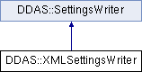

do not remove this div, it is closed by doxygen! 
|  |
| --- |
| NSCL DDAS1.0Support for XIA DDAS at the NSCL |

 end header part 
 Generated by Doxygen 1.8.8 

- [[Main Page|index]]
- [[Related Pages|pages]]
- [[Namespaces|namespaces]]
- [[Classes|annotated]]
- [[Files|files]]
- 
  [[|javascript:searchBox.CloseResultsWindow()]]

- [[Class List|annotated]]
- [[Class Index|classes]]
- [[Class Hierarchy|hierarchy]]
- [[Class Members|functions]]

 window showing the filter options 
[[All|javascript:void(0)]][[Classes|javascript:void(0)]][[Namespaces|javascript:void(0)]][[Files|javascript:void(0)]][[Functions|javascript:void(0)]][[Variables|javascript:void(0)]][[Macros|javascript:void(0)]][[Pages|javascript:void(0)]]

 iframe showing the search results (closed by default) 

- **DDAS**
- [[XMLSettingsWriter|classDDAS_1_1XMLSettingsWriter]]

 top 
[Public Member Functions](#pub-methods) |
[Static Public Member Functions](#pub-static-methods) |
[[List of all members|classDDAS_1_1XMLSettingsWriter-members]]

DDAS::XMLSettingsWriter Class Reference

header
`#include <XMLSettingsWriter.h>`

Inheritance diagram for DDAS::XMLSettingsWriter:

|  |  |
| --- | --- |
| Public Member Functions |
|  | XMLSettingsWriter(const char *filename) |
|  |
| virtual void | write(constModuleSettings&dspSettings) |
|  |

|  |  |
| --- | --- |
| Static Public Member Functions |
| static void | writeValue(tinyxml2::XMLPrinter&printer, unsigned value) |
|  |
| static void | writeValue(tinyxml2::XMLPrinter&printer, double value) |
|  |
| static void | writeValue(tinyxml2::XMLPrinter&printer, bool value) |
|  |
| static void | writeMultiplicityMasks(tinyxml2::XMLPrinter&printer, uint32_t low, uint32_t high) |
|  |

## Detailed Description

Writes settings to a group of xml files. One file is written per modules. On construction a base filename is passed in. Each module's settings are written into a per module file named base_Module_n.xml n is the module number (not the slot).

The structure of each XML file is: <module> <csra value="nnn"> <csrb value="nnn"> <format value="nnnn"> <maxevents value="nn"> <synchwait value="0|1"> <insych value="0|1"> <SlowFilterRange value="nnn"> <FastFilterRange value="nnn"> <EnableFastBackplaneTrigger value="0|1"> <trigConfig0-3 value='n' /> <HostRTPreset value="n">

## Constructor & Destructor Documentation

|  |  |  |  |  |  |
| --- | --- | --- | --- | --- | --- |
| DDAS::XMLSettingsWriter::XMLSettingsWriter | ( | const char * | filename | ) |  |

constructor Just save the filename for now:

- Parameters
  |  |  |
  | --- | --- |
  |  |  |

## Member Function Documentation

|  |  |  |  |  |  |  |  |
| --- | --- | --- | --- | --- | --- | --- | --- |
| void DDAS::XMLSettingsWriter::write(constModuleSettings&dspSettings) | void DDAS::XMLSettingsWriter::write | ( | constModuleSettings& | dspSettings | ) |  | virtual |
| void DDAS::XMLSettingsWriter::write | ( | constModuleSettings& | dspSettings | ) |  |

write For each module in the settings vector:

- Generate a module filename.
- Open a file pointer for the module XML file.
- Create an XMLPrinter for the module file.
- Write the module settings.

- Parameters
  |  |  |
  | --- | --- |
  | dspSettings | - the module settings to write. |

- Exceptions
  |  |  |
  | --- | --- |
  | std::runtime_error | - unable to open the output file. |

Implements [[DDAS::SettingsWriter|classDDAS_1_1SettingsWriter]].

|  |  |  |  |  |  |  |  |  |  |  |  |  |  |  |  |  |  |
| --- | --- | --- | --- | --- | --- | --- | --- | --- | --- | --- | --- | --- | --- | --- | --- | --- | --- |
| void DDAS::XMLSettingsWriter::writeMultiplicityMasks(tinyxml2::XMLPrinter&printer,uint32_tlow,uint32_thigh) | void DDAS::XMLSettingsWriter::writeMultiplicityMasks | ( | tinyxml2::XMLPrinter& | printer, |  |  | uint32_t | low, |  |  | uint32_t | high |  | ) |  |  | static |
| void DDAS::XMLSettingsWriter::writeMultiplicityMasks | ( | tinyxml2::XMLPrinter& | printer, |
|  |  | uint32_t | low, |
|  |  | uint32_t | high |
|  | ) |  |  |

writeMultiplicityMasks Writes the multiplicity mask element <MultiplicityMasks low="lowmask" high="highmask">

- Parameters
  |  |  |
  | --- | --- |
  | printer | - referencs the tinxyml2 printer. |
  | low | - low order mask bits. |
  | high | - high order mask bits. |

|  |  |  |  |  |  |  |  |  |  |  |  |  |  |
| --- | --- | --- | --- | --- | --- | --- | --- | --- | --- | --- | --- | --- | --- |
| void DDAS::XMLSettingsWriter::writeValue(tinyxml2::XMLPrinter&printer,unsignedvalue) | void DDAS::XMLSettingsWriter::writeValue | ( | tinyxml2::XMLPrinter& | printer, |  |  | unsigned | value |  | ) |  |  | static |
| void DDAS::XMLSettingsWriter::writeValue | ( | tinyxml2::XMLPrinter& | printer, |
|  |  | unsigned | value |
|  | ) |  |  |

writeValue Write an integer value attribute:

- Parameters
  |  |  |
  | --- | --- |
  | printer | - the XML printer. |
  | value | - the unsigned integer value. |

|  |  |  |  |  |  |  |  |  |  |  |  |  |  |
| --- | --- | --- | --- | --- | --- | --- | --- | --- | --- | --- | --- | --- | --- |
| void DDAS::XMLSettingsWriter::writeValue(tinyxml2::XMLPrinter&printer,doublevalue) | void DDAS::XMLSettingsWriter::writeValue | ( | tinyxml2::XMLPrinter& | printer, |  |  | double | value |  | ) |  |  | static |
| void DDAS::XMLSettingsWriter::writeValue | ( | tinyxml2::XMLPrinter& | printer, |
|  |  | double | value |
|  | ) |  |  |

writeElement Same as above with a double value.

|  |  |  |  |  |  |  |  |  |  |  |  |  |  |
| --- | --- | --- | --- | --- | --- | --- | --- | --- | --- | --- | --- | --- | --- |
| void DDAS::XMLSettingsWriter::writeValue(tinyxml2::XMLPrinter&printer,boolvalue) | void DDAS::XMLSettingsWriter::writeValue | ( | tinyxml2::XMLPrinter& | printer, |  |  | bool | value |  | ) |  |  | static |
| void DDAS::XMLSettingsWriter::writeValue | ( | tinyxml2::XMLPrinter& | printer, |
|  |  | bool | value |
|  | ) |  |  |

writeElement same as above but with boolean value

---

The documentation for this class was generated from the following files:- xml/[[XMLSettingsWriter.h|XMLSettingsWriter_8h_source]]
- xml/[[XMLSettingsWriter.cpp|XMLSettingsWriter_8cpp]]

 contents 
 start footer part 

---

Generated on Tue Mar 31 2020 13:10:45 for NSCL DDAS by   1.8.8
