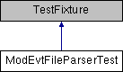

do not remove this div, it is closed by doxygen! 
|  |
| --- |
| NSCL DDAS1.0Support for XIA DDAS at the NSCL |

 end header part 
 Generated by Doxygen 1.8.8 

- [Main Page](https://github.com/FRIBDAQ/docs/tree/main/ddas-1.1/index.md)
- [Related Pages](https://github.com/FRIBDAQ/docs/tree/main/ddas-1.1/pages.md)
- [Namespaces](https://github.com/FRIBDAQ/docs/tree/main/ddas-1.1/namespaces.md)
- [Classes](https://github.com/FRIBDAQ/docs/tree/main/ddas-1.1/annotated.md)
- [Files](https://github.com/FRIBDAQ/docs/tree/main/ddas-1.1/files.md)
- 
  .md)

- [Class List](https://github.com/FRIBDAQ/docs/tree/main/ddas-1.1/annotated.md)
- [Class Index](https://github.com/FRIBDAQ/docs/tree/main/ddas-1.1/classes.md)
- [Class Hierarchy](https://github.com/FRIBDAQ/docs/tree/main/ddas-1.1/hierarchy.md)
- [Class Members](https://github.com/FRIBDAQ/docs/tree/main/ddas-1.1/functions.md)

 window showing the filter options 
[All](https://github.com/FRIBDAQ/docs/tree/main/ddas-1.1/javascript:void(0).md)[Classes](https://github.com/FRIBDAQ/docs/tree/main/ddas-1.1/javascript:void(0).md)[Namespaces](https://github.com/FRIBDAQ/docs/tree/main/ddas-1.1/javascript:void(0).md)[Files](https://github.com/FRIBDAQ/docs/tree/main/ddas-1.1/javascript:void(0).md)[Functions](https://github.com/FRIBDAQ/docs/tree/main/ddas-1.1/javascript:void(0).md)[Variables](https://github.com/FRIBDAQ/docs/tree/main/ddas-1.1/javascript:void(0).md)[Macros](https://github.com/FRIBDAQ/docs/tree/main/ddas-1.1/javascript:void(0).md)[Pages](https://github.com/FRIBDAQ/docs/tree/main/ddas-1.1/javascript:void(0).md)

 iframe showing the search results (closed by default)

 top 
[Public Member Functions](#pub-methods) |
[List of all members](https://github.com/FRIBDAQ/docs/tree/main/ddas-1.1/classModEvtFileParserTest-members.md)

ModEvtFileParserTest Class Reference

header
Tests for the ModEvtFileParser class.  
 [More...](https://github.com/FRIBDAQ/docs/tree/main/ddas-1.1/classModEvtFileParserTest.md#details)

Inheritance diagram for ModEvtFileParserTest:

|  |  |
| --- | --- |
| Public Member Functions |
|  | CPPUNIT_TEST_SUITE(ModEvtFileParserTest) |
|  |
|  | CPPUNIT_TEST(parse_0) |
|  |
|  | CPPUNIT_TEST(parse_1) |
|  |
|  | CPPUNIT_TEST(parse_2) |
|  |
|  | CPPUNIT_TEST(parse_3) |
|  |
|  | CPPUNIT_TEST(parse_4) |
|  |
|  | CPPUNIT_TEST_SUITE_END() |
|  |
| void | setUp() |
|  |
| void | tearDown() |
|  |
| vector< string > | createSampleFileContent() |
|  |
| string | mergeLines(const vector< string > &content) |
|  |
| string | createSampleStream() |
|  |
| void | parse_0() |
|  |
| void | parse_1() |
|  |
| void | parse_2() |
|  |
| void | parse_3() |
|  |
| void | parse_4() |
|  |

## Detailed Description

Tests for the ModEvtFileParser class.

---

The documentation for this class was generated from the following file:- configuration/ModEvtLenFileParserTest.cpp

 contents 
 start footer part 

---

Generated on Tue Mar 31 2020 13:10:45 for NSCL DDAS by   1.8.8
