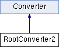

do not remove this div, it is closed by doxygen! 
|  |
| --- |
| NSCL DDAS1.0Support for XIA DDAS at the NSCL |

 end header part 
 Generated by Doxygen 1.8.8 

- [[index]]
- [[pages]]
- [[namespaces]]
- [[annotated]]
- [[files]]
- 
  [[javascript:searchBox.CloseResultsWindow()]]

- [[annotated]]
- [[classes]]
- [[hierarchy]]
- [[functions]]

 window showing the filter options 
[[javascript:void(0)]][[javascript:void(0)]][[javascript:void(0)]][[javascript:void(0)]][[javascript:void(0)]][[javascript:void(0)]][[javascript:void(0)]][[javascript:void(0)]]

 iframe showing the search results (closed by default)

 top 
[Public Member Functions](#pub-methods) |
[[classRootConverter2-members]]

RootConverter2 Class Reference

header
[[classConverter]] for data formats : NSCLDAQ 10.2-00x.  
 [[classRootConverter2#details]]

`#include <RootConverter2.h>`

Inheritance diagram for RootConverter2:

|  |  |
| --- | --- |
| Public Member Functions |
|  | RootConverter2() |
|  | Default constructor Constructs theDDASEventobject.More... |
|  |
| virtual | ~RootConverter2() |
|  | Default destructor Calls the parent destructor and also deletes the object pointed to by the m_ddasevent data member.More... |
|  |
| virtual void | Initialize(std::string filein, std::string fileout) |
|  | Adds ddasevent branch to tree and associates it with localDDASEventobject.More... |
|  |
| virtual void | DumpData(const CRingItem &item) |
|  | Conversion of CRingItem data and filling of the tree.More... |
|  |
| Public Member Functions inherited fromConverter |
|  | Converter() |
|  | Default constructor.More... |
|  |
| virtual | ~Converter() |
|  | Default destructor.More... |
|  |
| virtual void | Close() |
|  | Close ROOT file.More... |
|  |
| TFile * | GetFile() |
|  | Access the output file. |
|  |
| TTree * | GetTree() |
|  | Access the output tree. |
|  |

|  |  |
| --- | --- |
| Additional Inherited Members |
| Protected Attributes inherited fromConverter |
| TFile * | m_fileout |
|  |
| TTree * | m_treeout |
|  |

## Detailed Description

[[classConverter]] for data formats : NSCLDAQ 10.2-00x.

A concrete implementation of the [[classConverter]] base class to support the conversion of data built with NSCLDAQ versions 10.2-00x. This class expects a ring item whose ring-item-type is PHYSICS_EVENT. These are composed of a set of EVBFragment-type structures that surround the type of data . These structures have the following format

struct data_structure { uint32_t size_in_bytes uint64_t timestamp uint32_t source_id uint32_t payload_size (bytes) uint32_t barrier_type uint32_t pixie16_data[]; }

The Pixie-16 data format is defined by the Pixie-16 digitizer module. It consists of a minimum of 4 32-bit words for the Pixie16 data header followed by any subsequent optional data. The optional data may include trace data, energy sum data, or QDC data. The ddaschannel class is solely responsible for interpreting its structure.

The [[classRootConverter2]] object creates a branch in the tree referenced by Converter::m_treepointer named ddasevent. It holds the [[classDDASEvent]] objects produced by every call to the [[classRootConverter2#a8b5461e30739b427669f7aa1942614af]] method. [[classDDASEvent]] objects are really arrays of individual ddaschannel objects.

## Constructor & Destructor Documentation

|  |  |  |  |  |
| --- | --- | --- | --- | --- |
| RootConverter2::RootConverter2 | ( |  | ) |  |

Default constructor Constructs the [[classDDASEvent]] object.

See also[[classConverter#a1de81f3e06093411e5d27ce882bc010f]]

|  |  |  |  |  |  |  |
| --- | --- | --- | --- | --- | --- | --- |
| RootConverter2::~RootConverter2() | RootConverter2::~RootConverter2 | ( |  | ) |  | virtual |
| RootConverter2::~RootConverter2 | ( |  | ) |  |

Default destructor Calls the parent destructor and also deletes the object pointed to by the m_ddasevent data member.

## Member Function Documentation

|  |  |  |  |  |  |  |  |
| --- | --- | --- | --- | --- | --- | --- | --- |
| void RootConverter2::DumpData(const CRingItem &item) | void RootConverter2::DumpData | ( | const CRingItem & | item | ) |  | virtual |
| void RootConverter2::DumpData | ( | const CRingItem & | item | ) |  |

Conversion of CRingItem data and filling of the tree.

Responsible for converting the data stored in the CRingItem into the [[classDDASEvent]] object. This is the top level iterator through the data. It steps through the EVBFragments. For each EVBFragemt, the ExtractDDASChannelFromEVBFragment method is called and then the generated ddaschannel object is appended to the [[classDDASEvent]] object. When there are no more EVBFragments to process in the current item, the [[classDDASEvent]] is added to the tree.

Parameters
|  |  |
| --- | --- |
| item | is the CRingItem (that should always be of type PHYSICS_EVENT) |

Implements [[classConverter#a9ff35398f215af687593e4785f3ecf19]].

|  |  |  |  |  |  |  |  |  |  |  |  |  |  |
| --- | --- | --- | --- | --- | --- | --- | --- | --- | --- | --- | --- | --- | --- |
| void RootConverter2::Initialize(std::stringfilein,std::stringfileout) | void RootConverter2::Initialize | ( | std::string | filein, |  |  | std::string | fileout |  | ) |  |  | virtual |
| void RootConverter2::Initialize | ( | std::string | filein, |
|  |  | std::string | fileout |
|  | ) |  |  |

Adds ddasevent branch to tree and associates it with local [[classDDASEvent]] object.

First calls the [[classConverter#a7bc5c097d0bc9b7e1afdeffb18644cc1]] method to create the output file and the tree, then adds the ddasevent branch to the tree. This branch holds the [[classDDASEvent]] objects produced by the [[classRootConverter2#a8b5461e30739b427669f7aa1942614af]] method.

Parameters
|  |  |
| --- | --- |
| filein | currently not implemented |
| fileout | name of the root file to store the outputted data tree |

Reimplemented from [[classConverter#a7bc5c097d0bc9b7e1afdeffb18644cc1]].

---

The documentation for this class was generated from the following files:- ddasdumper/[[RootConverter2_8h_source]]
- ddasdumper/RootConverter2.cpp

 contents 
 start footer part 

---

Generated on Tue Mar 31 2020 13:10:45 for NSCL DDAS by   1.8.8
